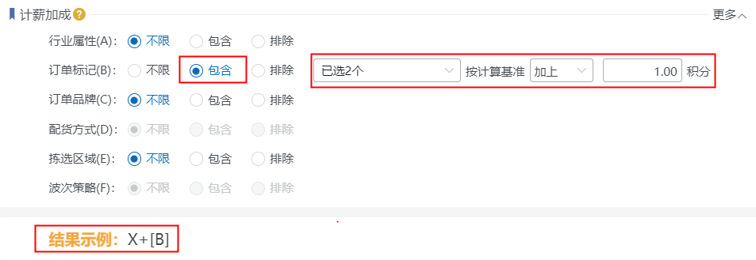

# 例外累加规则

### **01.新增例外累加规则**
具体步骤如下：

### **02.绩效策略复制**
若要建一个和已存在的策略类似的绩效策略，则可以使用复制功能，具体如下图所示：

### **03.策略停用、启用、删除**
绩效策略有停用和启用，这个可以根据用户的需求进行操作：

1）停用的策略可以开启；

2）删除策略需要先勾选策略，策略删除后就不能恢复，需要重新新建。

具体操作步骤如下图：

### **04.绩效策略设置规则了解**
策略分为下面四个大块：策略概要、适用范围、计薪标准、计薪加成。

#### **一、策略概要**

策略概要主要包括：

1.策略名称：表示绩效策略的名称，必填，不允许重复；

2.策略编码：是该策略的身份标识，可以自己输入，也可自动生成，不允许重复；

3.生效时间：默认长期生效，可设置为指定日期、每日定时，业务操作时间在指定时间范围内才会匹配到该策略。

4.生效对象：默认为所有人，可指定角色、指定人员，在指定范围内的可以匹配，否则无法匹配。

#### **二、适用范围**

适用范围主要包括：

1、业务模块：包括出库、大宗、入库、仓内四种，默认出库，单选。符合指定业务模块的能匹配该策略。

2、流程环节：关联业务模块，默认全选，可勾选部分，只对勾选环节的操作匹配生效。符合指定流程环节的能匹配该策略。(注：出库环节不关联业务配置主流程)

3、适用货主：默认不限，可指定包含范围或排除范围。在指定货主范围内或排除范围外的能匹配该策略。(注：此项对仓内-补货、移库、装箱、转移、预包任务环节不生效)

4、行业属性：默认不限，可指定包含范围或排除范围。单据明细包含指定行业属性或排除范围外的能匹配到该策略。订单维度的，按订单明细的行业属性匹配；拣货任务维度的，按任务明细的行业属性匹配(注：此项关联行业配置开关)

5、订单标记：默认不限，可指定包含范围或排除范围。在指定订单标记范围内或排除范围外的能匹配该策略。订单维度的，按订单上标记匹配，拣货任务维度的，按任务明细反算所属单据，再按订单标记匹配。(注：此项对入库、仓内模块不生效)

6、订单品牌：默认不限，可指定包含范围或排除范围。在指定订单品牌范围内或排除范围外的能匹配该策略。订单维度的，按订单明细品牌匹配；拣货任务维度的，按本次操作维度品牌匹配。(注：此项对入库、仓内模块不生效)

7、配货方式：默认不限，可指定包含范围或排除范围。出库模块对应零拣配货、波次配货，大宗模块对应大宗件。(注：此项对入库、仓内模块不生效)

8、拣选区域：默认不限，可指定包含范围或排除范围。在指定拣选区域内或排除范围外的能匹配该策略。订单维度的，按单据拣选库区/来源库区匹配；拣货任务维度的，按拣货任务上的拣选库区/来源库区匹配。(注：此项对入库模块、仓内模块-装箱、预包任务不生效)

9、波次策略：默认不限，可指定包含范围或排除范围。按波次订单归属波次策略匹配。(注：此项对大宗、入库、仓内模块不生效)

#### **三、计薪标准(X)**
匹配到此策略的单据，按设置规则计算积分，各模块对应的计算基准略有不同，具体含义可参考【[WMS-基础绩效策略](https://hupun.kf5.com/hc/kb/article/1590549/)】。

#### **四、计薪加成**
计薪加成是在计薪标准计算基础上的附加数据，若单据符合某一项或多项设置，则按配置计算该项加成，若不符合，则跳至下一项，有多项符合时累加计算。

1.行业属性(A)：默认不限，可指定包含范围或排除范围。单据明细包含指定行业属性或排除范围外的符合该条件，可根据设置计算积分。

选择“不限”时，不计算加成，结果示例如上图。

选择“包含”时，单据明细包含其中一项即可按计算基准计算加成，结果示例如上图。

选择“排除”时，单据明细需排除所有勾选项可按计算基准计算加成，结果示例如上图。

  2.订单标记(B)：默认不限，可指定包含范围或排除范围。在指定订单标记范围内或排除范围外的符合该条件，可根据设置计算积分。

选择“包含”时，订单标记包含其中一项即可按计算基准计算加成，结果示例如上图。

选择“排除”时，订单标记需排除所有勾选项可按计算基准计算加成，结果示例如上图。

  3.订单品牌(C)：默认不限，可指定包含范围或排除范围。在指定订单品牌范围内或排除范围外的符合该条件，可根据设置计算积分。计算方式同上述一致。

  4.配货方式(D)：默认不限，可指定包含范围或排除范围。出库模块对应零拣配货、波次配货，大宗模块对应大宗件。计算方式同上述一致。

  5.拣选区域(E)：默认不限，可指定包含范围或排除范围。在指定拣选区域内或排除范围外的符合该条件，可根据设置计算积分。计算方式同上述一致。

  6.波次策略(F)：默认不限，可指定包含范围或排除范围。按波次订单归属波次策略匹配的符合该条件，可根据设置计算积分。计算方式同上述一致。

> 更新: 2023-12-18 17:38:08  
> 原文: <https://hupun.yuque.com/unzko7/lsbfg0/tf8nvibl37hxc42g>