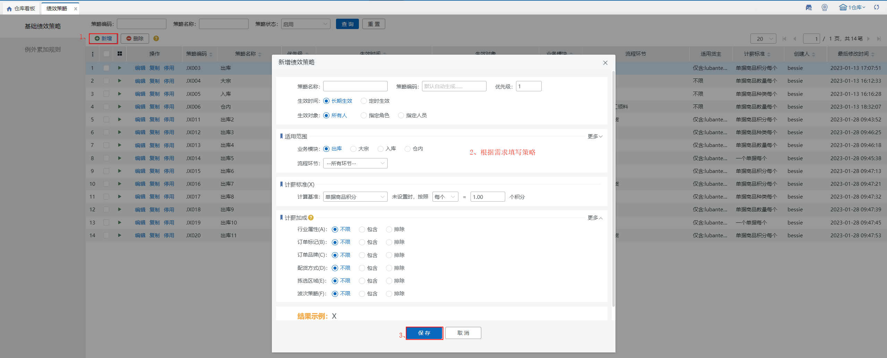
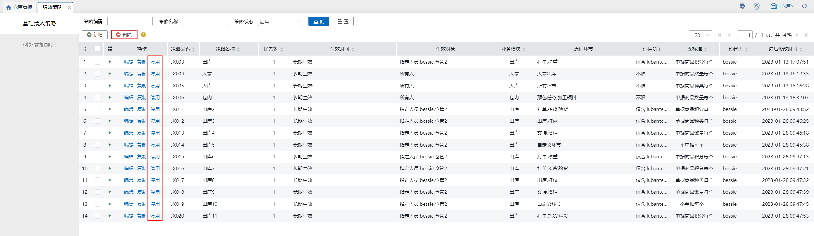
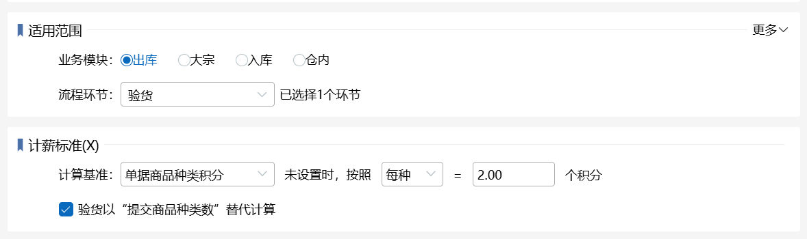
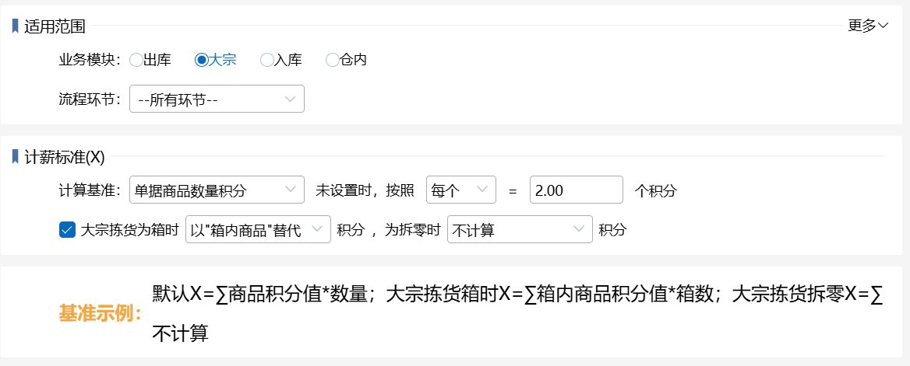
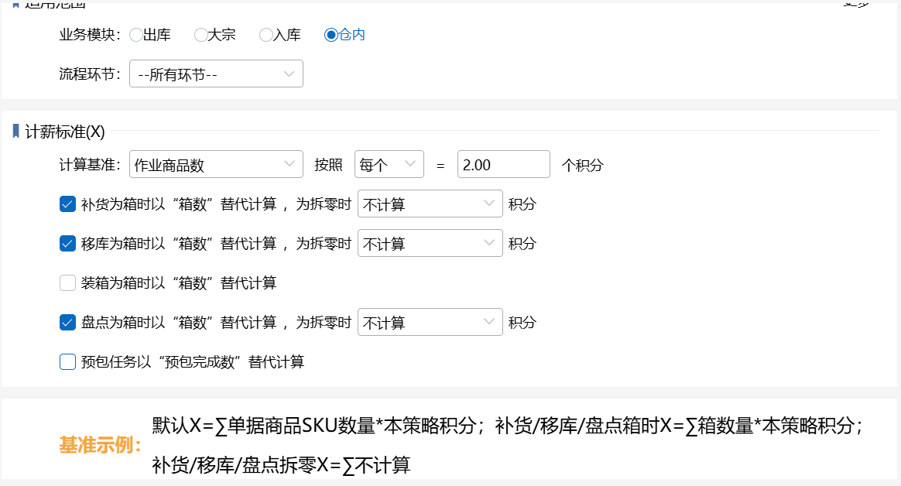
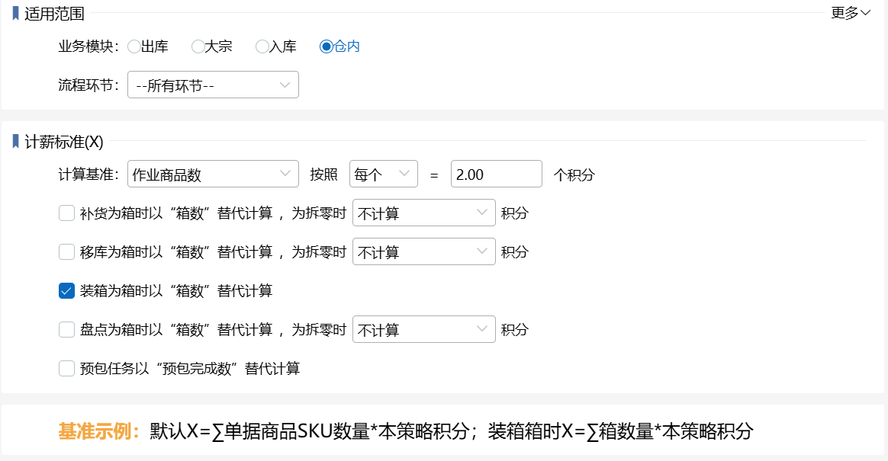
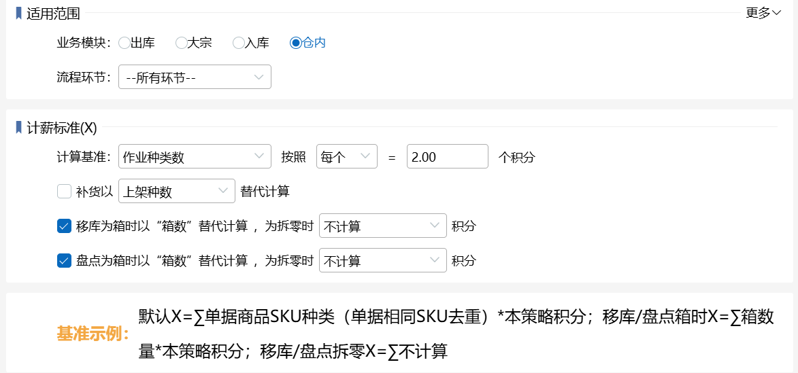
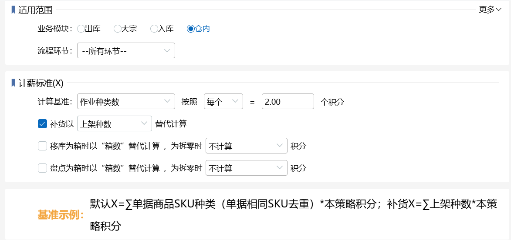
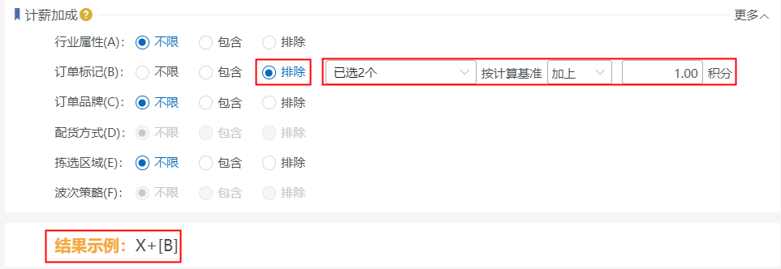

# 基础绩效策略

# 01.新增基础绩效策略
具体步骤如下：

# 02.绩效策略复制
若要建一个和已存在的策略类似的绩效策略，则可以使用复制功能，具体如下图所示：

# 03.策略停用、启用、删除
绩效策略有停用和启用，这个可以根据用户的需求进行操作：

1）停用的策略可以开启；

2）删除策略需要先勾选策略，策略删除后就不能恢复，需要重新新建。

具体操作步骤如下图：

# 04.绩效策略设置规则了解
策略分为下面四个大块：策略概要、适用范围、计薪标准、计薪加成。

## 一、策略概要

策略概要主要包括：

1.策略名称：表示绩效策略的名称，必填，不允许重复；

2.策略编码：是该策略的身份标识，可以自己输入，也可自动生成，不允许重复；

3.生效时间：默认长期生效，可设置为指定日期、每日定时，业务操作时间在指定时间范围内才会匹配到该策略。

4.生效对象：默认为所有人，可指定角色、指定人员，在指定范围内的可以匹配，否则无法匹配。

## 二、适用范围

适用范围主要包括：

1、业务模块：包括出库、大宗、入库、仓内四种，默认出库，单选。符合指定业务模块的能匹配该策略。

2、流程环节：关联业务模块，默认全选，可勾选部分，只对勾选环节的操作匹配生效。符合指定流程环节的能匹配该策略。(注：出库环节不关联业务配置主流程)

3、适用货主：默认不限，可指定包含范围或排除范围。在指定货主范围内或排除范围外的能匹配该策略。(注：此项对仓内-补货、移库、装箱、转移、预包任务环节不生效)

4、行业属性：默认不限，可指定包含范围或排除范围。单据明细包含指定行业属性或排除范围外的能匹配到该策略。订单维度的，按订单明细的行业属性匹配；拣货任务维度的，按任务明细的行业属性匹配(注：此项关联行业配置开关)

5、订单标记：默认不限，可指定包含范围或排除范围。在指定订单标记范围内或排除范围外的能匹配该策略。订单维度的，按订单上标记匹配，拣货任务维度的，按任务明细反算所属单据，再按订单标记匹配。(注：此项对入库、仓内模块不生效)

6、订单品牌：默认不限，可指定包含范围或排除范围。在指定订单品牌范围内或排除范围外的能匹配该策略。订单维度的，按订单明细品牌匹配；拣货任务维度的，按本次操作维度品牌匹配。(注：此项对入库、仓内模块不生效)

7、配货方式：默认不限，可指定包含范围或排除范围。出库模块对应零拣配货、波次配货，大宗模块对应大宗件。(注：此项对入库、仓内模块不生效)

8、拣选区域：默认不限，可指定包含范围或排除范围。在指定拣选区域内或排除范围外的能匹配该策略。订单维度的，按单据拣选库区/来源库区匹配；拣货任务维度的，按拣货任务上的拣选库区/来源库区匹配。(注：此项对入库模块、仓内模块-装箱、预包任务不生效)

9、波次策略：默认不限，可指定包含范围或排除范围。按波次订单归属波次策略匹配。(注：此项对大宗、入库、仓内模块不生效)

## 三、计薪标准(X)
匹配到此策略的单据，按设置规则计算积分，各模块对应的计算基准略有不同，通用基准具体含义可参考【[WMS-业务配置-其他配置-绩效配置](https://hupun.yuque.com/unzko7/lsbfg0/caki7lz4105n2vpg)】

个性基准具体含义如下：

### 1、出库模块
#### 1.1验货
##### 1.1.1验货以“提交商品种类数”替代计算（前提：选择单据种类数/单据商品种类积分）

计算基准选择【单据种类数】

含义：验货环节的操作使用“提交商品种类数”代替计算基准“单据种类数”进行积分计算，有按每个/按阶梯两种算法，<u>即：单次提交多笔单据验货时，把本次提交的所有单据视作整体进行SKU去重后进行积分计算</u>

**例1**：仓库1开启积分绩效，设置出库模块——单据种类数按照：每个=[2]个积分，勾选验货以“提交商品种类数”替代计算。

         仓库1下有波次A，波次内包含订单1和订单2，订单1包含sku1 2个、sku2 3个，订单2包含sku2 2个、sku3 6个。

         播种验货，提交波次A

         验货环节结算积分结果：3*2=6[即：验货提交商品种类数*默认积分]

         验货环节，作业商品种类数=2+2=4，提交商品种类数=3

**例2**：仓库1开启积分绩效，设置出库模块——单据种类数按照：阶梯 ，勾选验货以“提交商品种类数”替代计算。

         种类区间：0种-2种，首种类：1种，积分：2个，续种类：1个，续积分：1个；

         种类区间：2种-无穷多种，首种类：3种，积分：3个，续种类：1种，续积分：2个； 

         仓库1下有波次A，波次内包含订单1和订单2，订单1包含sku1 2个、sku2 3个，订单2包含sku2 2个、sku3 6个 sku4 5个

         提交波次A

         验货环节计算积分结果：3+2=5   [即：波次A种类数4种，落到第二区间，首种类3个，积分3个，续种类1种，续积分2个]

计算基准选择【单据种类数积分】

同样按照单据种类数替代计算的逻辑，不同的是，按照单据种类数*商品配置的验货环节积分（未配置时取策略上的默认积分）

**例1**：仓库1开启积分绩效，设置出库模块——单据商品种类积分未设置时，按照每种=[2]个积分，勾选验货以“提交商品种类数”替代计算。

         仓库1下有波次A，波次内包含订单1和订单2，订单1包含sku1 2个、sku2 3个，订单2包含sku2 2个、sku3 6个。（sku1配置验货绩效积分=3；sku2配置验货绩效积分=4；sku3没配置）

         播种验货，提交波次A

         验货环节结算积分结果：3+4+2=9

#### 1.2拣货
##### 1.2.1拣货为箱时【以"箱内商品"替代/不计算】积分，为拆零时【不计算/按策略计算】积分（前提：选择单据商品数量积分）
下拉项可自定选择配置，但是不能同时选择“不计算”

（1）**拣货为箱时【以"箱内商品"替代】积分，为拆零时【不计算】积分**

含义：拣货时，订单内锁定箱库存的明细，以箱内商品数量进行积分计算，拆零库存则不计算积分

例1：仓库1开启积分绩效，设置出库模块——单据商品数积分未设置时，按照每个=[2]个积分。

订单内包含：商品A*13（锁定箱A（一箱=4件）*3，拆零库存*1）、商品B*5

拣货环节结算积分结果：4*3*2=24

（2）**拣货为箱时【以"箱内商品"替代】积分，为拆零时【按策略计算】积分**

含义：拣货时，订单内锁定箱库存的明细，以箱内商品数量进行积分计算，拆零按照策略中计算基准计算积分

例1：仓库1开启积分绩效，设置出库模块——单据商品数积分未设置时，按照每个=[2]个积分。

订单内包含：商品A*13（锁定箱A（一箱=4件）*3，拆零库存*1）、商品B*5

拣货环节结算积分结果：4*3*2+1*2+5*2=36

（3）**拣货为箱时【不计算】积分，为拆零时【按策略计算】积分**

含义：拣货时，订单内锁定箱库存的明细，锁定箱库存的明细不计算积分，，拆零库存则按照策略中计算基准计算积分

例1：仓库1开启积分绩效，设置出库模块——单据商品数积分未设置时，按照每个=[2]个积分。

订单内包含：商品A*13（锁定箱A（一箱=4件）*3，拆零库存*1）、商品B*5

拣货环节结算积分结果：1*2+5*2=12

##### 1.2.2拣货为箱时【以"箱内商品"替代/以“拣货种类库位数”替代/不计算】积分，为拆零时【以“拣货种类库位数”替代/不计算/按策略计算】积分（前提：选择单据商品种类积分）
下拉项可自定选择配置，但是不能同时选择“不计算”

（1）**拣货为箱时【以"箱内商品"替代】积分，为拆零时【不计算】积分**

含义：拣货时，订单内锁定箱库存的明细，以箱内商品种类（箱内相同SKU去重）进行积分计算，拆零库存则不计算积分

例1：仓库1开启积分绩效，设置出库模块——单据商品数积分未设置时，按照每个=[2]个积分。

订单内包含：商品A*13（锁定箱A（一箱=4件）*3，拆零库存*1）、商品B*5

拣货环节结算积分结果：1*2=2

（2）**拣货为箱时【以"箱内商品"替代】积分，为拆零时【按策略计算】积分**

含义：拣货时，订单内锁定箱库存的明细，以箱内商品种类（箱内相同SKU去重）进行积分计算，拆零按照策略中计算基准计算积分

例1：仓库1开启积分绩效，设置出库模块——单据商品数积分未设置时，按照每个=[2]个积分。

订单内包含：商品A*13（锁定箱A（一箱=4件）*3，拆零库存*1）、商品B*5

拣货环节结算积分结果：1*2+1*2+1*2=6

（3）**拣货为箱时【以"箱内商品"替代】积分，为拆零时【以"拣货种类库位数"替代】积分**

含义：拣货时，订单内锁定箱库存的明细，以箱内商品种类（箱内相同SKU去重）进行积分计算，拆零按照sku+库位维度去重计算积分

例1：仓库1开启积分绩效，设置出库模块——单据商品数积分未设置时，按照每个=[2]个积分。

订单内包含：商品A*13（锁定箱A（一箱=4件）*3，拆零库存*1（A库位*1））、商品B*5（A库位*2、B库位*3）

拣货环节结算积分结果：1*2+1*2+1*2+1*2=8

（4）**拣货为箱时【不计算】积分，为拆零时【按策略计算】积分**

含义：拣货时，订单内锁定箱库存的明细，锁定箱库存的明细不计算积分，拆零库存则按照策略中计算基准计算积分

例1：仓库1开启积分绩效，设置出库模块——单据商品数积分未设置时，按照每个=[2]个积分。

订单内包含：商品A*13（锁定箱A（一箱=4件）*3，拆零库存*1）、商品B*5

拣货环节结算积分结果：1*2+1*2=4

（5）**拣货为箱时【不计算】积分，为拆零时【以"拣货种类库位数"替代】积分**

含义：拣货时，订单内锁定箱库存的明细，锁定箱库存的明细不计算积分，拆零按照sku+库位维度去重计算积分

例1：仓库1开启积分绩效，设置出库模块——单据商品数积分未设置时，按照每个=[2]个积分。

订单内包含：商品A*13（锁定箱A（一箱=4件）*3，拆零库存*1（A库位*1））、商品B*5（A库位*2、B库位*3）

拣货环节结算积分结果：1*2+1*2+1*2=6

（6）**拣货为箱时【以"拣货种类库位数"替代】积分，为拆零时【不计算】积分**

含义：拣货时，订单内锁定箱库存的明细，以箱内商品种类（箱内相同SKU+库位去重）进行积分计算，拆零库存则不计算积分

例1：仓库1开启积分绩效，设置出库模块——单据商品数积分未设置时，按照每个=[2]个积分。

订单内包含：商品A*13（锁定箱A（一箱=4件）*3（A库位*1、B库位*2），拆零库存*1（A库位*1））、商品B*5

拣货环节结算积分结果：1*2+1*2=4

（7）**拣货为箱时【以"拣货种类库位数"替代】积分，为拆零时【按策略计算】积分**

含义：拣货时，订单内锁定箱库存的明细，以箱内商品种类（箱内相同SKU+库位去重）进行积分计算，拆零按照策略中计算基准计算积分

例1：仓库1开启积分绩效，设置出库模块——单据商品数积分未设置时，按照每个=[2]个积分。

订单内包含：商品A*13（锁定箱A（一箱=4件）*3（A库位*1、B库位*2），拆零库存*1（A库位*1））、商品B*5

拣货环节结算积分结果：1*2+1*2+1*2+1*2=8

（8）**拣货为箱时【以"拣货种类库位数"替代】积分，为拆零时【以"拣货种类库位数"替代】积分**

含义：拣货时，订单内锁定箱库存的明细，以箱内商品种类（箱内相同SKU+库位去重）进行积分计算，拆零按照sku+库位维度去重计算积分

例1：仓库1开启积分绩效，设置出库模块——单据商品数积分未设置时，按照每个=[2]个积分。

订单内包含：商品A*13（锁定箱A（一箱=4件）*3（A库位*1、B库位*2），拆零库存*1（A库位*1））、商品B*5（A库位*2、B库位*3）

拣货环节结算积分结果：1*2+1*2+1*2+1*2+1*2=10

##### 1.2.3拣货为箱时【以"箱数"替代/不计算】积分，为拆零时【不计算/按策略计算】积分（前提：选择单据商品数）

（1）**拣货为箱时【以"箱数"替代】积分，为拆零时【不计算】积分**

含义：拣货时，订单内锁定箱库存的明细，以箱数量进行积分计算，拆零库存则不计算积分

例1：仓库1开启积分绩效，设置出库模块——单据商品数积分未设置时，按照每个=[2]个积分。

订单内包含：商品A*13（锁定箱A（一箱=4件）*3，拆零库存*1）、商品B*5

拣货环节结算积分结果：3*2=6

（2）**拣货为箱时【以"箱数"替代】积分，为拆零时【按策略计算】积分**

含义：拣货时，订单内锁定箱库存的明细，以箱数量进行积分计算，拆零按照策略中计算基准计算积分

例1：仓库1开启积分绩效，设置出库模块——单据商品数积分未设置时，按照每个=[2]个积分。

订单内包含：商品A*13（锁定箱A（一箱=4件）*3，拆零库存*1）、商品B*5

拣货环节结算积分结果：3*2+1*2+5*2=24

（3）**拣货为箱时【不计算】积分，为拆零时【按策略计算】积分**

含义：拣货时，订单内锁定箱库存的明细，锁定箱库存的明细不计算积分，，拆零库存则按照策略中计算基准计算积分

例1：仓库1开启积分绩效，设置出库模块——单据商品数积分未设置时，按照每个=[2]个积分。

订单内包含：商品A*13（锁定箱A（一箱=4件）*3，拆零库存*1）、商品B*5

拣货环节结算积分结果：1*2+5*2=12

##### 1.2.4拣货为箱时【以"箱数"替代/不计算】积分，为拆零时【不计算/按策略计算】积分（前提：选择单据种类数）

（1）**拣货为箱时【以"箱数"替代】积分，为拆零时【不计算】积分**

含义：拣货时，订单内锁定箱库存的明细，以箱数量进行积分计算，拆零库存则不计算积分

例1：仓库1开启积分绩效，设置出库模块——单据商品数积分未设置时，按照每个=[2]个积分。

订单内包含：商品A*13（锁定箱A（一箱=4件）*3，拆零库存*1）、商品B*5

拣货环节结算积分结果：3*2=6

（2）**拣货为箱时【以"箱数"替代】积分，为拆零时【按策略计算】积分**

含义：拣货时，订单内锁定箱库存的明细，以箱数量进行积分计算，拆零按照策略中计算基准计算积分

例1：仓库1开启积分绩效，设置出库模块——单据商品数积分未设置时，按照每个=[2]个积分。

订单内包含：商品A*13（锁定箱A（一箱=4件）*3，拆零库存*1）、商品B*5

拣货环节结算积分结果：3*2+1*2+5*2=24

（3）**拣货为箱时【不计算】积分，为拆零时【按策略计算】积分**

含义：拣货时，订单内锁定箱库存的明细，锁定箱库存的明细不计算积分，，拆零库存则按照策略中计算基准计算积分

例1：仓库1开启积分绩效，设置出库模块——单据商品数积分未设置时，按照每个=[2]个积分。

订单内包含：商品A*13（锁定箱A（一箱=4件）*3，拆零库存*1）、商品B*5

拣货环节结算积分结果：1*2+5*2=12

### 2、大宗模块
#### 2.1大宗拣货
##### 2.1.1.大宗拣货为箱时【以"箱内商品"替代/不计算】积分，为拆零时【不计算/按策略计算】积分（前提：选择单据商品数量积分）
含义和计算逻辑和【出库-拣货-1.2.1】一致。

##### 2.1.2大宗拣货为箱时【以"箱内商品"替代/以“拣货种类库位数”替代/不计算】积分，为拆零时【以“拣货种类库位数”替代/不计算/按策略计算】积分（前提：选择单据商品种类积分）
含义和计算逻辑和【出库-拣货-1.2.2】一致。

##### 2.1.3拣货为箱时【以"箱数"替代/不计算】积分，为拆零时【不计算/按策略计算】积分（前提：选择单据商品数）
含义和计算逻辑和【出库-拣货-1.2.3】一致。

##### 2.1.4拣货为箱时【以"箱数"替代/不计算】积分，为拆零时【不计算/按策略计算】积分（前提：选择单据种类数）
含义和计算逻辑和【出库-拣货-1.2.4】一致。

#### 2.2大宗装箱
##### 2.2.1大宗装箱以“箱数”替代计算（前提：选择单据商品数）

含义：大宗装箱时，订单拆分装箱时，以装箱数量进行积分计算

例1：仓库1开启积分绩效，设置大宗模块——单据商品数未设置时，按照每个=[2]个积分。

订单内包含：商品A*13、商品B*5

大宗装箱时：箱1：商品A*3+商品B*2；箱2：商品*4+商品B*1；箱3：商品A*6+商品B*2

大宗装箱环节结算积分结果：3*2=6

### 3、仓内模块
#### (1)补货/移库/盘点为箱时以“箱数”替代计算，为拆零时【不计算/按策略计算】积分（前提：作业商品数）
含义：仓内补货/移库/盘点环节的操作区分箱库存和拆零库存，箱库存使用“箱数”代替计算基准“作业商品数”进行积分计算，拆零库存可以选择不计算/按策略计算积分，有按每个/按阶梯两种算法。

例1：仓库1开启积分绩效，设置仓内模块——作业商品数按照：每个=[2]个积分，勾选补货/移库/盘点为箱时以“箱数”替代计算，为拆零时【不计算】积分。

case数据：箱A包含：商品A*3+商品B*2、箱B包含：商品B*2+商品C*1、箱C包含：商品C*5

仓库1下的补货单/移库单/盘点单A内商品明细：箱A*2+箱B*3+箱C*1+商品A*2+商品C*1

补货/移库/盘点环节结算积分结果：2*2+3*2+1*2+0+0=12[即：提交箱数*默认积分]

例2：仓库1开启积分绩效，设置仓内模块——作业商品数按照：每个=[2]个积分，勾选补货/移库/盘点为箱时以“箱数”替代计算，为拆零时【按策略计算】积分。

case数据：箱A包含：商品A*3+商品B*2、箱B包含：商品B*2+商品C*1、箱C包含：商品C*5

仓库1下的补货单/移库单/盘点单A内商品明细：箱A*2+箱B*3+箱C*1+商品A*2+商品C*1

补货/移库/盘点环节结算积分结果：2*2+3*2+1*2+2*2+1*2=18[即：（提交箱数+拆零数量）*默认积分]

#### (2)装箱为箱时以“箱数”替代计算（前提：作业商品数）

含义：仓内装箱环节的操作，箱库存使用“箱数”代替计算基准“作业商品数”进行积分计算，有按每个/按阶梯两种算法。

例1：仓库1开启积分绩效，设置仓内模块——作业商品数按照：每个=[2]个积分，勾选装箱为箱时以“箱数”替代计算。

case数据：箱A包含：商品A*3+商品B*2

仓库1下的装箱订单A内商品明细：箱A*2

装箱环节结算积分结果：2*2=4[即：装箱数量*默认积分]

例2：仓库1开启积分绩效，设置仓内模块——作业商品数按照：每个=[2]个积分，不勾选装箱为箱时以“箱数”替代计算。

case数据：箱A包含：商品A*3+商品B*2

仓库1下的装箱订单A内商品明细：箱A*2

装箱环节结算积分结果：（3+2）*2*2=20[即：箱内商品数量总和*箱数*默认积分]

#### (3)预包任务以“预包完成数”替代计算（前提：作业商品数）

含义：预包任务环节的操作使用“预包完成数”代替计算基准进行积分计算。

例1：仓库1开启积分绩效，设置仓内模块——作业商品数按照：每个=3积分，预包任务以“预包完成数”替代计算。

         预包任务1计划预包数量=10，完成数量=7。

         预包任务计算积分结果：7*3   [即：预包完成数*默认积分]

#### (4)移库/盘点为箱时以“箱数”替代计算，为拆零时【不计算/按策略计算】积分（前提：选择作业种类数）

含义：仓内移库/盘点环节的操作区分箱库存和拆零库存，箱库存使用“箱数”代替计算基准“作业商品数”进行积分计算，拆零库存可以选择不计算/按策略计算积分，有按每个/按阶梯两种算法。

例1：仓库1开启积分绩效，设置仓内模块——作业种类数按照：每个=[2]个积分，勾选移库/盘点为箱时以“箱数”替代计算，为拆零时【不计算】积分。

case数据：箱A包含：商品A*3+商品B*2、箱B包含：商品B*2+商品C*1、箱C包含：商品C*5

仓库1下的移库单/盘点单A内商品明细：箱A*2+箱B*3+箱C*1+商品A*2+商品C*1

移库/盘点环节结算积分结果：（2+3+1+0+0）*2=12[即：提交箱数*默认积分]

例2：仓库1开启积分绩效，设置仓内模块——作业种类数按照：每个=[2]个积分，勾选移库/盘点为箱时以“箱数”替代计算，为拆零时【按策略计算】积分。

case数据：箱A包含：商品A*3+商品B*2、箱B包含：商品B*2+商品C*1、箱C包含：商品C*5

仓库1下的移库单/盘点单A内商品明细：箱A*2+箱B*3+箱C*1+商品A*2+商品C*1

移库/盘点环节结算积分结果：（2+3+1+1+1）*2=16[即：（补货提交箱数+拆零商品种类数）*默认积分]

#### (5)补货以“上架数/下架数”替代计算（前提：选择作业种类数）

含义：补货环节的操作使用“上架数/下架数”代替计算基准“作业种类数”进行积分计算。

例1：仓库1开启积分绩效，设置仓内模块——作业种类数按照：每个=3积分，补货以“上架数/下架数”替代计算。

         补货任务1部分补货，完成情况：明细sku1 来源库位1 目标库位2 计划数量4 已补数量2，明细sku2 来源库位1 目标库位2 计划数量4 已补数量2，

         明细sku2 来源库位1 目标库位3 计划数量4 已补数量2，明细sku3 来源库位1 目标库位1 计划数量4 已补数量2。上架种数=4，下架种数=3。

         补货以“上架数”计算积分结果：4*3=12   [即：上架种数*默认积分] 

         补货以“下架数”计算积分结果：3*3=9   [即：下架种数*默认积分] 

另注：打包装箱，作废箱后，会扣除绩效及其他字段的数据。

##### 

#### **四、计薪加成**
计薪加成是在计薪标准计算基础上的附加数据，若单据符合某一项或多项设置，则按配置计算该项加成，若不符合，则跳至下一项，有多项符合时累加计算。

1.行业属性(A)：默认不限，可指定包含范围或排除范围。单据明细包含指定行业属性或排除范围外的符合该条件，可根据设置计算积分。

选择“不限”时，不计算加成，结果示例如上图。

选择“包含”时，单据明细包含其中一项即可按计算基准计算加成，结果示例如上图。

选择“排除”时，单据明细需排除所有勾选项可按计算基准计算加成，结果示例如上图。

  2.订单标记(B)：默认不限，可指定包含范围或排除范围。在指定订单标记范围内或排除范围外的符合该条件，可根据设置计算积分。

选择“包含”时，订单标记包含其中一项即可按计算基准计算加成，结果示例如上图。

选择“排除”时，订单标记需排除所有勾选项可按计算基准计算加成，结果示例如上图。

  3.订单品牌(C)：默认不限，可指定包含范围或排除范围。在指定订单品牌范围内或排除范围外的符合该条件，可根据设置计算积分。计算方式同上述一致。

  4.配货方式(D)：默认不限，可指定包含范围或排除范围。出库模块对应零拣配货、波次配货，大宗模块对应大宗件。计算方式同上述一致。

  5.拣选区域(E)：默认不限，可指定包含范围或排除范围。在指定拣选区域内或排除范围外的符合该条件，可根据设置计算积分。计算方式同上述一致。

  6.波次策略(F)：默认不限，可指定包含范围或排除范围。按波次订单归属波次策略匹配的符合该条件，可根据设置计算积分。计算方式同上述一致。

> 更新: 2026-03-26 15:05:48  
> 原文: <https://hupun.yuque.com/unzko7/lsbfg0/dx7fs2lnqq24mnz1>