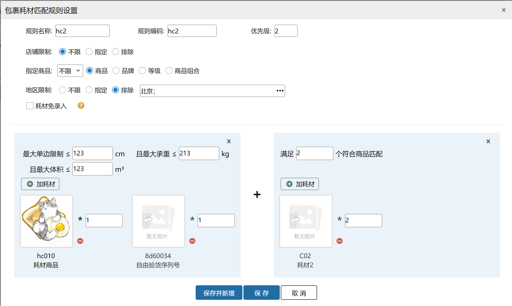
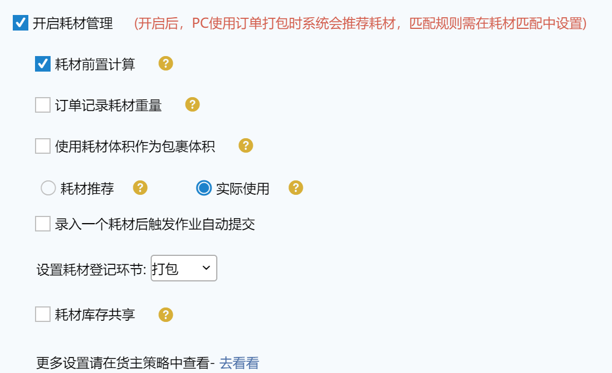

# 耗材匹配

这个页面功能主要是设置订单中商品匹配多少耗材的规则。匹配规则 : 规则仅针对本仓，每个耗材类别最多匹配生效一个具体规则，有重复规则的按优先级高的（数字小的优先级更高）、规则编码小的优先生效。智能规则优先级为0级时，优先级最高。

注意：业务配置开启了耗材管理才会出现该页面。

耗材规则类别分为按包裹和按商品。最多设置五个类别，每个类别下面最多2000个规则，不同规则之间的名称+编码不能相同。

### 01.耗材类别为包裹
包裹匹配 : 常规的包材如快递袋、纸箱、充气垫等填充物，可按包裹匹配。

有两种类型：按业务规则、按智能规则

#### （1）业务规则：根据规则中设置的各条件匹配包裹及耗材
1. 规则名称：可不填，最多16个字符，不填按规则编码填充。

2. 规则编码：可不填，不填自动生成。

3. 优先级：优先级越小，优先级越高，类别下先根据优先级匹配规则。

4. 货主：若设置了指定货主，只有指定货主的包裹才会匹配这个规则；排除同理。

5. 店铺：若设置了指定店铺，只有指定店铺的包裹才会匹配这个规则；排除同理。

6. 耗材：设置匹配这个规则将会推荐的耗材。可选范围为商品类型为耗材的商品。

7.商品、等级、品牌、商品组合：若设置了包含，含有该商品/品牌/等级/商品组合的包裹会匹配此规则；设置了仅含，仅有该商品/品牌/等级/商品组合的包裹会匹配此规则；设置了排除，除去此商品/品牌/等级的包裹会匹配此规则。

例：规则设置包含商品A、B，包裹中有商品A、B、C，可匹配此规则。

规则设置仅含等级a，包裹中商品都为等级a，可匹配此规则；包裹中商品等级为a、b，不匹配此规则。

规则设置排除品牌1，包裹中商品都不是品牌1，可匹配此规则；包裹商品品牌为1、2，不匹配此规则。

规则设置仅含商品组合A*1、B*2，包裹中有商品A*1、B*2，可匹配此规则；包裹中有商品A*2、B*2，不匹配此规则；

规则设置包含商品组合A*1、B*2，包裹中有商品A*2、B*2，可匹配此规则；包裹中有商品A*2、B*2、C*1，可匹配此规则；包裹中有商品A*2、C*2，不匹配此规则；包裹中有商品A*2，不匹配此规则。

注：商品组合中最多允许添加10种规格的商品。

8. 最大单边填写数值后：

a.最大单边tab内设置多个耗材，订单中所有商品边长比较，取Max，Max<=最大单边，则符合匹配

b.最大单边tab内仅设置1个耗材，订单中商品三边<=耗材三边，所有商品逐一比对，若所有商品都符合则匹配，否则不匹配。

9. 最大承重：订单总重量和匹配到耗材商品的总重量和去和最大承重对比，若超过最大承重，该订单不匹配。

10. 最大体积：订单总体积和匹配到耗材商品的总体积和去和最大体积对比，若超过最大体积，该订单不匹配这个规则的耗材。

注意：按包裹设置的耗材规则，业务场景适用于对整个包裹打包需要使用的耗材，例如：一个包裹需要一个打包袋，五个防震泡沫。

11.按指定商品匹配：订单满足规则的商品数量除以规则中指定商品的数量，得到应匹配耗材的数量（不能整除时取整）。

例：规则设置仅含商品A、B，订单满足2个符合商品匹配耗材a数量1个，包裹中A-3个，B-2个，则匹配耗材a数量2个。

注意：按包裹设置的耗材规则，业务场景适用与对整个包裹打包需要使用的耗材，例如：一个包裹需要一个打包袋，五个防震泡沫。

例：

商品sku1 品牌：A 等级:A 重量：1kg 最长边：200cm 体积：1立方米

商品sku2 品牌：B 等级:B 重量：0.5kg 最长边：150cm 体积：0.03立方米

商品sku3 品牌：A 等级:A 重量：0.8kg 最长边：100cm 体积：0.15立方米

耗材HCN01 重量：0.1kg 最长边：200cm 体积：0.1立方米

耗材HCN02 重量：0.2kg 最长边：150cm 体积：0.3立方米

按包裹规则设置-排除品牌B，最大单边<=200cm，且最大承重<=5kg，且最大体积<=4立方米 耗材是HCN01；订单满足3个指定商品匹配HCN02:1个

订单1-sku1:2个 sku2:1个，订单未匹配耗材

订单2-sku1 1个 sku3:2个，sku1和sku3品牌均为A；

最大单边200=200，最大承重1×1+2×0.8+0.1=2.7kg<5kg，最大体积1×1+2×0.15+0.1=1.4立方米<4立方米；订单商品数量3=指定商品数量3，则订单匹配耗材HCN01:1个 HCN02:1个

订单原重量2.6Kg，加入耗材重量后订单重量2.9Kg。

注：耗材最多支持添加5种类型。

#### （2）智能规则：按照历史订单使用耗材及规则条件智能匹配耗材数据
1. 规则名称：可不填，最多16个字符，不填按规则编码填充。

2. 规则编码：可不填，不填自动生成。

3. 优先级：默认为0，可修改。

4.计算偏好：统计在数据累计时间范围内出库的、具有相同明细的订单耗材使用情况

    使用次数最多：按照使用次数最多的耗材数据进行推荐

    耗材成本最低：按照耗材参考进价计算结果最低的耗材数据进行推荐

5. 货主：若设置了指定货主，只有指定货主的包裹才会匹配这个规则；排除同理。

6. 店铺：若设置了指定店铺，只有指定店铺的包裹才会匹配这个规则；排除同理。

7. 地区：若设置了指定地区，只有收件地址为指定地区的包裹才会匹配这个规则；排除同理。支持手动选择和导入两种方式。

8.耗材免录入：当业务配置-耗材管理-开启实际使用时，订单匹配到该规则后，在对应操作页面登记环节将自动填入推荐耗材，可以手动录入其他耗材。

##### ①新增智能规则
智能规则设置保存成功后，默认数据累计时间为0，系统会在次日凌晨自动执行批处理，根据近7天内出库的订单根据计算模型统计耗材数据，执行成功后，数据累计时间显示7天，并在后续每一天都+1天，计算模型里新增最近1天出库订单数据；上限为365天，最多只根据最近365天的出库订单统计数据。

注：若已有包裹类别下存在智能规则，则不允许再新增包裹分类；同一个包裹分类下可新增多条智能规则。

##### ②重算
点击重算，系统会在次日凌晨按照最近7天内出库订单重新计算耗材数据，若当前智能推荐耗材不是用户所需的，可进行重算操作

##### ③编辑
修改规则后，不影响计算模型中已有的数据，后续新订单会按照修改后的规则进行累计计算，因此不推荐对规则进行大改，否则智能推荐结果可能会存在较大偏差。

若修改计算偏好，从“使用次数最多”改成“耗材成本最低”会实时生效，反之需要等次日批处理执行后生效。

##### ④删除
删除智能规则后，当前规则不再生效。

### 02.耗材类别为商品
商品匹配 : 某些易碎、液体等特殊商品，需要针对单个商品如充气柱、气泡膜等特殊包材，可按商品匹配。规则设置后，订单内全部商品都在指定商品范围内才会匹配该规则。

1.规则名称：可不填，最多16个字符，不填按规则编码填充。

2.规则编码：可不填，不填自动生成。

3.优先级：优先级越小，优先级越高，类别下先根据优先级匹配规则。

4.货主：若设置了指定货主，只有指定货主的包裹才会匹配这个规则；排除同理。

5.店铺：若设置了指定店铺，只有指定店铺的包裹才会匹配这个规则；排除同理。

6.商品：若设置指定的商品，订单只要包含一个指定商品，就会匹配该规则。最多设置20个sku。

7.品牌：若设置指定的品牌，订单是属于指定品牌的才会匹配该规则。

8.等级：若设置指定的等级，订单内商品是属于指定等级的才会匹配该规则。

9.耗材：设置匹配这个规则将会推荐的耗材。可选范围为商品类型为耗材的商品。

10.条件：n个商品匹配m个耗材。

例子：一个商品匹配3个耗材，订单2个商品，最终推荐6个耗材（可被整除）。3个商品匹配5个耗材，订单7个商品，最终推荐10个耗材（余数不匹配）。注意：仅指定商品会匹配规则。

11、耗材免录入

当业务配置-耗材管理-开启实际使用时，订单匹配到该规则后，在对应操作页面登记环节将自动填入推荐耗材，可以手动录入其他耗材。

12、仅匹配此数量

开启时，订单中商品规格和数量需要精准匹配此规则中所设置的商品及符合商品数量，才能够匹配到此规则，未开启时无此限制。

例：耗材规则中设置指定商品00023，满足1个符合商品匹配hc011*3，勾选“仅匹配此数量”

订单1 明细00023*1，则能匹配到此规则，耗材hc011*3，

订单2 明细00023*2，则不能匹配到此规则。

### 03.耗材匹配节点
前提：业务配置-开启订单记录耗材重量

开启耗材前置计算时，订单落单时/打到零拣时/匹配波次时/从大宗出库打到待分配时，订单匹配耗材且重新计算订单重量和快递成本，未开启耗材前置计算时，订单在PC和PDA指定耗材登记环节（包括验货/打包/称重）后订单匹配耗材且重新计算订单重量和快递成本。

 

> 更新: 2026-08-19 16:04:41  
> 原文: <https://hupun.yuque.com/unzko7/lsbfg0/yurh68zhhre7aa0v>