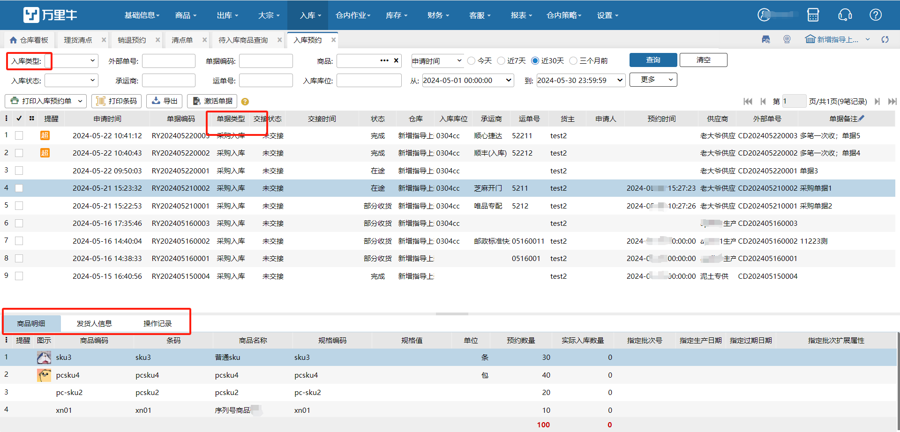
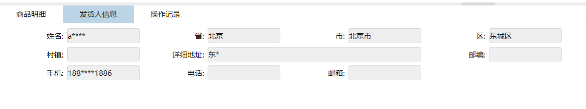

# 入库预约

ERP发起采购计划，将采购单推送至WMS，在WMS中就会生成一笔入库预约单。

入库预约页面默认显示申请时间是近7天的采购单据，支持打印入库预约单以及商品条码。

入库预约单包括三种类型：采购入库，调拨入库和其他入库，具体页面如下：

 

**提示**

1.查询条件中的入库类型对应单据类型中的类型，包括：采购入库，调拨入库和其他入库，若选择“空白”则表示三个类型的单据都要查询。

2.该笔入库预约单的商品明细和具体的操作记录都会在这个页面显示，但是实际入库的操作分别要在【入库】-【采购入库】和【其他入库】进行。

3.发货人信息，可查看预约单供应商相关数据。

4.运单号支持批量查询多笔单据，支持空格、逗号分隔。（入库模块运单号都支持）

5.打印预约单后，单据行显示打印标记及打印次数。

**其中：**入库状态分为4个类型：

1）在途：表示入库预约单已经建立，但是仓库还没有实际入库；

2）部分收货：表示仓库只有部分入库，还有一些因为某些原因还没有入库；

3）收货完成：表示仓库已经全部入库完成；

4）关闭：表示单据已部分入库或还未入库，就被ERP通知关闭掉了。

 

> 更新: 2025-04-10 11:03:57  
> 原文: <https://hupun.yuque.com/unzko7/lsbfg0/kgpu0nlyknmikubh>