# 其他入库单

入库预约中有存在调拨入库预约单或其他入库预约单后就可以在该页面进行入库操作。

### 1. 调拨入库
1.当发起调拨入库请求后，就可以在该页面进行调拨入库，实际入库页面如下：

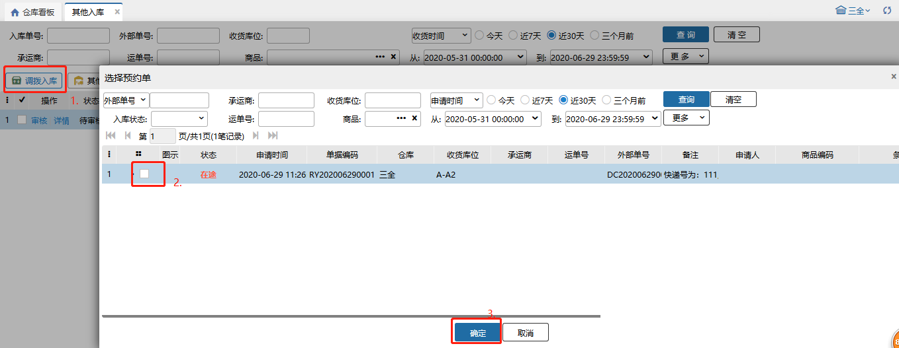

点确定之后进入下图这个页面：

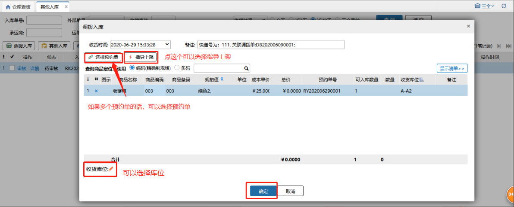

2. 有修改入库成本权限的操作员，选择预约单后，可以修改商品的成本单价。                        

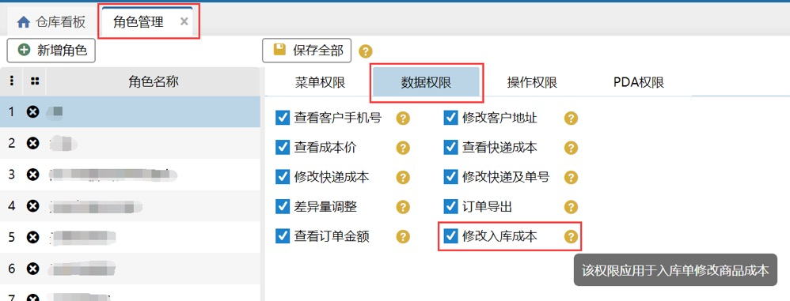

3. 生产批次导入时，若导入的生产批次号在系统中存在，生产日期、过期日期允许不填，导入批次后取系统中的生产日期、过期日期；若导入的生产批次号在系统中不存在，生产日期、过期日期必填。

例：生产批次商品A，在系统中有批次20200106：生产日期：2020-01-06，过期日期：2022-01-06

预约单01，明细：生产批次商品A，可入库数量100；

1）导入生产批次，批次号：20200106，生产日期、过期日期为空，能正常导入，导入后，批次：20200106，生产日期：2020-01-06，过期日期：2022-01-06。

2）导入生产批次，批次号：20200106，生产日期：2020-01-01,过期日期：2020-012-31，能正常导入，导入后，批次：20200106，生产日期：2020-01-06，过期日期：2022-01-06。

3）导入生产批次，批次号：20200107，生产日期、过期日期为空，导入失败，生产日期、过期日期不能为空。                  

同一预约单内生产批次商品有两条一样的商品明细，生产批次导入时，会根据可入库数量填充。其中：

**相同库位**情况下：                  

1.超收/不超收，先填充第一行，填充满后填充第二行。                    

**不同库位**下：                   

1.不超收，按照库位明细填充。

2.超收，先填充第一行，超收的部分填充到第二行，另外一个库位的直接过滤不填充。

例1：预约单01，明细1：生产批次商品A 可入库数量5；明细2：商品A 可入库数量5。

导入生产批次：商品A  批次p1 数量6 库位A1；商品A 批次p2 数量4 库位A1；                  

导入后，明细1：批次p1，数量5，库位A1；明细2：批次p1，数量1，批次p2，数量4，库位A1 

例2：预约单01，明细1：生产批次商品A 可入库数量5；明细2：商品A 可入库数量5。

导入生产批次：商品A  批次p1 数量6 库位A1；商品A 批次p2 数量4 库位A2；

导入后，明细1：批次p1，数量5，库位A1；明细2：批次p1，数量1，库位A1；

同一预约单内生产批次商品有两条一样的商品明细，序列号导入时，会根据可入库数量填充。

例3：预约单01，明细1：序列号商品B 可入库数量5；明细2：商品B 可入库数量5。

序列号导入：商品B 序列号：x01、x02、x03、x04、x05、x06、x07、x08、x09、x10

导入后：明细1：商品B 数量5，序列号：x01、x02、x03、x04、x05

明细2：商品B 数量5，序列号：x06、x07、x08、x09、x10

3.开启次品管理开关后，调拨入库页面商品名称前新增库存属性列，功能栏新增添加次品按钮，点击按钮跳转选择商品规格页面，勾选商品并确定后，添加次品入库，具体操作如下图：

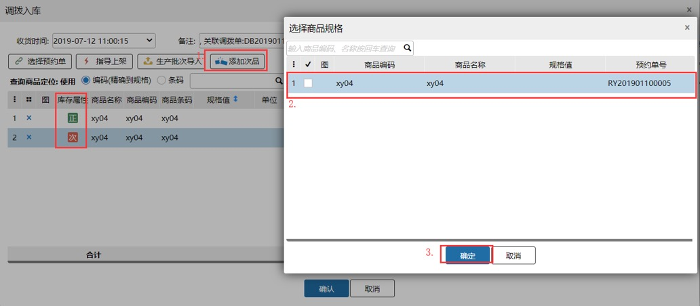

注意：

1. 可添加的次品为调拨入库页面展示的商品；

2. 选择多个预约单时，添加的次品明细关联所选择的预约单；

3. 正品的收货库位过滤次品库位，次品收货库位无限制；

4. 序列号商品已支持添加次品入库，添加次品时，选择序列号商品，录入序列号入库后，序列号根据库存属性区分；

5.商品开启入库批次管理，添加次品入库后，入库批次号为空；

同sku正品、次品不能同时存放同一库位，案例如下：

前提：空拣选库位A、拣选库位B有商品a的正品库存、拣选库位C有商品a的次品库存、次品库位D

①商品a 正品选择库位A，次品选择库位A报错：所选的目标库位不能同时存放同一个商品的正次商品；

②商品a 正品选择时，查询库位D结果为空，选择库位C，保存报错：目标库位上有同商品的不同属性库存；

③商品a 次品选择库位B，保存报错：目标库位上有同商品的不同属性库存；

④商品a 正品选择库位B，次品选择库位C，保存入库成功；

⑤序列号商品b添加次品入库，次品无序列号。

若上次入库操作（包括采购入库、销退入库、其他入库、销退扫描入库、收货入库）次品所选收货库位都为同一库位，调拨入库再次添加次品时，次品收货库位会自动带出上次入库的次品选择的收货库位。

次品入库回传：

1）业务配置选择次品库存管理全部对内模式，入库后次品数量回传ERP；

2）业务配置选择次品库存管理全部半对外模式，入库后次品数量不回传ERP。

**开启入库支持使用容器：**入库时扫描容器编码，支持货品入到容器里。

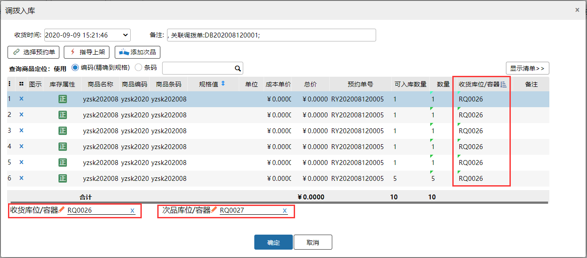

### 2. 其他入库
1.实际入库页面如下：

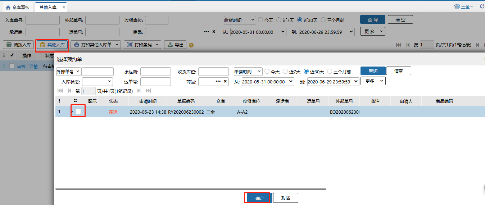

点确定之后进入下图这个页面：

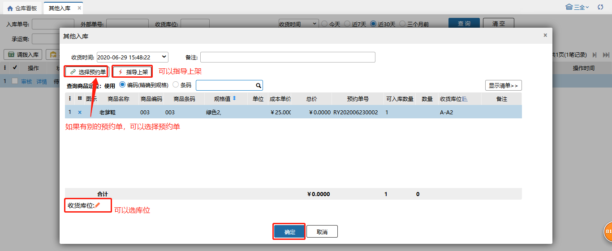

提示

1. 商品入库后会通知erp，erp商品库存也会对应增加，单据状态也会对应发生更新；

2.入库时可以选择收货库位，入库后对应的库位可用库存和实际库存会增加。

3.选择入库库位时对库位类型没有限制。

4.在仓内策略–业务配置，开启商品条码截取，扫描输入截取的商品条码会与商品信息的条码进行对比校验；

5.开启次品管理开关后调拨入库页面商品名称前新增库存属性列，功能栏新增添加次品按钮，点击按钮跳转选择商品规格页面，勾选商品并确定后，添加次品入库，具体操作如下图：

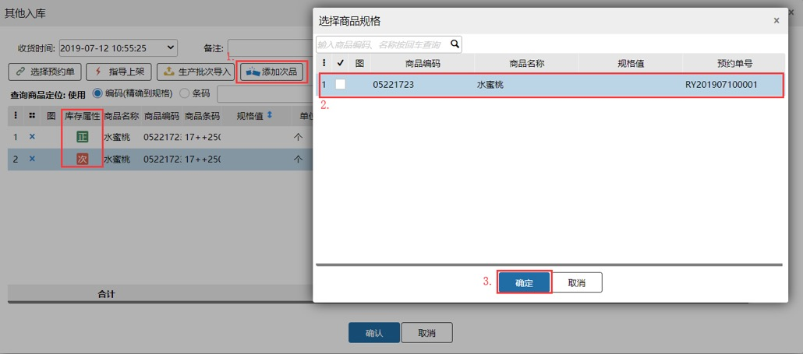

注意：

1. 可添加的次品为其他入库页面展示的商品；

2. 选择多个预约单时，添加的次品明细关联所选择的预约单；

3. 正品的收货库位过滤次品库位，次品收货库位无限制；

4.序列号商品已支持添加次品入库，添加次品时，选择序列号商品，录入序列号入库后，序列号根据库存属性区分。

5.商品开启入库批次管理，添加次品入库后，入库批次号为空；

6.同sku正品、次品不能同时存放同一库位，案例如下：

前提：空拣选库位A、拣选库位B有商品a的正品库存、拣选库位C有商品a的次品库存、次品库位D

①商品a 正品选择库位A，次品选择库位A报错：所选的目标库位不能同时存放同一个商品的正次商品；

②商品a 正品选择时，查询库位D结果为空，选择库位C，保存报错：目标库位上有同商品的不同属性库存；

③商品a 次品选择库位B，保存报错：目标库位上有同商品的不同属性库存；

④商品a 正品选择库位B，次品选择库位C，保存入库成功；

⑤序列号商品b添加次品入库，次品无序列号。

若上次入库操作（包括采购入库、销退入库、其他入库、销退扫描入库、收货入库）次品所选收货库位都为同一库位，其他入库再次添加次品时，次品收货库位会自动带出上次入库的次品选择的收货库位。

次品入库回传：

1）业务配置选择次品库存管理全部对内模式，入库后次品数量回传ERP；

2）业务配置选择次品库存管理全部半对外模式，入库后次品数量不回传ERP。

**开启入库支持使用容器：**入库时扫描容器编码，支持货品入到容器里。

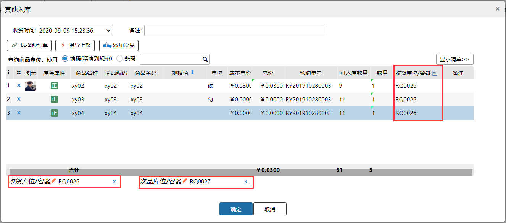

### 3.入库审核-旧版
入库配置开启入库审核后，调拨入库或其他入库后会生成入库审核单，具体操作如下：

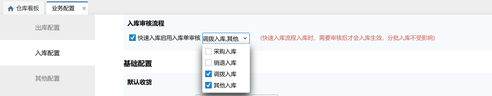

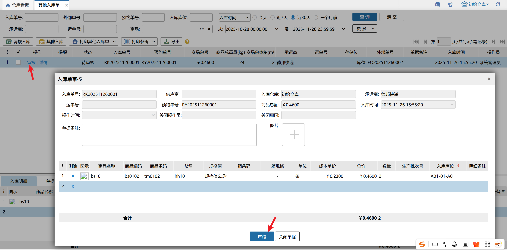

注意：

①开启次品管理后，入库单审核页面商品编码前新增库存属性列，选择商品页面新增开启添加次品勾选项；

②入库审核单添加商品时，可选择的是预约单内的商品；

③.开启入库支持使用容器，入库审核页面扫描容器编码支持货品入到容器中。

### 4.入库审核-新版
在审批管理页面配置快速入库—调拨/其他入库审批流程后，符合配置的调拨入库或其他入库后会生成待入库+审批中的入库单，具体操作请参考[采购入库审核](https://hupun.yuque.com/unzko7/lsbfg0/crl0rycd2i8g3a23#M1x2b)。

### 5.确认入库并跳转装箱
其他入库时，可以确认入库之后就直接跳到打包装箱里面去将入库商品进行批量装箱

前置条件：有打包装箱权限的操作员才显示该按钮

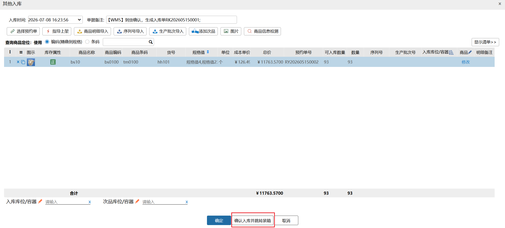

> 更新: 2026-07-08 16:24:33  
> 原文: <https://hupun.yuque.com/unzko7/lsbfg0/kk54nauq2fs3cwnr>