# 采购入库单

仓库接收到采购预约单，就可以在采购入库页面进行商品入库动作，采购入库具体有两种入库操作：采购入库和验货入库。

### **1.采购入库**
采购入库是针对有入库预约单的操作，具体操作如下图：

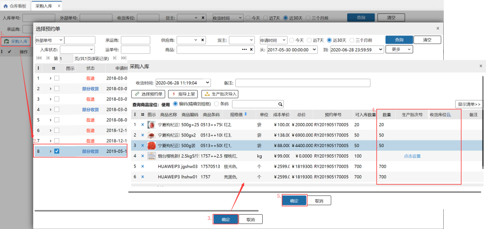

**注意：**

1. 有修改入库成本权限的操作员，选择预约单后，可以修改商品的成本单价。                      

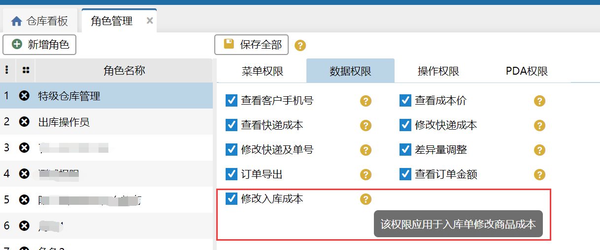

2.生产批次导入时，若导入的生产批次号在系统中存在，生产日期、过期日期允许不填，导入批次后取系统中的生产日期、过期日期；若导入的生产批次号在系统中不存在，生产日期、过期日期必填。

例：生产批次商品A，在系统中有批次20200106：生产日期：2020-01-06，过期日期：2022-01-06                     

预约单01，明细：生产批次商品A，可入库数量100；                       

1）导入生产批次，批次号：20200106，生产日期、过期日期为空，能正常导入，导入后，批次：20200106，生产日期：2020-01-06，过期日期：2022-01-06。                     

2）导入生产批次，批次号：20200106，生产日期：2020-01-01,过期日期：2020-012-31，能正常导入，导入后，批次：20200106，生产日期：2020-01-06，过期日期：2022-01-06。                    

3）导入生产批次，批次号：20200107，生产日期、过期日期为空，导入失败，生产日期、过期日期不能为空。.                     

3.同一预约单内生产批次商品有两条一样的商品明细，生产批次导入时，会根据可入库数量填充。其中：                     

**相同库位情况下：**                   

超收/不超收，先填充第一行，填充满后填充第二行。                  

**不同库位下：**                    

①.不超收，按照库位明细填充                    

②.超收，先填充第一行，超收的部分填充到第二行，**另外一个库位的直接过滤不填充。**                 

    例1：预约单01,明细1：生产批次商品A 可入库数量5；明细2：商品A 可入库数量5。

    操作导入生产批次：商品A  批次p1 数量6 库位A1；商品A 批次p2 数量4 库位A1；

    导入后结果展示：明细1：批次p1，数量5，库位A1；明细2：批次p1，数量1，批次p2，数量4，库位A1

    例2：预约单01,明细1：生产批次商品A 可入库数量5；明细2：商品A 可入库数量5。

    操作导入生产批次：商品A  批次p1 数量6 库位A1；商品A 批次p2 数量4 库位A2；

    导入后结果展示：明细1：批次p1，数量5，库位A1；明细2：批次p1，数量1，库位A1；

4.同一预约单内生产批次商品有两条一样的商品明细，序列号导入时，会根据可入库数量填充。

  例：预约单01,明细1：序列号商品B 可入库数量5；明细2：商品B 可入库数量5。

  操作序列号导入：商品B 序列号：x01、x02、x03、x04、x05、x06、x07、x08、x09、x10.

  导入后结果展示：明细1：商品B 数量5，序列号：x01、x02、x03、x04、x05

                             明细2：商品B 数量5，序列号：x06、x07、x08、x09、x10

5.开启次品管理开关后采购入库页面商品名称前新增库存属性列，功能栏新增添加次品按钮，点击按钮跳转选择商品规格页面，勾选商品并确定后，添加次品入库，具体操作如下图：

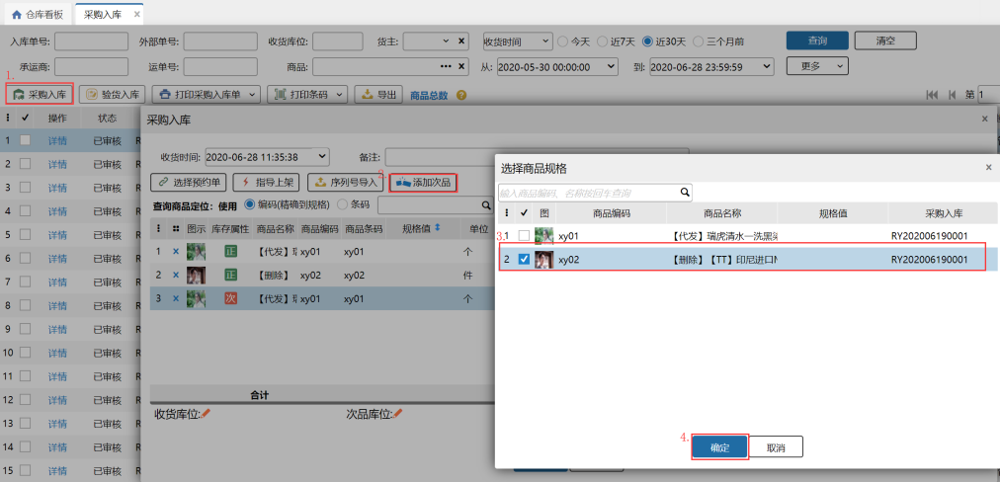

**注意：**

1. 可添加的次品为采购入库页面展示的商品；

2.选择多个预约单时，添加的次品明细关联所选择的预约单；

3. 正品的收货库位过滤次品库位，次品收货库位无限制；

4. 序列号商品已支持添加次品入库，添加次品时，选择序列号商品，录入序列号入库后，序列号根据库存属性区分。

5. 商品开启入库批次管理，添加次品入库后，入库批次号为空；

6.同sku正品、次品不能同时存放同一库位，案例如下：

前提：空拣选库位A、拣选库位B有商品a的正品库存、拣选库位C有商品a的次品库存、次品库位D

①商品a 正品选择库位A，次品选择库位A报错：所选的目标库位不能同时存放同一个商品的正次商品；

②商品a 正品选择时，查询库位D结果为空，选择库位C，保存报错：目标库位上有同商品的不同属性库存；

③商品a 次品选择库位B，保存报错：目标库位上有同商品的不同属性库存；

④商品a 正品选择库位B，次品选择库位C，保存入库成功；                     

若上次入库操作（包括采购入库、销退入库、其他入库、销退扫描入库、收货入库）次品所选收货库位都为同一库位，采购入库再次添加次品时，次品收货库位会自动带出上次入库的次品选择的收货库位。

次品入库回传：                     

1）业务配置选择次品库存管理全部对内模式，入库后次品数量回传ERP；                     

2）业务配置选择次品库存管理全部半对外模式，入库后次品数量不回传ERP。                    

7.同一预约单内生产批次商品有两条一样的商品明细，生产批次导入时，会根据可入库数量填充。其中：

**相同库位情况下：**

超收/不超收，次品都填充到第一行；

**不同库位下：**

超收/不超收，按照库位明细填充；

例1：预约单01,明细1：次品，生产批次商品A ；明细2：次品，商品A 。

操作导入生产批次：次品，商品A  批次p1 数量6 库位A1；次品，商品A 批次p2 数量4 库位A1；

导入后结果展示：明细1：次品，商品A：批次p1，数量6，批次p2，数量4，库位A1；明细2：次品，商品A 数量 0.

例2：预约单01,明细1：次品，生产批次商品A ；明细2：次品，商品A 。

操作导入生产批次：次品，商品A  批次p1 数量6 库位A1；次品，商品A 批次p2 数量4 库位A2；

导入后结果展示：明细1：次品，商品A  批次p1 数量6 库位A1；明细2:次品，商品A 批次p2 数量4 库位A2；

**入库清单：**查看预约单的入库进度。

可入库数量=预约数量-已入库数量

差异=可入库数量-本次入库数量

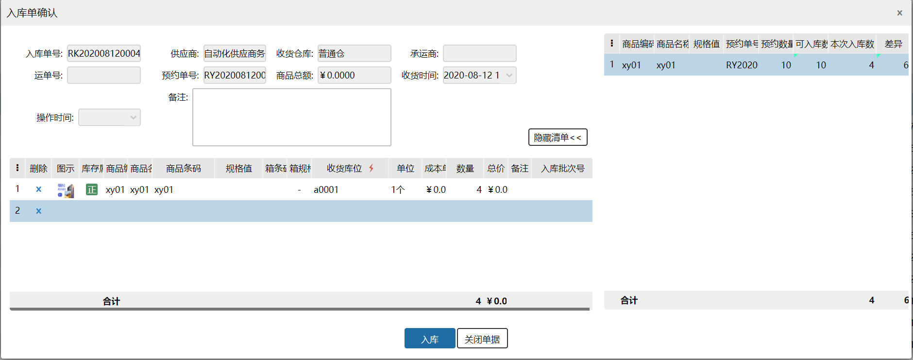

**开启入库支持使用容器：**入库时扫描容器编码，支持货品入到容器里。

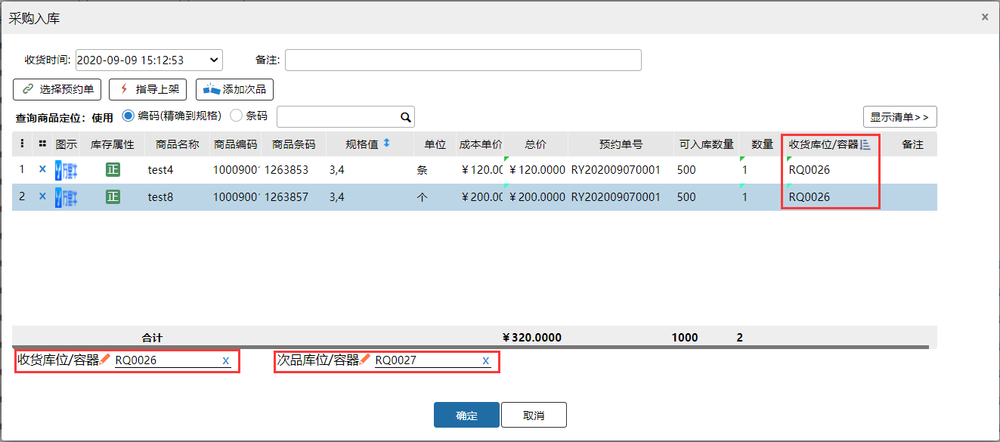

### **2.验货入库-旧版**
验货入库是在有商品可以入库，但是没有采购预约单的情况下进行的，具体操作如下图，点击验货入库按钮弹出验货入库页面，现在供应商、货主后，录入商品编码/条码添加入库商品，选择入库库位后点击保存，验货入库成功。

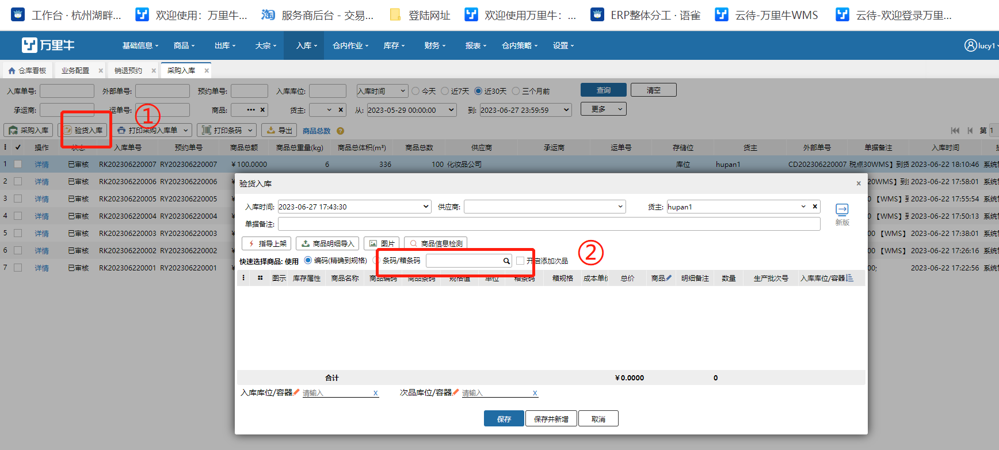

提示

1.商品采购入库后会通知erp，erp商品库存也会对应增加，单据状态也会对应发生更新；

2.验货入库只会在wms增加库存，仅会通知万里牛 erp增加库存；

3.入库时可以选择收货库位，入库后对应的库位会增加相应的可用库存和实际库存；

4.选择入库库位时对库位类型没有限制；

5.在仓内策略–业务配置，开启商品条码截取，扫描输入截取的商品条码会与商品信息的条码进行对比校验；

6.验货入库成功后，不关闭一级采购入库菜单，再次验货入库后，记忆上次验货入库选择的供应商；

7.支持导入商品明细，快速添加入库商品，操作步骤如下：

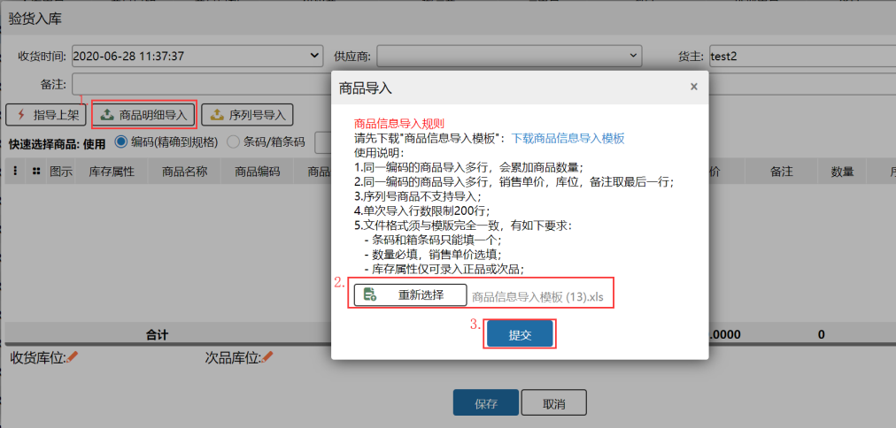

注意：

1.商品编码、条码、箱条码填一个即可；

2.同一编码的商品导入多行，会累加商品数量；

3.同一编码的商品导入多行，销售单价，库位，备注取最后一行；

4.序列号商品不支持导入；

5.单次导入行数限制200行；

6.文件格式须与模版完全一致，有如下要求：

- 条码和箱条码只能填一个；   

- 数量必填，销售单价选填；

-开启次品库存管理开关库存属性必填仅可录入正品或次品；

开启次品管理开关后验货入库页面商品名称前新增库存属性列，条码右侧新增开启添加次品勾选项，勾选后根据编码查询商品或录入商品条码后，添加次品入库，具体操作如下图：

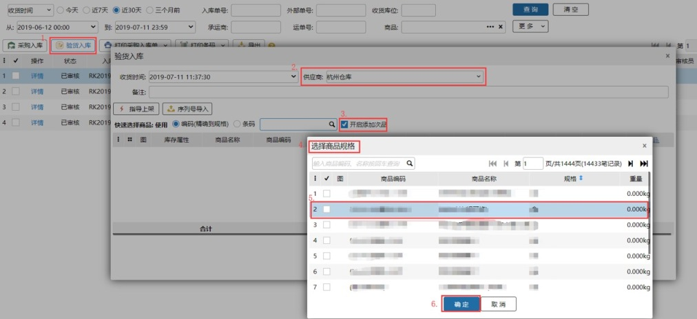

提示：

1. 正品的收货库位过滤次品库位，次品收货库位无限制；

2.序列号商品不允许添加次品入库，勾选添加次品后，选择序列号商品报错：序列号商品暂不支持此操作；

3. 商品开启入库批次管理，添加次品入库后，入库批次号为空；

4.同sku正品、次品不能同时存放同一库位，案例如下：

前提：空拣选库位A、拣选库位B有商品a的正品库存、拣选库位C有商品a的次品库存、次品库位D

①商品a 正品选择库位A，次品选择库位A报错：所选的目标库位不能同时存放同一个商品的正次商品；

②商品a 正品选择时，查询库位D结果为空，选择库位C，保存报错：目标库位上有同商品的不同属性库存；

③商品a 次品选择库位B，保存报错：目标库位上有同商品的不同属性库存；

④商品a 正品选择库位B，次品选择库位C，保存入库成功；

若上次入库操作次品所选收货库位都为同一库位，验货入库再次添加次品时，次品收货库位会自动带出上次入库的次品选择的收货库位。

次品入库回传：

1）业务配置选择次品库存管理全部对内模式，入库后次品数量回传ERP；                   

2）业务配置选择次品库存管理全部半对外模式，入库后次品数量不回传ERP。  

保存并新增 :点击保存并新增，验货入库页面不关闭，且选择的收货时间、供应商、货主、备注都保留，可以连续入库。

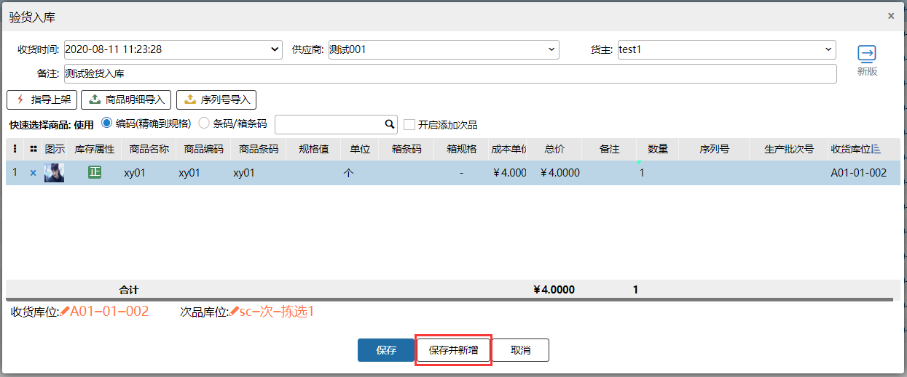

**开启入库支持使用容器：**入库时扫描容器编码，支持货品入到容器里。

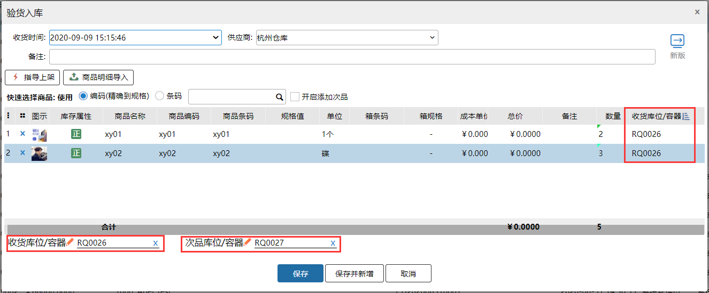

### **3.验货入库-新版    **
点击验货入库按钮，在验货入库弹窗中点击"新版"按钮切换到新版验货入库页面，新版支持扫描条码添加商品，操作步骤如下所示：

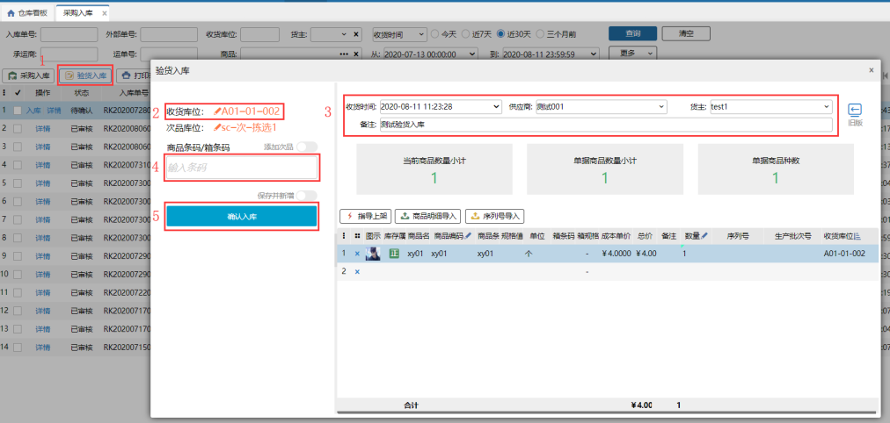

注意：

1.先选择供应商、货主后再扫描商品；

2.选择收货库位后，扫描条码添加商品后会自动带出选择的库位；

3.界面右侧已添加商品的数量、收货库位可以编辑修改，其中数量不能修改为小于0的正整数；

4.选中页面右侧的商品明细列表空白行的商品编码，支持通过编辑查询添加商品。

5.开启保存并新增，确认入库页面不关闭，库位、收货时间、供应商、货主、备注不变，可以继续入库。

**开启入库支持使用容器：**入库时扫描容器编码，支持货品入到容器里。

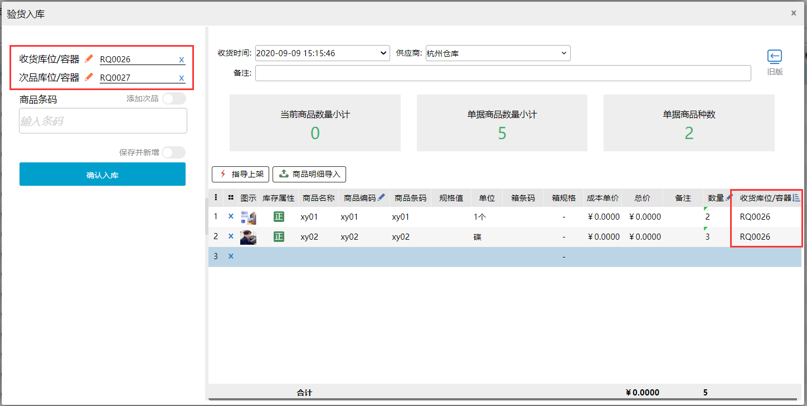

### **4.入库审核-旧版**
入库配置开启入库审核后，采购入库或验货入库后会生成入库审核单，具体操作如下：

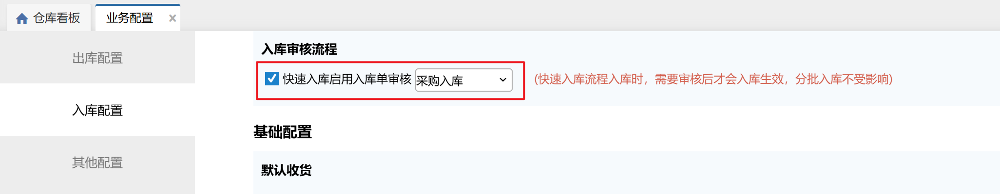

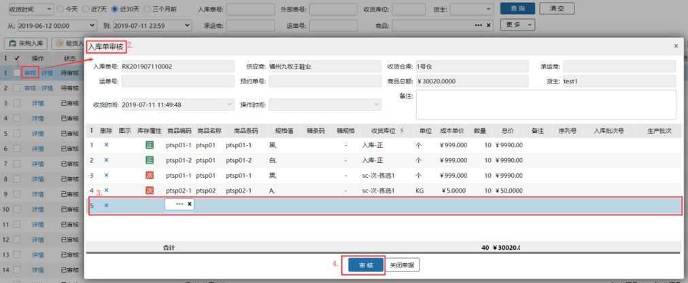

注意：

①开启次品管理后，入库单审核页面商品编码前新增库存属性列，选择商品页面新增开启添加次品勾选项；

②采购入库审核单添加商品时，可选择的是预约单内的商品，验货入库单审核添加商品时，可选择当前仓的所有商品；

③.开启入库支持使用容器，入库审核页面扫描容器编码支持货品入到容器中。

### 5.入库审核-新版
在[审批管理](https://hupun.yuque.com/unzko7/lsbfg0/gumupf3qnnlkrcrs)页面配置快速入库—采购入库审批流程后，符合配置的采购入库或验货入库后会生成待入库+审批中的入库单，具体操作如下：

#### 5.1 创建审批流
先在审批管理页面新增审批流程，业务模块选择[入库-快速入库]，单据类型选择[采购入库/采购验货入库]，适用仓库、适用货主选择指定数据，审批人去重/不去重，如下图所示为2级审批流，第一级审批人是角色[普通仓工]，第二级审批人是账号[bessie]，配置完成后点击保存，审批流创建成功。

#### 5.2 新建入库单
1仓库，操作员bs01，新建采购入库/验货入库单，单据货主为lubantestwms01，符合审批流程，单据进入审批流，单据状态及审批状态如下，点击审批单号可跳转到审批中心查看审批单。

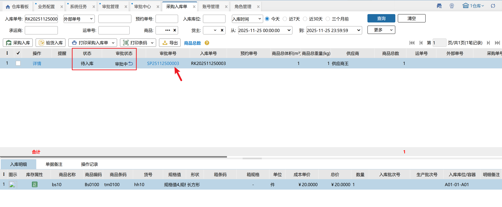

审批单发起人为入库单创建人，当前审批人为第一级审批人，当前审批等级为第一级：

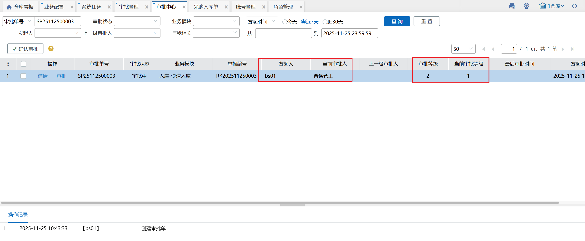

其中：

①发起人能看到审批单，但不能操作；

②当前审批人、超级管理员、普通管理员能看到并审批单据；

③其他账号看不到审批单。

#### 5.3 审批通过
有审批权限的账号可以在审批中心选择审批单进行审批操作，选择对应审批单点击审批/确认审批，在弹窗中填写审批意见后点击审批通过按钮，即可完成审批。上一级审批完成后，进入下一级审批，审批人按流程配置发生变化。

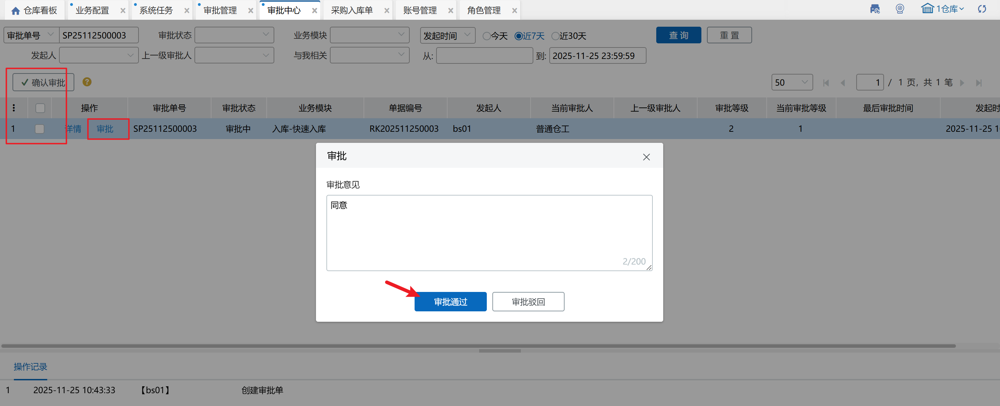

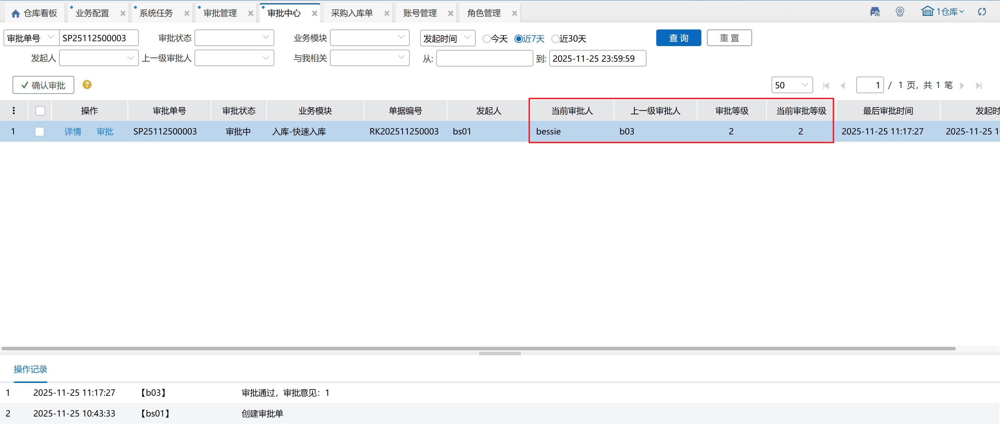

第二级审批人审批过程同上，审批通过后，审批流结束，对应入库单自动确认入库。

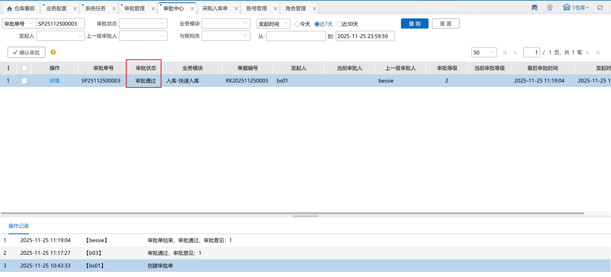

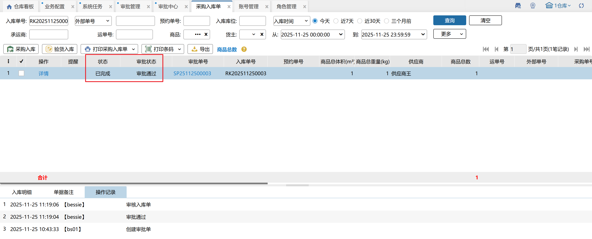

#### 5.4 审批驳回
有审批权限的账号可以在审批中心选择审批单进行审批操作，选择对应审批单点击审批/确认审批，在弹窗中填写审批意见后点击审批驳回按钮，即可驳回审批。驳回审批后，审批流结束。

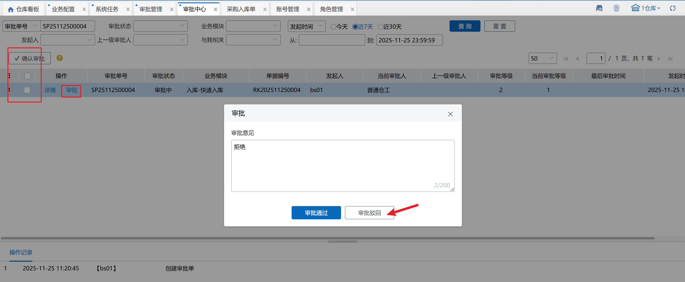

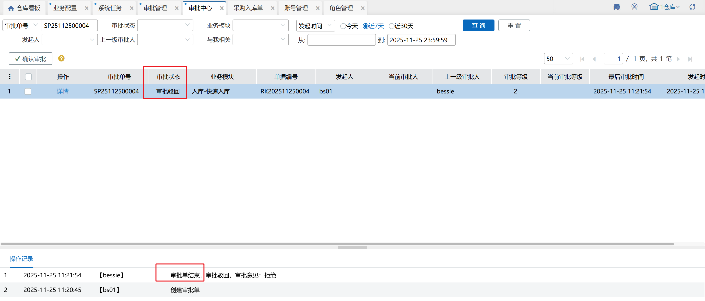

可在对应入库单上进行修改并提交重新发起新的审批，或者关闭单据。

#### 5.5 审批撤销
入库单发起审批后，若提交单据有误，可以手动撤销审批，待修改后重新提交发起新的审批。

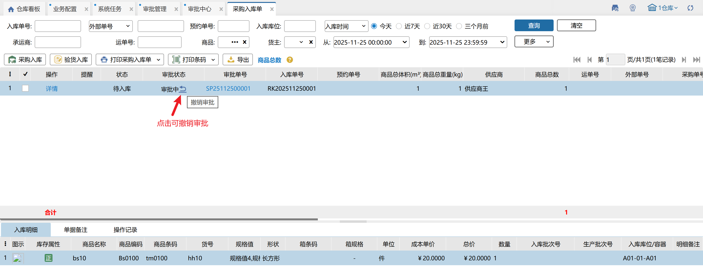

### **6.采购入库单**
采购入库单支持查看某一入库单的商品总额及商品总数。统计了查询出所有预约单的商品汇总。

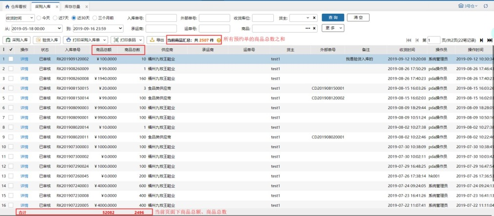

### **7.入库装箱的单据确认入库**
 在pda[入库装箱](https://hupun.yuque.com/docs/share/e3d57a38-6059-4610-ad01-0213e116c859?)完成采购预约单的装箱后此页面生成待确认的采购入库单，点击入库，商品确认入库成功，库位库存增加装箱商品的库存。

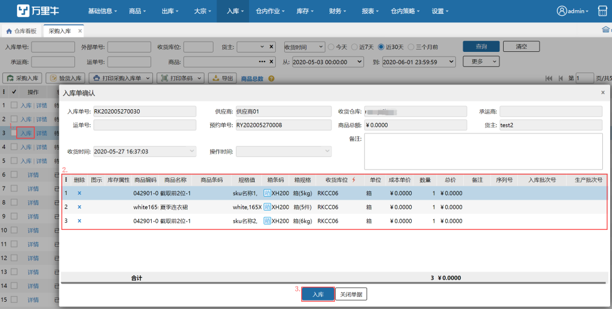

注意：

1.pda入库装箱后，PC未确认入库前，库位库存不会增加，唯一箱是待生效状态；

2.待确认的入库单不能新增明细，唯一箱的数量不支持编辑，允许删除装箱明细；

3.支持修改装箱的库位，库位仅限在存储、箱拣选、过渡库位中修改；

4.确认入库后，货箱的状态是生效，库位库存增加。

5.开启入库支持使用容器，待入库页面扫描容器编码支持货品入到容器中。

### **8.序列号**
1.序列号标准模式，入库时必须录入序列号且支持导入序列号。

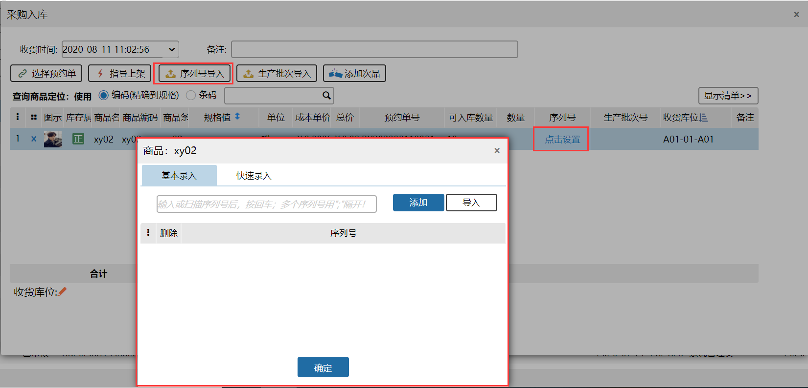

2.序列号简洁模式，开启入库登记序列号，入库时必须录入序列号且支持导入序列号；未开启入库登记序列号，入库时无需录入序列号且页面不显示导入序列号按钮。

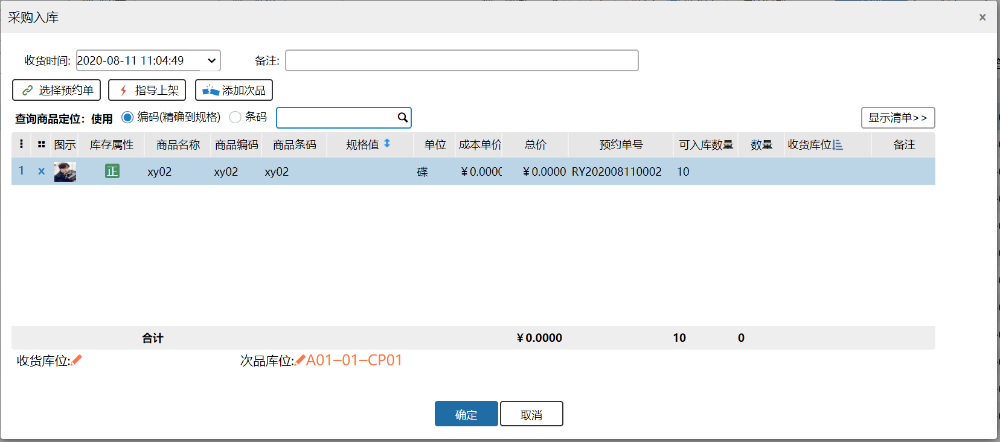

3.码上放心换码路径支持仅扫描箱号

开启“上传码上放心单据入库前查询外箱码自动填写关联序列号”情况下，扫描外箱码时可以通过开启“仅扫描外箱码”实现录入外箱码后不会弹出录入序列号弹窗，可以直接连续扫描外箱码录入。

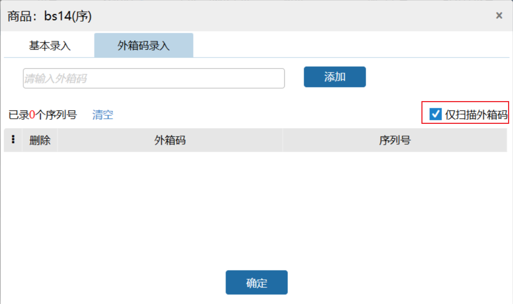

### 9.辅助单位
新增辅助单位换算商品数量，关联开启商品多单位管理+出库快速换算推荐模式显示。

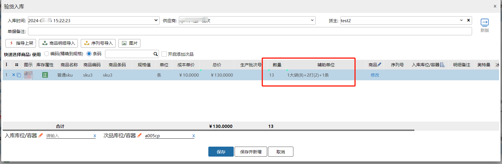

1.暂不支持序列号商品编辑。

2.辅助单位弹窗显示商品多单位信息，编辑后自动把辅助单位数量换算基础单位数量后相加，更新到数量，辅助单位显示已填数量辅助单位拼接结果。

3.生产批次商品辅助单位入口在批次录入弹窗内，入库明细列上仅支持弹窗显示，不支持修改，显示辅助单位合计数据。

4.修改数量后辅助单位清空，收货清单无预约单收货生成入库单合并相同sku数量后辅助单位清空。

5.复制的明细需手动编辑辅助单位。

6待入库、待审核单据、草稿已有辅助单位的仅显示文本，再进入弹窗，辅助单位弹窗数据显示初始化空白。（ps：批次商品录入->批次辅助单位弹窗内，会显示批次辅助单位具体数据）

7.支持导出和打印辅助单位。

已支持页面：PC端入库模块（生产批次商品辅助单位仅采购/验货入库、有/无预约单收货清点、其他/销退入库支持）、仓内盘点任务。

### 10.确认入库并跳转装箱
采购入库/验货入库时，可以确认入库之后就直接跳到打包装箱里面去将入库商品进行批量装箱

前置条件：有打包装箱权限的操作员才显示该按钮

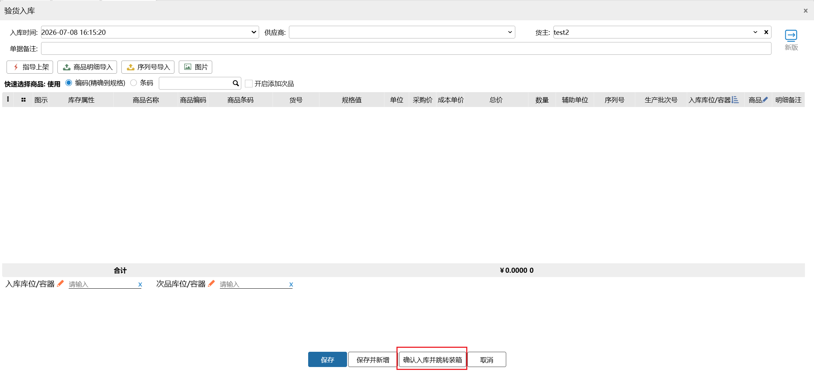

> 更新: 2026-07-08 16:21:24  
> 原文: <https://hupun.yuque.com/unzko7/lsbfg0/crl0rycd2i8g3a23>