# 销退入库单

有生成退货入库或换货入库的预约单后，就可以在该页面进行退货或换货的入库操作，具体页面如下：

### 1.选择预约单
选择对应的售后预约单（可在查询栏进行条件筛选，查询单据）。

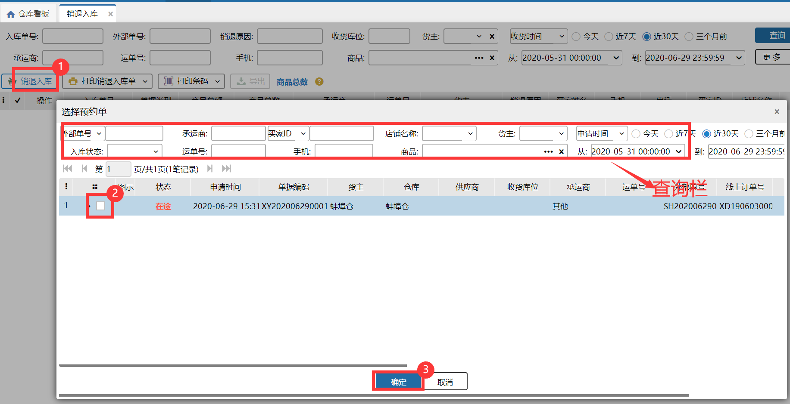

### 2.销退入库
#### 2.1 非买赔业务
填写对应数量及收货库位后保存即可。支持商品明细导入，可以通过表格导入商品

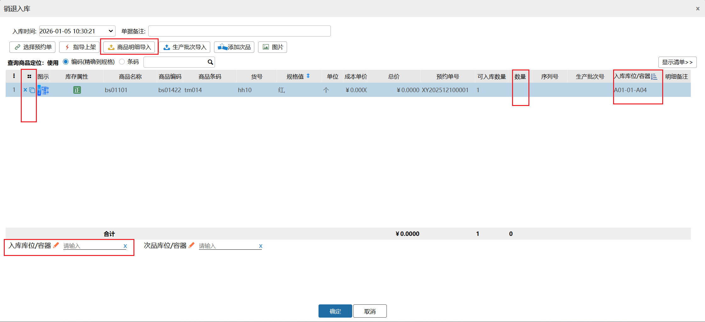

#### 2.2 买赔业务
:::color3
场景：买赔业务在售后场景下可视为将不入库商品进行记录，买赔仅是不做入库后的索赔，对于仓储业务来说是一个向上游反馈异常不可收数量的方式。本次更新在销退入库、销退预约相关页面新增"拒收数量"录入与展示，支持货主在销退环节记录拒收商品数量，并按开关控制是否启用该功能。

:::

开启后台开关后，销退入库单录入、查看明细处增加了“拒收数量”列，用户可按实际情况输入/不输入拒收数量，对于单条明细可以不拒收（不输入拒收数量，置空 ）/部分拒收（拒收数量<可入库数量）/全部拒收（拒收数量=可入库数量），输入后保存单据，生成入库单。

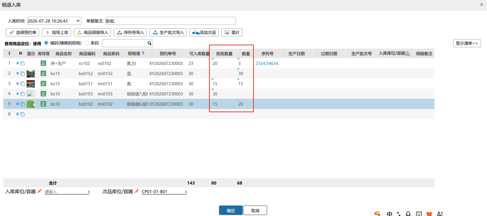

根据拒收数量差异，入库单和关联预约单结果也有不同，具体如下：

①所有明细全部拒收，不生成入库单，销退预约单自动关闭；

②明细部分拒收、部分正常收入，生成入库单，显示对应拒收数量、实收数量，销退预约单显示部分收货/完成；

③明细全部正常收入无拒收，生成入库单，显示对应实收数量，销退预约单显示完成。

注：

1.剩余未入库数量=预约数量-（实际入库数量+拒收数量）

2.后台开关与"业务配置-入库审核（老审核）"互斥，若已开启老审核流程，开启后台开关后不生效，若已开启后台开关，开启老审核流程会报错

3.采购入库单、其他入库单、采购预约单不受此开关影响，不显示拒收相关列

4.次品明细不需要录入拒收数量

5.生产批次商品、序列号商品有拒收数量时，这部分数量不需要录入行业属性信息

6.导出、打印支持拒收数量

提示：

1.商品入库后会通知ERP，ERP商品库存也会对应增加，单据状态也会对应发生更新。

2.入库时可以选择收货库位，入库后对应的库位可用库存和实际库存会增加。

3.选择入库库位时对库位类型没有限制。

4.在仓内策略–业务配置，开启商品条码截取，扫描输入截取的商品条码会与商品信息的条码进行对比校验。

5.有修改入库成本权限的操作员，选择预约单后，可以修改商品的成本单价。                 

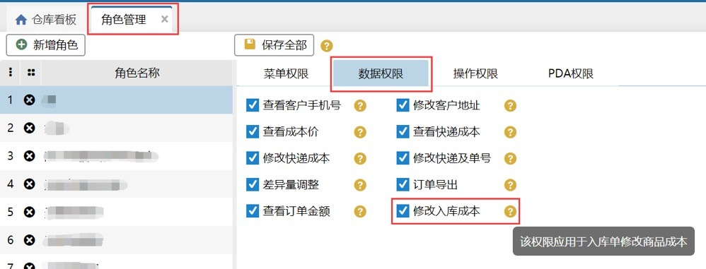

6. 若导入的生产批次号在系统中不存在，生产日期、过期日期必填。

例：生产批次商品A，在系统中有批次20200106：生产日期：2020-01-06，过期日期：2022-01-06

预约单01，明细：生产批次商品A，可入库数量100；

1）导入生产批次，批次号：20200106，生产日期、过期日期为空，能正常导入，导入后，批次：20200106，生产日期：2020-01-06，过期日期：2022-01-06。

2）导入生产批次，批次号：20200106，生产日期：2020-01-01,过期日期：2020-012-31，能正常导入，导入后，批次：20200106，生产日期：2020-01-06，过期日期：2022-01-06。

3）导入生产批次，批次号：20200107，生产日期、过期日期为空，导入失败，生产日期、过期日期不能为空。

同一预约单内生产批次商品有两条一样的商品明细，生产批次导入时，会根据可入库数量填充。其中：

7.支持商品导入，和采购预约单入库一致，支持导入商品和对应的库位信息，目前至少支持5000条商品信息导入

**相同库位情况下：**

1.超收/不超收，先填充第一行，填充满后填充第二行。

**不同库位下：**

1.不超收，按照库位明细填充

2.超收，先填充第一行，超收的部分填充到第二行，**另外一个库位的直接过滤不填充。**

 例1：预约单01,明细1：生产批次商品A 可入库数量5；明细2：商品A 可入库数量5。

导入生产批次：商品A  批次p1 数量6 库位A1；商品A 批次p2 数量4 库位A1；

导入后，明细1：批次p1，数量5，库位A1；明细2：批次p1，数量1，批次p2，数量4，库位A1；

 例2：预约单01,明细1：生产批次商品A 可入库数量5；明细2：商品A 可入库数量5。

导入生产批次：商品A  批次p1 数量6 库位A1；商品A 批次p2 数量4 库位A2；

导入后，明细1：批次p1，数量5，库位A1；明细2：批次p1，数量1，库位A1；

开启次品管理开关后销退入库页面商品名称前新增库存属性列，功能栏新增添加次品按钮，点击按钮跳转选择商品规格页面，勾选商品并确定后，添加次品入库，具体操作如下图：

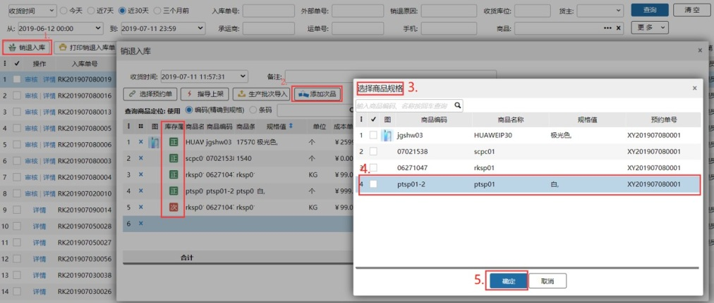

注意：

1. 可添加的次品为销退入库页面展示的商品。

2.选择多个预约单时，添加的次品明细关联所选择的预约单。

3. 正品的收货库位过滤次品库位，次品收货库位无限制。

4.序列号商品已支持添加次品入库，添加次品时，选择序列号商品，录入序列号入库后，序列号根据库存属性区分。

5.商品开启入库批次管理，添加次品入库后，入库批次号为空。

6.同sku正品、次品不能同时存放同一库位，案例如下：

前提：空拣选库位A、拣选库位B有商品a的正品库存、拣选库位C有商品a的次品库存、次品库位D。

①商品a 正品选择库位A，次品选择库位A报错：所选的目标库位不能同时存放同一个商品的正次商品。

②商品a 正品选择时，查询库位D结果为空，选择库位C，保存报错：目标库位上有同商品的不同属性库存。

③商品a 次品选择库位B，保存报错：目标库位上有同商品的不同属性库存。

④商品a 正品选择库位B，次品选择库位C，保存入库成功。

7.若上次入库操作（包括采购入库、销退入库、其他入库、销退扫描入库、收货入库）次品所选收货库位都为同一库位，销退入库添加次品时，次品收货库位会自动带出上次入库的次品选择的收货库位。

8.入库配置开启销退入库差异收时，销售退货可以入预约单外的商品，点击销退入库页面商品明细空白行的商品编码，跳转选择商品页面，可以选择当前仓库的所有商品，操作如下：                   

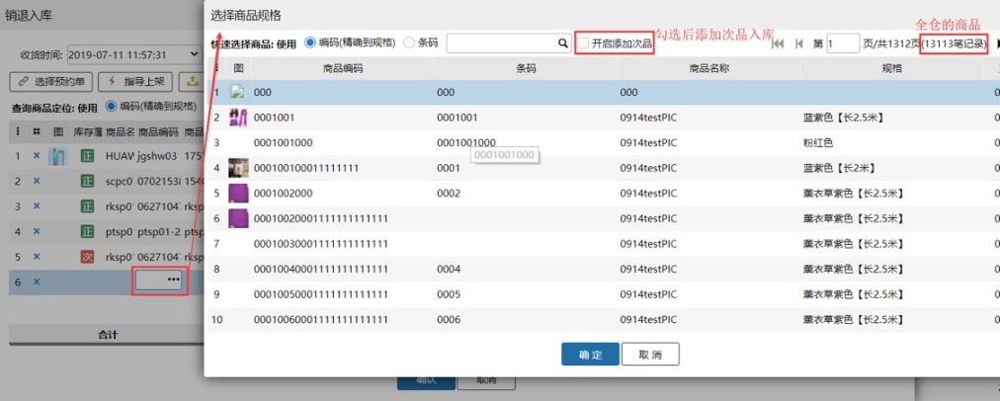

9.次品入库回传：

 1）业务配置选择次品库存管理全部对内模式，入库后次品数量回传ERP。

 2）业务配置选择次品库存管理全部半对外模式，入库后次品数量不回传ERP。

10.新增单据类型查询项，原单入库的单据可以在销退入库处进行查询。

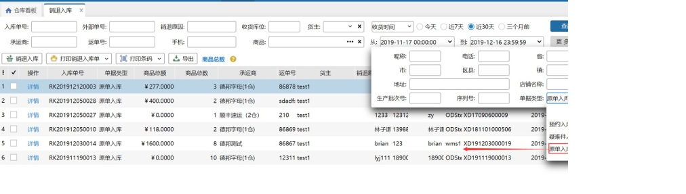

11.开启入库支持使用容器：入库时扫描容器编码，支持货品入到容器里。

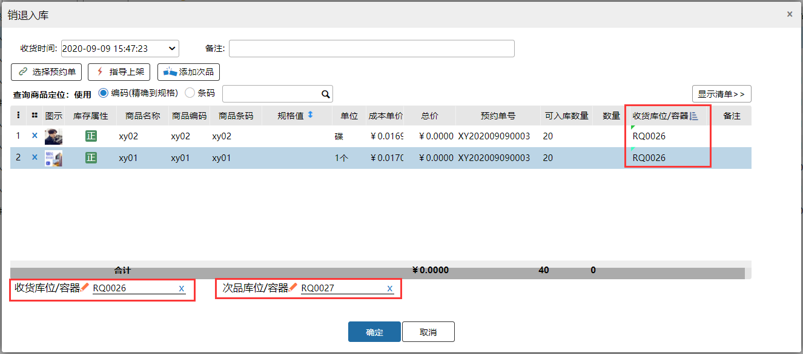

### 3.入库审核-旧版
入库配置开启入库审核后，销退入库后会生成入库审核单，具体操作如下：

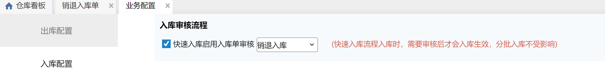

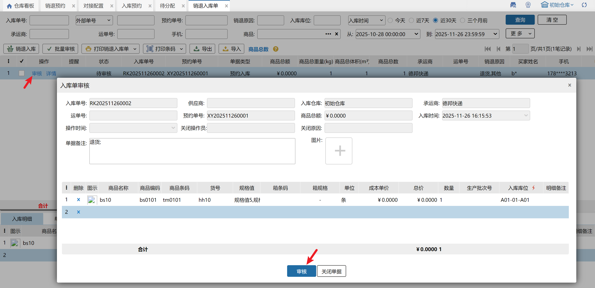

注意：

①开启次品管理后，入库单审核页面商品编码前新增库存属性列，选择商品页面新增开启添加次品勾选项；

②销退入库审核单添加商品时，可选择的是预约单内的商品；

③开启入库支持使用容器，入库审核页面扫描容器编码支持货品入到容器中。

支持勾选多笔批量审核待审核单据。

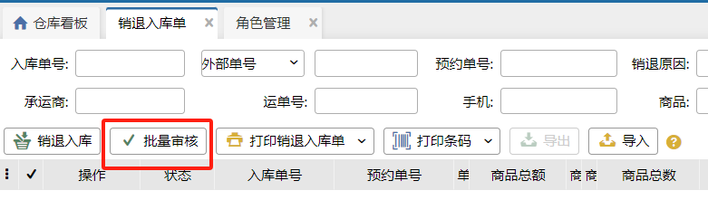

注意：

①关联业务配置入库单审核开关+角色权限入库单审核权限显示。

②不支持跨页勾选。

③仅支持待审核单据操作，否则报错。

④批量审核失败无入库草稿生成。

### 4.入库审核-新版
在审批管理页面配置快速入库—调拨/其他入库审批流程后，符合配置的调拨入库或其他入库后会生成待入库+审批中的入库单，具体操作请参考[采购入库审核](https://hupun.yuque.com/unzko7/lsbfg0/crl0rycd2i8g3a23#M1x2b)。

### 5.导入
支持导入销退预约单入库、原单入库。

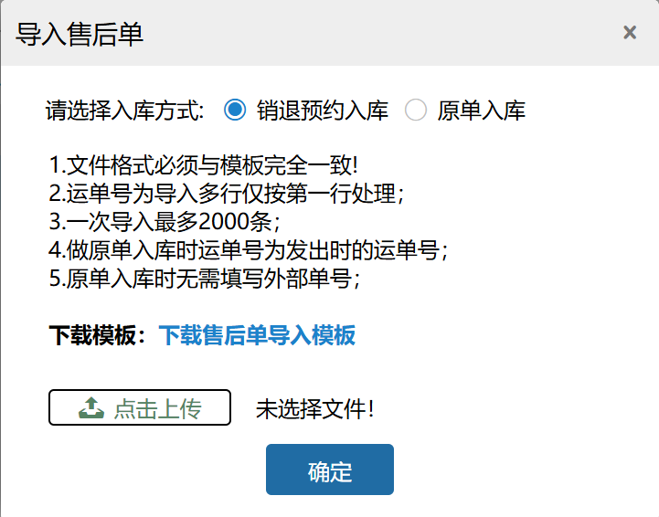

1.按钮关联角色管理-允许操作销退入库权限显示。

2.原单入库选项关联操作员是否有原单入库菜单权限显示。

3.不支持包含生产批次、入库批次、序列号、次品商品的单据导入入库。

4.仅支持预约单状态为在途的单据。

5.若开启销退入库单审核的配置，则导入单据为待审核状态。

6.导入入库失败无草稿生成。

7.导入支持部分成功，导入失败时可数据中心查看错误原因。

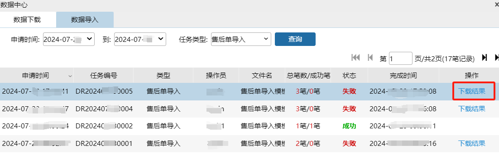

### 

> 更新: 2026-07-28 17:33:38  
> 原文: <https://hupun.yuque.com/unzko7/lsbfg0/gd5kg1rv7rpmiwk8>