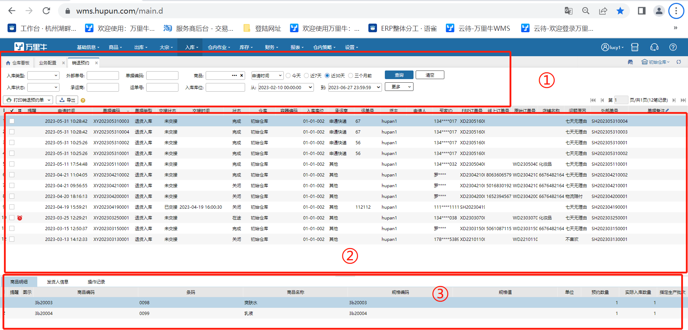
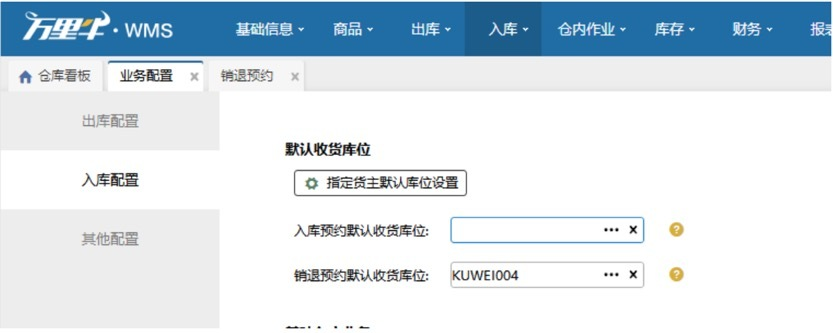
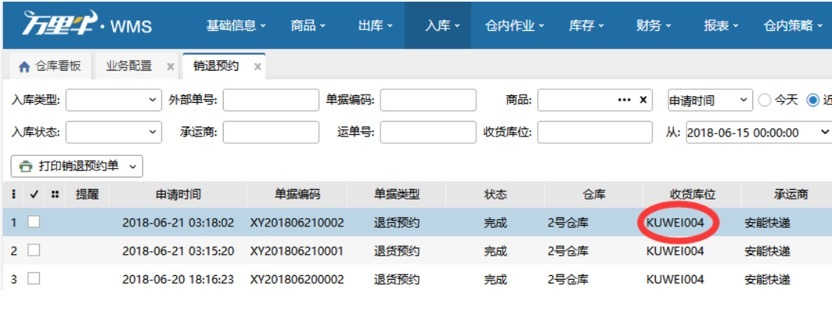

# 销退预约

已完成的订单需要退货或者换货，则erp会发起退货入库或者换货入库请求，wms就会自动生成一笔销退预约单。

### **1.入库类型有两种类型：退货入库、换货入库。**
具体页面如下：

如图1为查询条件区，默认查询条件为申请时间为近7天的销退预约单据；

如图2为预约单据显示区，可翻页查询；

如图3为具体单笔单据的详细信息。

提示

1.支持修改预约单的承运商、运单号、备注；

2. 预约单信息修改同步至ERP场景

1）对接万里牛erp的销退预约单，修改承运商、运单号、备注后会通知到erp更新售后单的承运商、运单号；

2）erp修改售后单的承运商、运单号、问题详情后wms的销退预约单的承运商、运单号随后更新，erp修改问题详情，更新到wms的备注里。

3）wms预约单状态为部分收货、收货完成、关闭时，erp更新售后单的承运商、运单号、备注，wms不再同步更新。

4）wms销退预约单完成30天内允许修改承运商、运单号、备注。

3.打印预约单后，单据行显示打印标记及打印次数。

入库状态分为4种:

1）在途：表示预约已创建，但是仓库还没有实际入库；

2）部分收货：表示仓库只有部分入库；

3）收货完成：表示仓库已全部入库，单据已操作完成；

4）关闭：表示仓库还未入库或者部分入库时，接受到erp发起终止售后的请求。

### **2. 销退入库单创建就已显示有收货库位**
这类现象是由于在【业务配置】-【入库配置】页面有设置默认收货库位，如下图：

设置页面：

结果如下图：

 

**提示**

1. 系统暂时不支持淘宝后台直接退款等售后单自动创建，必须要在erp创建售后单才能创建；

2. 退货、换货预约单的的订单必须要在wms发货的才可以。

> 更新: 2025-04-10 11:04:30  
> 原文: <https://hupun.yuque.com/unzko7/lsbfg0/ly5cshsu34bdoxoz>