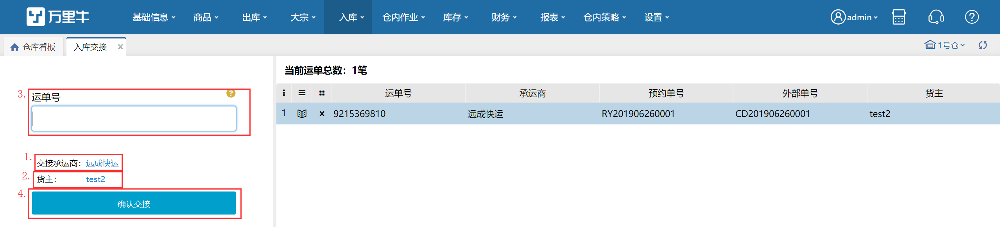

# 收货交接

入库承运商交接，用于仓库入库预约单未完全入库时，记录是否有完成承运商交接。此处只要在这个页面有完成交接，则系统认为该预约单已经从承运商处交接过来。具体操作如下：

**提示**

1.承运商每次交接只能选择一个，若要交接的承运商系统不存在，输入该承运商名称，自动视为要交接的承运商；

2.入库预约单有运单号时才能交接；

3.一个预约单的运单号如果有多个，且用“,”分开，交接时输入其中一个运单号，也能自动匹配预约单；

4.运单号在系统没有匹配的入库预约单时，将视为该运单号与已选的承运商交接，承运商可在右侧列表中修改；

5.当前运单总数显示为待确认交接的运单总数；

6.当运单号匹配到预约单时，点击列首图标，可查看预约单商品详情；

7.运单号+承运商唯一，运单号+预约单唯一。

> 更新: 2023-12-19 15:23:10  
> 原文: <https://hupun.yuque.com/unzko7/lsbfg0/qhh4iygffq3o7fvv>