# 清点单

仓库接收到采购/调拨/其他预约单时，可以在清点单页面进行商品清点动作，清点完成后再进行入库。清点单有两种模式：快速清点（有预约）和快速清点（无预约）。

注意：清点单和入库审核开关互斥，若开启入库审核开关，则不显示清点单菜单，若未开启入库审核开关，则显示清点单菜单。（前提：未开启12004开关，否则菜单与审核开关不关联）

### **1.**快速清点（有预约）
有预约单又分为采购入库预约单、其他入库预约单、调拨入库预约单、销退预约单。

以采购入库预约单为例，以下是手工录入的操作步骤，与采购入库方法基本一致：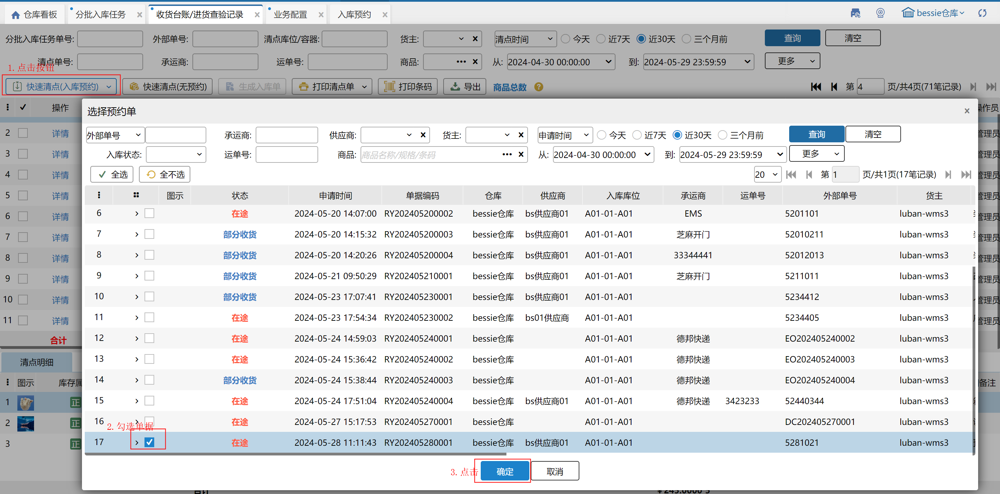

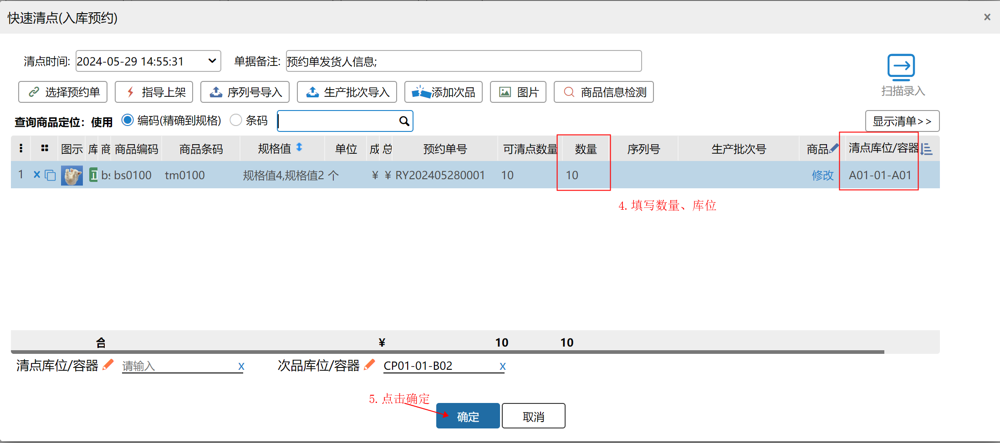

支持商品明细导入（仅支持普通商品）

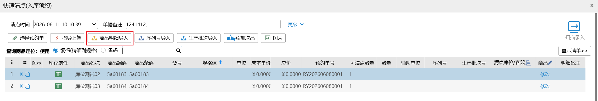

填写数量、库位后，点击确定按钮，生成一个清点单及对应预约单的待确认入库单：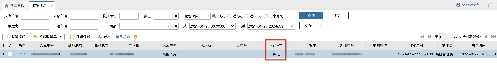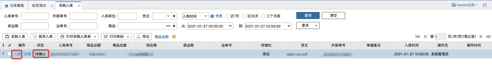

#### 预约单附加信息
场景：冷链药品必填送货单位和发货地址，收货的时候用于核对信息。

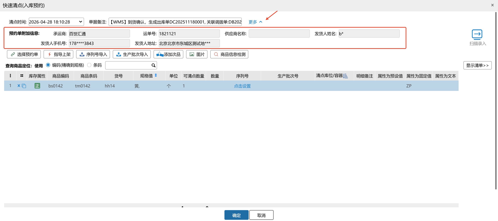

注：默认脱敏显示，有敏感信息查看权限的可点击查看具体信息，无权限的不能查看。

#### 库存自定义描述
若当前仓库开启库存自定义描述，以快速清点为例说明录入步骤。

①属性值类型为文本：在对应操作页面，手工录入正品值/次品值；

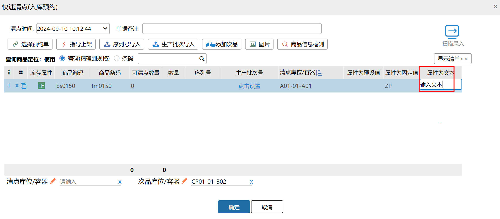

②属性值类型为固定值：在对应操作页面，库存属性为正品的明细自动带出正品值，库存属性为次品的明细自动带出次品值，不允许修改；

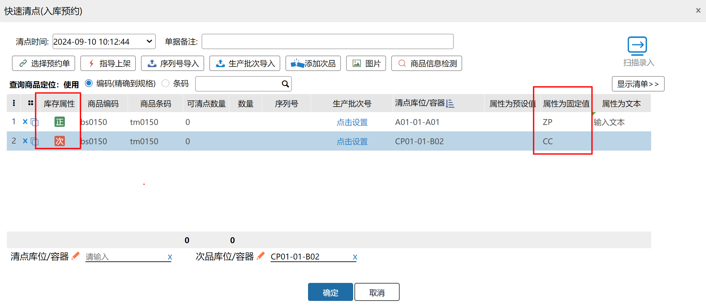

③属性值为预设值：在对应操作页面，库存属性为正品的明细，下拉选择正品值预设值，库存属性为次品的明细，下拉选择次品值预设值。

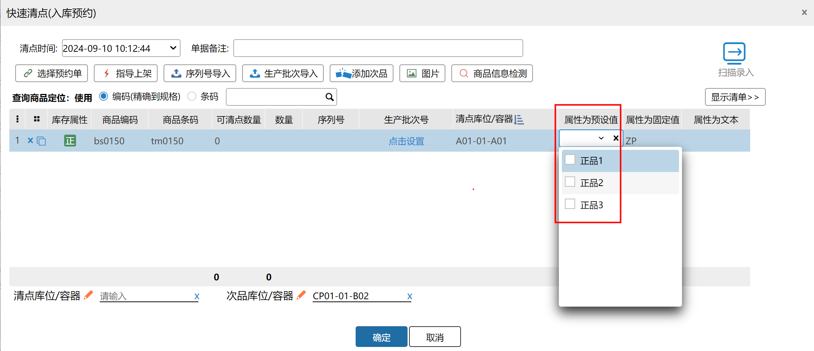

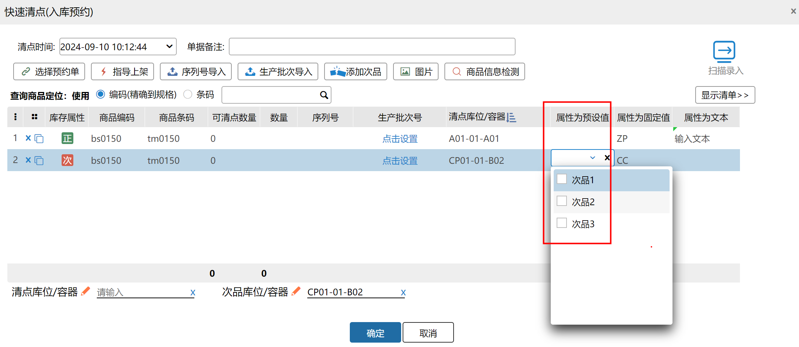

清点单保存成功后，在明细行上能看到录入的属性值：

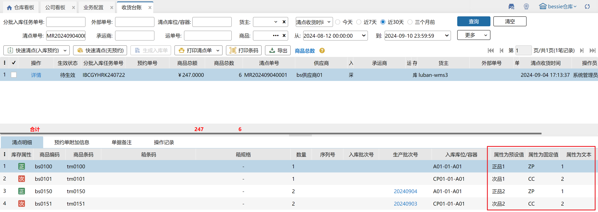

库存自定义描述支持打印，勾选当前仓设置的属性名称并打印即可：

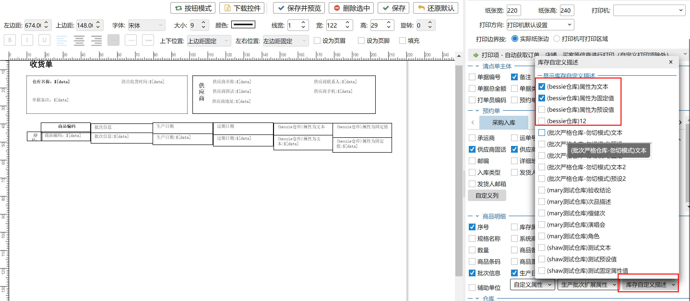

#### 入库修改指定批次
若明细为生产批次商品，且有指定批次时，根据当前账号权限判断是否允许在入库时录入非指定批次。

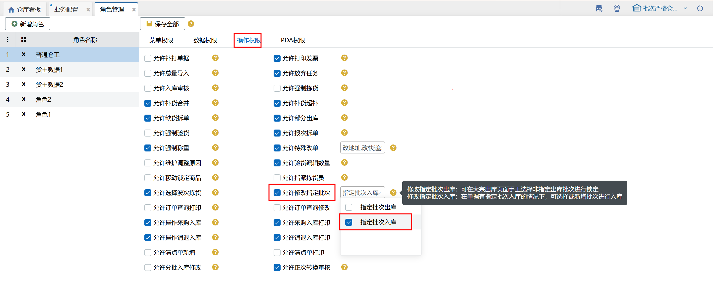

若当前账号为超管、普通管理员、一级部门主管或勾选了允许修改指定批次-指定批次入库的其他账号，则在入库时，允许为指定批次明细录入非其他非指定批次号，否则只能选择到指定批次号，如下图所示：

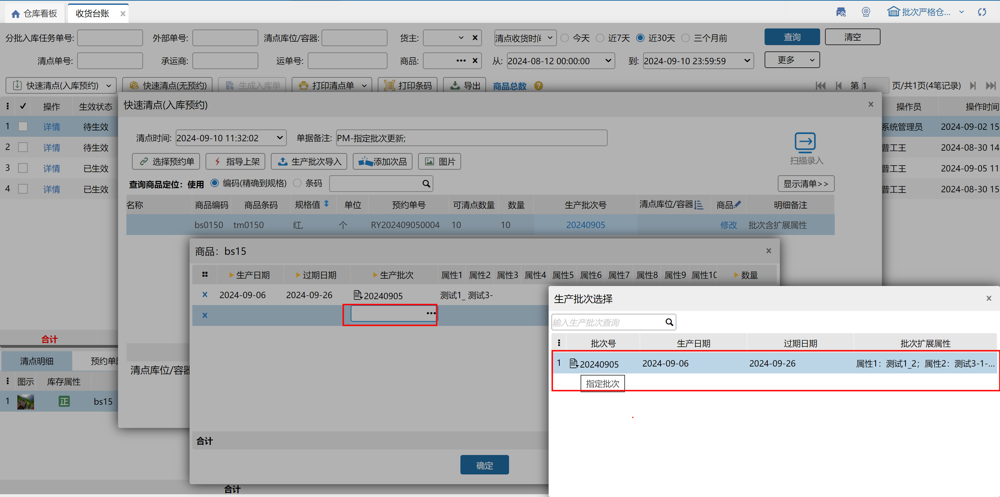

**注意：**

1.清点单不允许修改，可点击查看详情；

2.入库单为待确认状态，可在入库详情修改，点击入库确认后，该笔采购预约单入库成功；

3.修改入库单不影响清点单数据；

4.一次清点可选择同货主、同类型的多笔预约单；

5.允许对一笔预约单多次清点，明细数量会在原数量基础上扣减之前已经清点过的数量；

6.点击扫描录入，自动跳转到理货清点页面。

### 2.快速清点（无预约）
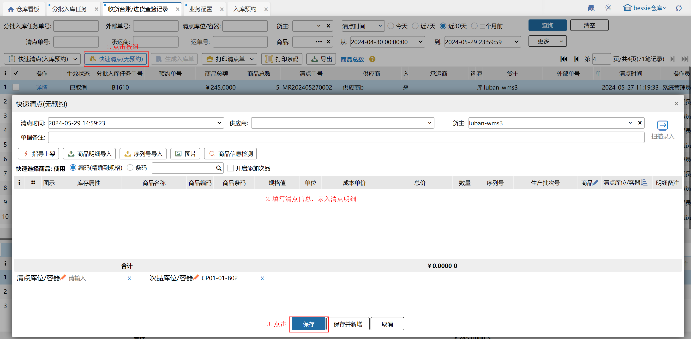

无预约单清点不需要选择预约单，填写清点信息和明细后点击保存，即可生成清点单和入库单。

> 更新: 2026-06-11 10:11:17  
> 原文: <https://hupun.yuque.com/unzko7/lsbfg0/cogi67y2zn60c0q3>