# 分批入库任务

此页面主要用于查看和管理不同类型的分批入库任务。

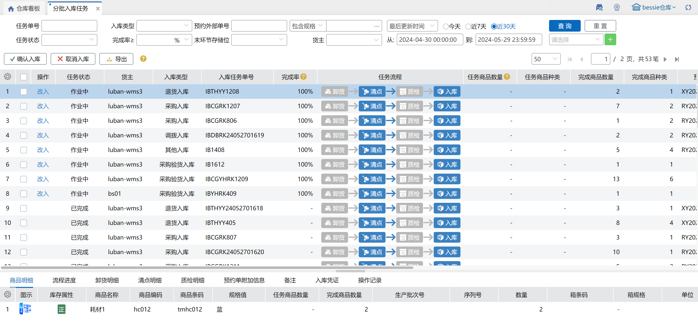

### 1.生成任务
从PC清点单、PC/PDA理货清点、PDA清点装箱等页面生成清点单后，同步会生成对应的分批入库任务，默认任务状态为【作业中】，按业务配置——[个性配置](https://hupun.yuque.com/unzko7/lsbfg0/zexgznlchnpsc7p7#C6Npb)匹配任务流程。

其中，各数量列含义如下：

任务商品数量：首环节完成商品数量，单环节时显示-

任务商品种类：首环节完成商品种类，单环节时显示-

完成商品数量：末环节完成商品数量

完成商品种类：末环节完成商品重量

+ **商品明细**

单次清点后，商品明细和清点明细一致，若进行多次清点，则同sku合并显示（库存属性+指定生产批次）。

其中，各数量列含义如下：

任务商品数量：首环节完成商品数量，单环节时显示-

完成商品数量：末环节完成商品数量

已作业商品数量：末环节已作业商品数量

+ **流程进度**

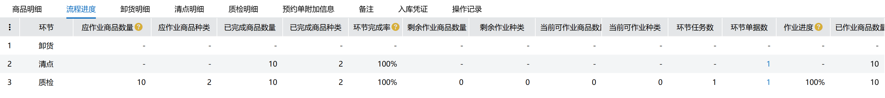

显示各环节作业进度，目前只支持清点、质检环节。环节单据数点击可跳转到清点单/质检单页面显示对应的单据。

其中，各数量列含义如下：

应作业商品数量：上环节已完成商品数量，单环节时显示-

应作业商品种类：上环节已完成商品种类，单环节时显示-

已完成商品数量：本环节已完成商品数量

已完成商品种类：本环节已完成商品种类

环节完成率：本环节完成商品数量/本环节应作业商品数量

剩余作业商品数量：应作业商品数量-已作业商品数量

剩余作业种类：剩余作业商品种类

当前可作业商品数量：应作业商品数量-已完成商品数量

当前可作业种类：当前可作业商品种类

环节任务数：本环节关联的任务数量

环节单据数：本环节关联的单据数量

作业进度：已作业商品数量/应作业商品数量

已作业商品数量：已完成商品数量+作业中商品数量，单环节显示-

+ **卸货明细**

功能开发中……

+ **清点明细**

显示对应清点单明细，箱明细转化为拆零数量，同sku+库存属性合并显示。

其中，各数量列含义如下：

应作业商品数量：清点环节时显示-

已完成商品数量：已完成清点的商品数量

当前可作业商品数量：清点环节时显示-

已作业商品数量：已完成清点的商品数量

+ **质检明细**

以树结构形式显示明细，父级显示清点明细，子级显示质检结果，未质检的明细无子明细。

其中，各数量列含义如下：

应作业商品数量：上一环节完成商品数量(拆零)，上一环节为空显示“-”

未创建任务商品数量：应作业商品数量-已创建任务商品数量

可作业商品数量：应作业商品数量-已作业商品数量

已作业商品数量：已完成商品数量+作业中商品数量

作业中商品数量：创建任务暂存的作业结果商品数量

已完成商品数量：已质检通过的商品完成数量(拆零)

+ **预约单附加信息**

默认带出预约单上对应数据，其中采购验货入库无预约单，支持手动修改信息，其他类型不支持修改。

+ **备注 **

任务状态为【作业中】时，允许手动修改备注。

+ **入库凭证**

支持手动上传网络或本地图片，最多6张。

+ **操作记录**

显示任务相关操作记录。

注：相同货主、相同供应商的采购验货入库会自动合并为一个【作业中】入库任务。

### 2.改入
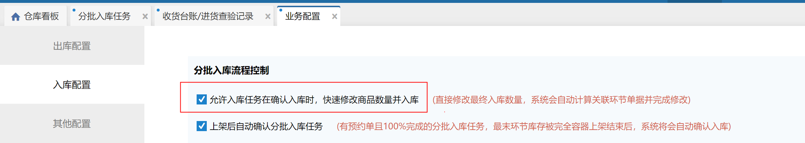

改入关联业务配置-允许入库任务在确认入库时，快速修改商品数量并入库，勾选则显示改入，否则不显示。

点击改入显示任务修改弹窗，环节结果单据根据任务流程环节显示。

任务清点+入库流程，弹窗分区显示入库任务明细、对应清点单据以及清点单明细。

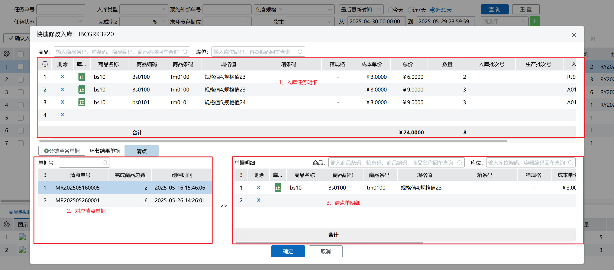

任务清点+质检+入库流程，弹窗显示入库任务明细、对应清点单、质检单以及单据明细。

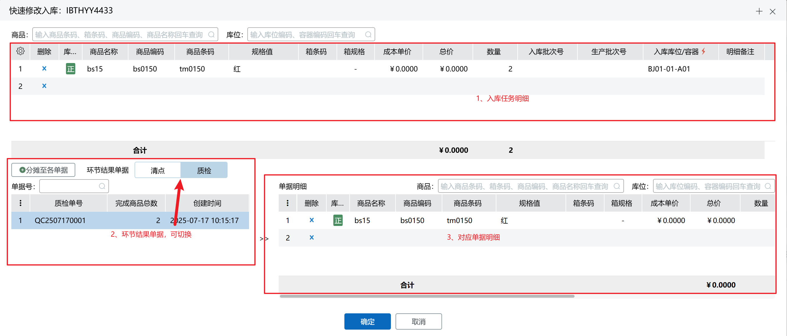

入库任务明细、清点单明细、质检单明细修改范围包括明细数量、入库库位、明细备注、增减明细等，其中不同类型的任务可修改范围关联相关配置，具体如下：

+ 入库超收

开启允许入库超收，对应单据可入库数量允许超出预约数量，修改数量后标红显示。

+ 销退入库差异收货

开启销退入库差异收货，退货入库/换货入库类型的任务允许新增预约单外的商品明细并入库，新增明细数量标红显示。

+ 次品管理

开启次品管理开关后允许添加次品明细。

+ 序列号商品管理

开启序列号商品管理时，包含序列号商品明细的入库任务支持改入。

+ 生产批次商品管理
    - 开启生产批次商品管理时，包含生产批次商品明细的入库任务支持改入。
    - 批次禁收规则

生产批次商品按禁收规则进行校验，不符合时页面会有异常提示。

    - 同批次多日期开关

开启开关后允许添加同批次号不同日期的批次信息。

注：

①货箱明细不支持修改数量；

②同一个任务同时有清点和质检环节时，清点单据明细不允许修改。

修改入库任务明细后，点击分摊至各单据按钮，可以将改动同步至单据明细上，其中有数量变化的明细会标红显示，同时所属单据也会标红显示，表示此单据有改动。

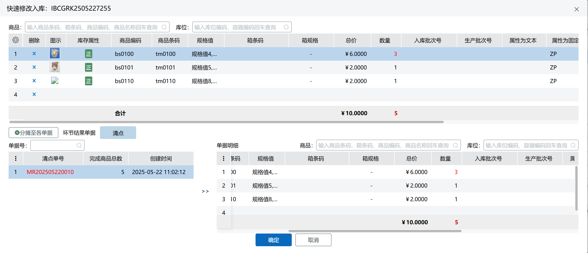

修改完成后点击确定，由于修改后数量与前置环节数量不等，系统显示数量异常提示。点击确定则继续确认入库，点击取消则不再确认入库，点击不再提醒，下次确认入库时不显示此弹窗。

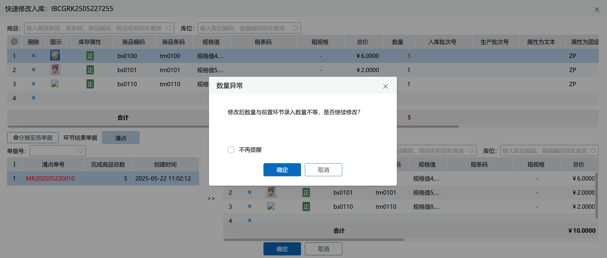

入库成功后，对应单据上会同步修改信息并显示操作记录。

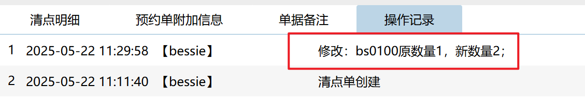

若入库任务明细和单据明细数量、规格、生产批次等存在不一致的情况，入库时会报错提示。

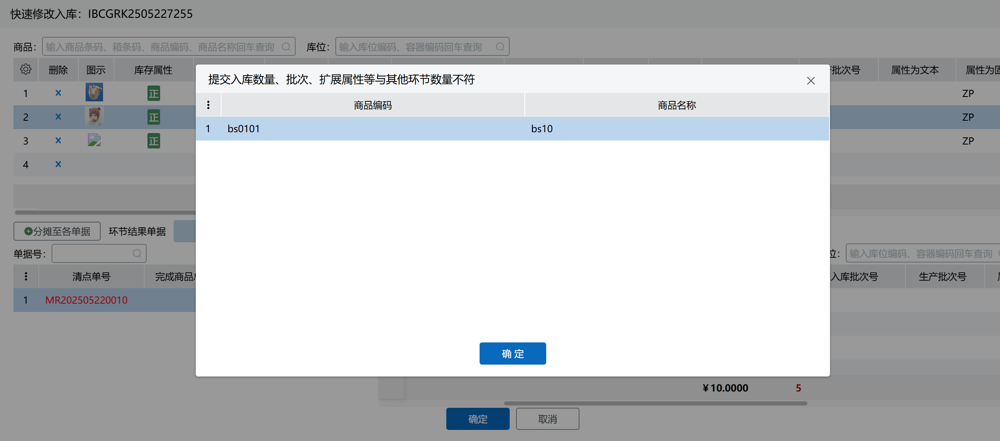

### 3.关联明细快速定位
操作列新增定位按钮，点击后显示红色，并高亮蓝色显示各环节关联的明细行，点击切换环节可以查看关联明细。

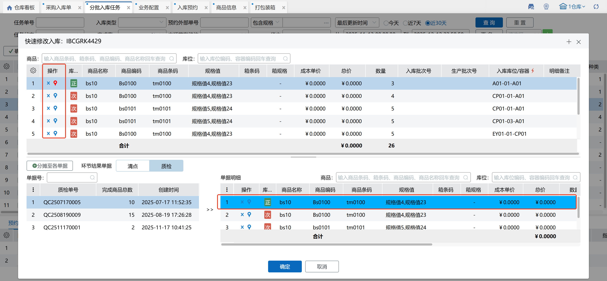

注：①点击环节单据明细定位按钮，可以反向定位关联的上层入库明细；

②再次点击定位按钮，会取消关联行高亮显示效果；

③删除当前定位行，会取消关联行高亮显示效果；

④新增明细分摊到单据后，可以通过定位按钮找到关联行。

### 4.上传溯源系统
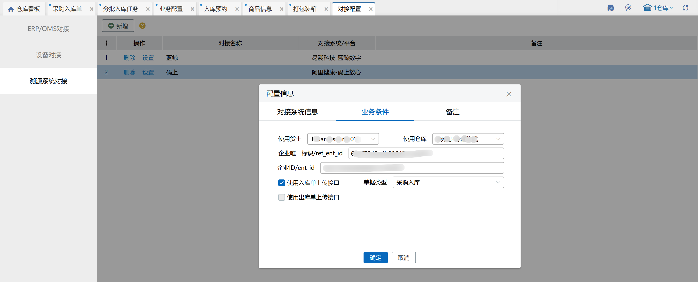

前提：对接配置——[溯源系统对接](https://hupun.yuque.com/unzko7/lsbfg0/gpgz776pazg6t2mx#l2ZFi)中设置当前仓对接码上放心平台，分批入库任务明细中包含序列号外箱码时，在确认入库或改入确认时，入库任务变成【作业中】并生成一个【待入库】入库单，将外箱码上传到码上放心平台，并在系统中生成一条[溯源上传记录](https://hupun.yuque.com/unzko7/lsbfg0/ftw5c7450kfccl72)，根据平台处理结果显示状态：

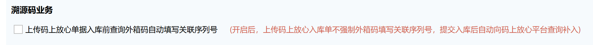

当前仓未开启【上传码上放心单据入库前查询外箱码自动填写关联序列号】时，外箱码上传成功后，不会回填到对应清点单据和分批入库任务明细上，仍按照生成时的序列号信息显示；开启则会回填到对应入库单明细上。

注：【作业中】分批入库任务有溯源上传记录生成时，不允许二次清点，要先把作业中任务完结后再进行清点。

### 5.确认入库
#### 5.1 未设置审批管理
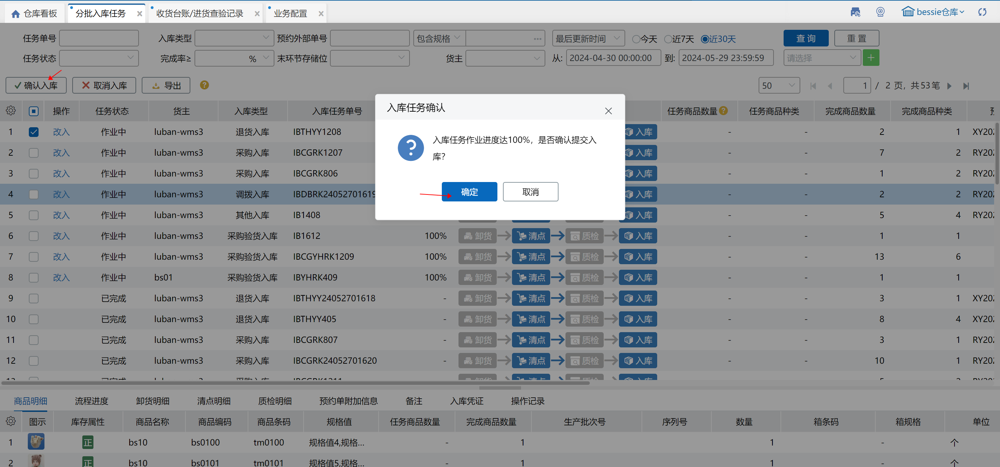

勾选单据点击确认入库，在弹窗中点击确定后，若正常入库，则任务状态变成【已完成】，关联的清点单/质检单变成【已生效】，同时生成【已审核】状态的入库单；否则弹窗显示失败原因。

#### 5.2 设置审批管理
在[审批管理](https://hupun.yuque.com/unzko7/lsbfg0/gumupf3qnnlkrcrs)页面配置分批入库—指定单据类型审批流程后，符合配置的入库任务在确认入库或改入后会生成作业中+审批中的入库任务，具体操作请参考[采购入库审核](https://hupun.yuque.com/unzko7/lsbfg0/crl0rycd2i8g3a23#M1x2b)。

### 6.取消入库
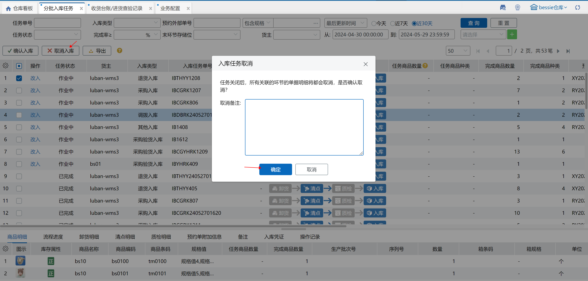

勾选单据点击取消入库，在弹窗中输入取消备注（非必填）后点击确定，若取消成功，则任务状态变成【已取消】，关联的清点单/质检单变成【已取消】，不会生成入库单；否则弹窗显示失败原因。

### 7.导出
可选择按查询结果或按单据导出任务数据。

> 更新: 2026-01-29 18:39:15  
> 原文: <https://hupun.yuque.com/unzko7/lsbfg0/gnq86bvaynt3kg0u>