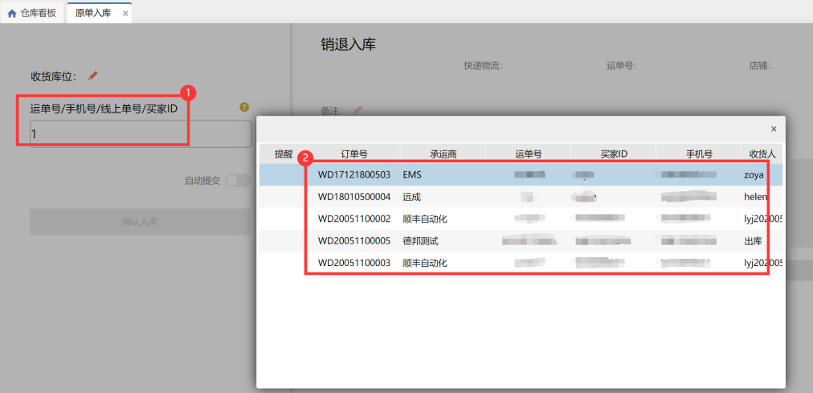
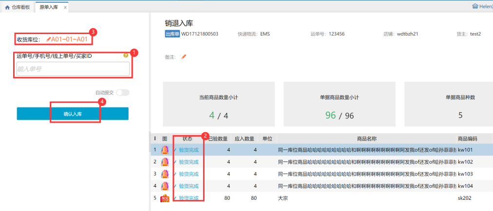
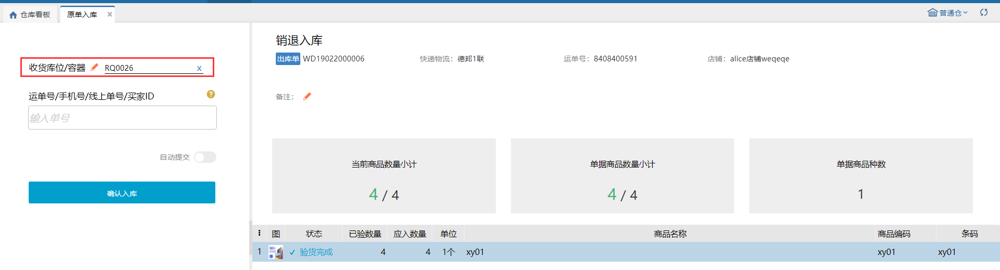

# 原单入库

从仓库销售出库的订单扫描运单号、买家ID、手机号任意一个可以原单入库，具体操作页面如下：

### **1.扫描信息匹配到多个原单**
当扫描的信息有多个销售出库的单据匹配时，会弹出匹配的订单供选择，最多显示十个匹配的订单，按照仓库接单时间排序，具体操作页面如下：

### **2.扫描信息匹配到一个原单**
单据不包含序列号商品时，扫描运单号、买家ID、手机号之一后，会自动验货，此时选择收货库位后可入库；

单据包含序列号商品时，要扫描序列号之后才会验货成功，具体操作页面如下：

提示

1.拥有销售出库仓库权限的用户可以选择权限下的任意仓库原单入库；

2.仓内策略--其他配置中开启验证业务单据有效性的前提下，原单入库会验证序列号商品的序列号是不是原始出库时登记的序列号；

3.仓内策略--入库配置中开启了允许入库超收，原单入库已验数量可以修改为大于应入数量的值；

4.仓内策略--入库配置开启了允许入库超收、允许销退入库差异收货，原单入库可以差异收货;

5.订单经过拆单、合单及系统已经建立售后预约单的则不支持原单入库。

### ** 3.开启入库使用容器**
入库时扫描容器编码，支持货品入到容器里。

> 更新: 2023-12-21 17:50:04  
> 原文: <https://hupun.yuque.com/unzko7/lsbfg0/yxx8i8g1fnistalh>