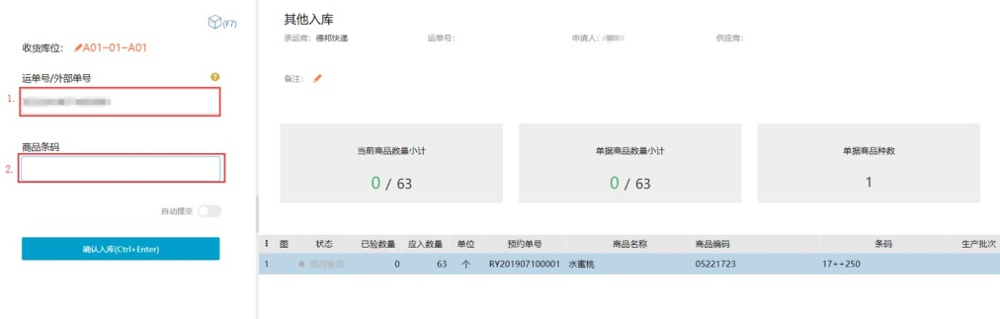
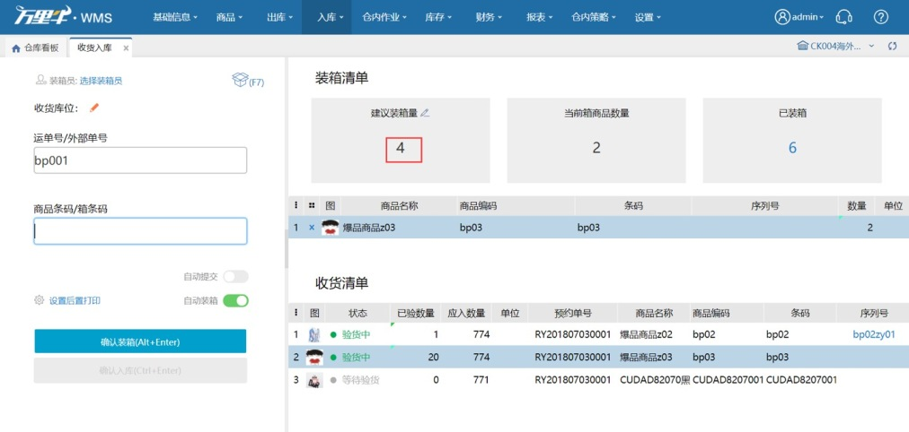
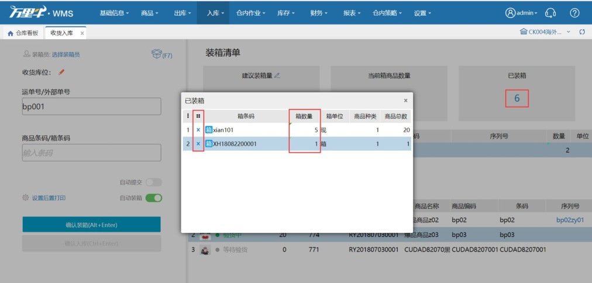
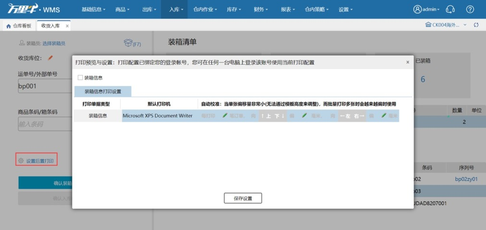
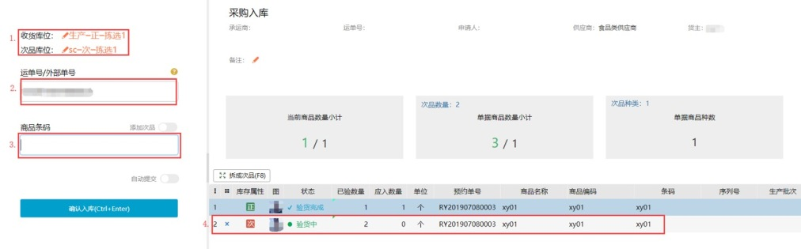
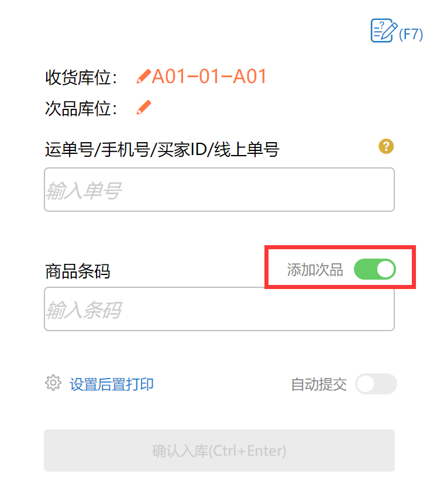
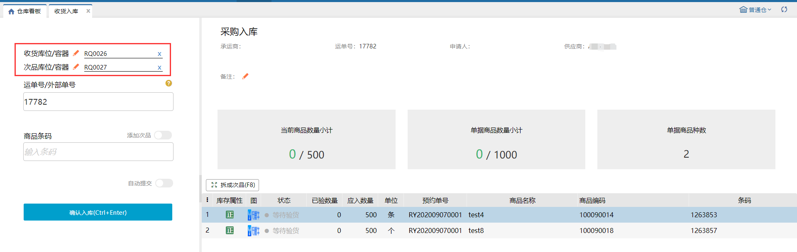

# 收货入库

收货入库可以通过扫描单据信息进行入库操作。同时支持入库装箱。扫描时匹配除销退单据之外的所有未完成入库预约单。

### **1.收货入库**
1）扫描项：支持扫描预约单的运单号和外部单号，左模糊匹配。

2）扫描匹配：匹配一个单据，直接带入单据内明细信息。扫描匹配多个单据，弹出框显示匹配到的单据，默认显示20个。只支持同类型和同货主的单据同时入库。

3）扫描商品条码：支持条码截取、辅助条码和主条码。扫描匹配到一个商品直接添加该商品数量，扫描匹配到多个商品弹出框选择；在仓内策略–业务配置，开启扫描条码强制提交后，未开启自动提交时，收货入库无需点击确认入库，扫描wanliniu666可自动入库。

 

### **2.入库装箱**
名词解释：唯一箱：通过打包装箱等途径装的箱子，每个箱子拥有唯一的箱条码，不同箱子之间的箱条码不可能重复。规格箱：开启了全流程库存管理时，商品可设置装箱规格，根据不同的数量比例设置箱子中sku数量的多少。

1）装箱条件：仅在未开启入库审核时才能入库装箱。点击装箱按钮或者按F7直接跳转装箱页面。

2）扫描商品条码/箱条码：扫描商品条码：匹配之后，装箱清单中加上该sku。扫描规格箱条码：装箱清单中加上该规格箱规则中对应的sku数量。扫描唯一箱条码：只匹配待生效的唯一箱条码，且待生效的唯一箱中的sku存在于预约单中。

3）建议装箱量：开启全流程库存管理时，sku的建议装箱数量为规格箱启用的箱规则中最低层级的箱子数量。若没有规格箱规则，建议装箱数量为该sku设置的库区预警上限-下限的最小值。若都无，建议装箱数量为-。建议装箱数量可以手动填写，当sku的数量到达建议装箱数量时，可自动装箱。

4）已装箱：点击已装箱的数字，弹出框会显示已经装箱的箱子信息。规格箱数量可编辑，增加、减少或删除箱子。唯一箱只能删除箱子。点击箱图标，显示箱内sku信息。唯一箱装箱但是未入库时，打包装箱能查询到该箱子信息，状态为待生效。

5）后置打印：后置打印在每次装箱后打印箱条码，方便操作员装箱后贴上箱条码。

### **3.开启次品开关后收货入库**
业务配置开启次品开关后，收货库位下新增次品库位，商品条码右上方新增添加次品开关，右侧商品明细中新增库存属性列，新增快捷键F8拆成次品，具体操作如下所示：

**提示：**

1.  未开启添加次品开关，扫描录入的都是正品，开启添加次品开关，扫描录入的都是次品；                      

2. 收货库位过滤次品库位，次品库位无限制；

3. 序列号商品已支持添加次品入库，添加次品时，选择序列号商品，录入序列号入库后，序列号根据库存属性区分。

4. 商品开启入库批次管理，添加次品入库后，入库批次号为空；

5. 扫描录入商品的正品入库明细后，使用快捷键F8可以从当前已验的正品中拆成次品，当正品已验数量为0时，不可拆出次品；

6. 同sku正品、次品不能同时存放同一库位，案例如下：

前提：空拣选库位A、拣选库位B有商品a的正品库存、拣选库位C有商品a的次品库存、次品库位D

①商品a 正品选择库位A，次品选择库位A报错：所选的目标库位不能同时存放同一个商品的正次商品；

②商品a 正品选择时，查询库位D结果为空，选择库位C，保存报错：目标库位上有同商品的不同属性库存；

③商品a 次品选择库位B，保存报错：目标库位上有同商品的不同属性库存；

④商品a 正品选择库位B，次品选择库位C，保存入库成功；

⑤序列号商品b添加次品入库，次品无序列号。

7.若上次入库操作次品所选收货库位都为同一库位，收货入库再次添加次品时，次品收货库位会自动带出上次入库的次品选择的收货库位。

次品入库回传：

1）业务配置选择次品库存管理全部对内模式，入库后次品数量回传ERP；

2）业务配置选择次品库存管理全部半对外模式，入库后次品数量不回传ERP。                     

 

### **4.开启入库使用容器后收货入库**
入库时扫描容器编码，支持货品入到容器里。

### 

> 更新: 2023-12-21 17:48:55  
> 原文: <https://hupun.yuque.com/unzko7/lsbfg0/tct91keu3a3ogybd>