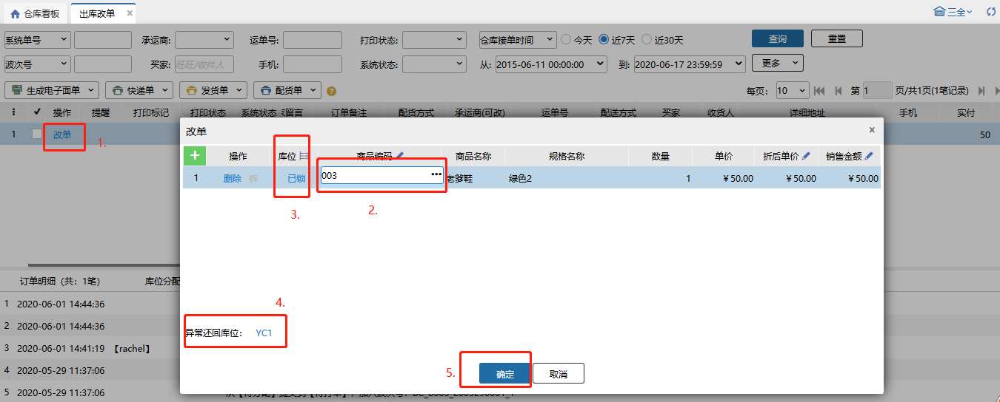
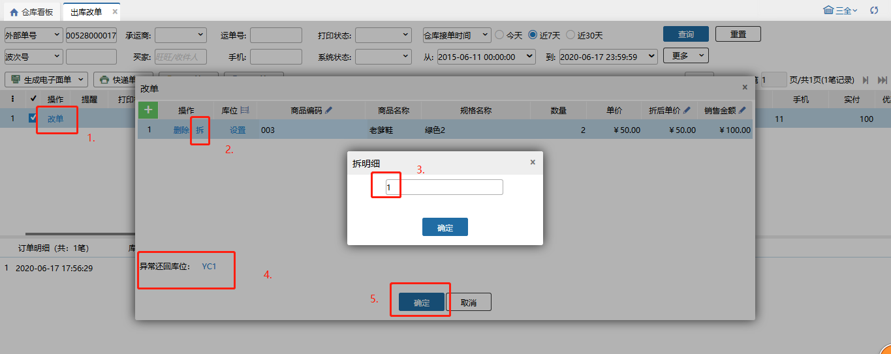
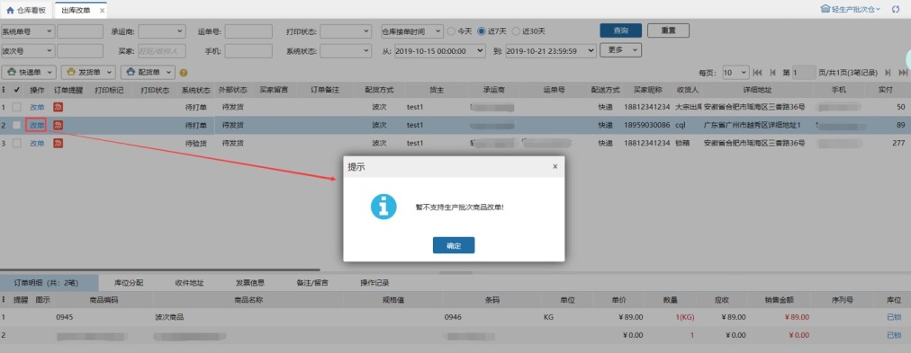

# 出库改单

### 使用场景
出库改单主要用来用户推送订单到wms中发现商品错了，可以直接在wms中修改商品不需要在erp修改后重新下单，缩短了流程。也常用于服装类目中，订单中sku库存不足，改码发货的场景。

### 01.改单
#### (1) 全部换商品
下单时订单中的商品是A，推到wms中发现订单中商品填写错误，可以把商品A换为商品B。

选择一个订单点击“改单”，在改单窗口，点击商品编码处修改商品，设置商品锁定的库位，选择原商品还回的库位，确认后改单成功并通知erp，具体步骤如图所示。

#### (2)部分换商品
订单需要5件商品A（L码），拿货时发现只有3件商品A（L码），但商品A（XL码）充足，把5件商品，拆分为3件A（L码）+2件A（XL码）。

选择一个订单点击“改单”,在改单窗口，点击“拆”，输入数量点确定后会出来选商品得页面，选择要换得商品。设置商品的库位，选择原商品还回的库位，确认后改单成功并通知erp，具体步骤如图所示。

 

**提示**

①.销售出库单、大宗订单都支持，调拨出库、其他出库类型的订单不允许改单；

②.生产批次商品和序列号商品不支持，只支持普通商品；

③.拣货之后的环节都需要异常还回；

④.换商品的过程，数量不会增也不会减，只有商品的变化；

⑤.锁库不变，库位总量和库位库存扣减是在确认改单时；

⑥.对接伯俊ERP的调拨出库、其他出库单不允许改单，只允许改地址

#### (3）商品生产批次管理标准模式下改单
业务配置开启生产批次管理标准模式，订单包含生产批次商品时，不支持出库改单；

#### (4) 改地址
收件地址支持手动修改和识别。在详细地址中输入需要识别的信息后，点击识别，系统自动解析出对应信息并填充，红字为识别出的信息，点击保存生效。

#### (5) 改承运商
替换承运商/回收电子面单时，已打印快递单的订单会弹窗提示：该订单已打印快递单，若继续修改请销毁已打印面单；点击继续按钮，替换承运商/回收电子面单，点击取消按钮，不替换承运商/回收电子面单。

### 02.打印
勾选某笔订单点击相应按钮，即可打印快递单、发货单、配货单。

> 更新: 2026-04-14 10:52:01  
> 原文: <https://hupun.yuque.com/unzko7/lsbfg0/enxgs9wtoloa3zun>