# 出库组包

组包是物流与供应链履约中，将多个小件合并为一个大件或按流向 / 规则整合为 “包裹组” 的作业模式，核心是降本、提效、合规与适配平台规则，在国内快递通常是快递方按照集包地进行组包，而在跨境托管场景中则为核心履约环节。出库组包页面主要用于组包创建、修改及作废等相关操作，具体操作如下。

### 页面布局
出库组包页面及功能区域如下图所示：

#### ①组包规则设置区
初始页面默认无组包规则，若组包不限分组条件，符合扫描范围的订单都可以添加到小包列表中；若要指定分组条件，可以点击设置规则，按需设置不同分组条件，这样在扫描时会根据选择的规则进行筛选，符合规则的可以添加到小包列表，不符合的有相应提示，不会添加到小包列表中。

**组包规则设置**

**平台规则**

平台规则是系统预设规则，带有【平台】标识，支持查看，不支持修改和删除。选择平台规则后创建大包，属于平台组包。

**新增自定义规则**

点击+新增规则，设置分组包括货主、平台/店铺、收货地址、收货公司、承运商，设置后点击保存即可。选择自定义规则或无规则创建大包，属于非平台组包。

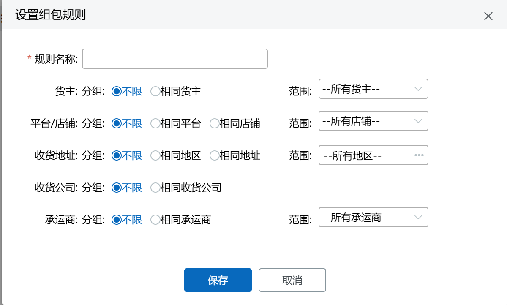

以货主为例：分组不限+范围所有货主，即扫描不同货主的订单都可组成同一个大包；

分组不限+范围指定货主，即扫描货主需在指定范围内才允许组成同一个大包；

相同货主+范围所有货主，即扫描相同货主的订单才允许组成同一个大包，以扫描的第一个订单货主为分组依据；

相同货主+范围指定货主，即扫描相同货主且在指定范围内的订单才允许组成同一个大包，以扫描的第一个订单货主为分组依据。

以收货地址为例：分组不限+范围所有地区，即扫描不同地区的订单都可组成同一个大包；

分组不限+范围指定地区，即扫描地区需在指定范围内才允许组成同一个大包；

相同地区+范围所有地区，即扫描相同地区的订单才允许组成同一个大包，以扫描的第一个订单收货地区（省市区）为分组依据；

相同地区+范围指定地区，即扫描相同地区且在指定范围内的订单才允许组成同一个大包，以扫描的第一个订单货主为分组依据；

相同地址，即扫描相同地址（省市区详细地址）的订单才允许组成同一个大包，以扫描的第一个订单收货地址为分组依据。

以收货公司为例：分组不限，即扫描不同收货公司的订单都可组成同一个大包；

相同收货公司，即扫描相同收货公司的订单才允许组成同一个大包，以扫描的第一个订单收货公司为分组依据。

平台/店铺、承运商分组逻辑同货主类似。

**修改自定义规则**

选择需要修改的规则，点击修改并保存即可。

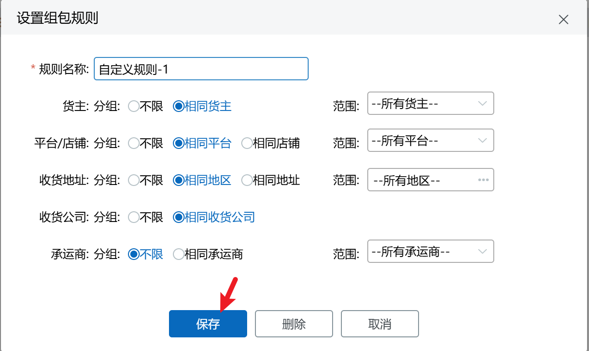

****

**删除自定义规则**

选择需要删除的规则，点击修改-删除并二次确认即可。

注：最多支持添加20条规则（含平台规则）。

#### ②小包/大包扫描框
小包指未组包的订单，大包指已创建的组包。扫描框支持扫描已出库且未迁移到历史库的订单/波次进行组包操作，或扫描已创建的大包进行修改物流或作废操作。扫描小包需符合当前设置规则，匹配到有效单据后会添加到右侧小包列表中，无匹配或其他异常时会报错提示原因。

扫描单号有多个匹配单据时，可以在弹窗中选择对应单据添加到列表中。

先扫描匹配到大包后，不允许再扫描小包，系统提示如下图，可先重置页面后再扫描小包。

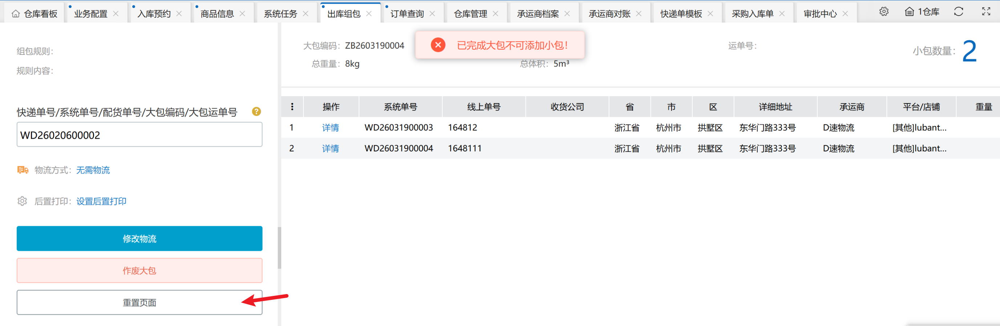

先扫描匹配到小包后，再扫描大包，系统提示如下，可选择切换到大包操作流程或取消。

注：小包列表最多支持扫描添加500个订单。

#### ③物流方式、后置打印设置区
平台组包物流方式有两种：仓库自有物流、平台物流；非平台组包物流方式有两种：无需物流，仓库自有物流。

出库组包支持后置打印大包快递单、大包清单。在组包过程中可以按需选择对应物流方式及后置打印单据。

#### ④小包列表显示区
在创建大包时，用于显示已经扫描的小包信息，支持移除小包、查看小包明细详情。

扫描大包编码匹配到小包信息，支持查看小包明细详情，不支持移除。

#### ⑤功能按钮区
创建大包：扫描小包单号进行组包时显示此按钮，点击后创建大包。

修改物流：扫描匹配到非平台大包编码时显示此按钮，点击后可修改物流信息。

作废大包：扫描匹配到非平台大包编码时显示此按钮，点击后可作废大包。

重置页面：一键清除页面数据，重新录入新单号。

#### ⑥大包信息显示区
显示大包相关信息，包括大包编码、承运商、运单号、总重量、总体积、小包数量。

### 创建大包
#### 平台组包
平台组包有默认的平台组包规则，平台组包规则是固定的，只能查看无法修改。

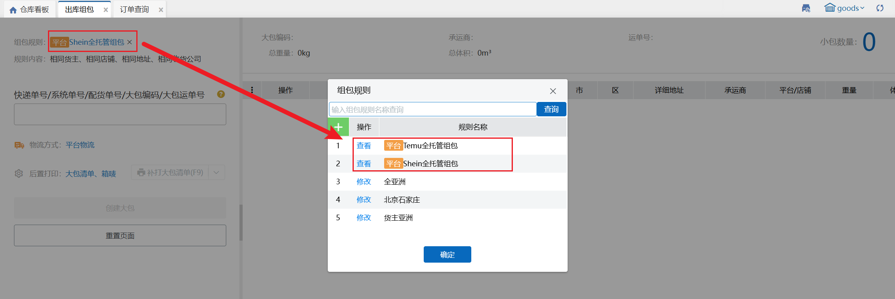

选择平台组包规则后，扫描需要组包的订单号/波次号，选择物流方式及后置打印单据类型后，点击创建大包，在弹窗中填写大包、物流等信息后提交，完成创建大包。

#####  Temu全托管组包

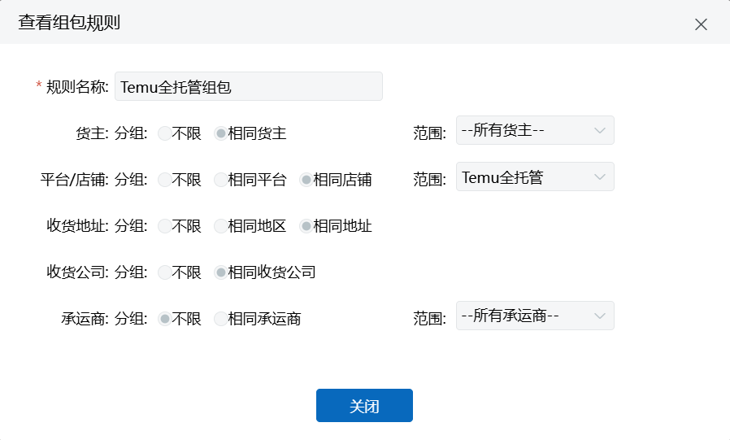

物流方式选择“平台物流”，点击创建大包按钮，会弹出“[平台]组包信息确认”，会显示大包信息，物流信息。物流信息中，平台推荐物流需要自行选择，选择物流后会显示可以选择的上门取货时间，选择符合范围的上面取货时间。

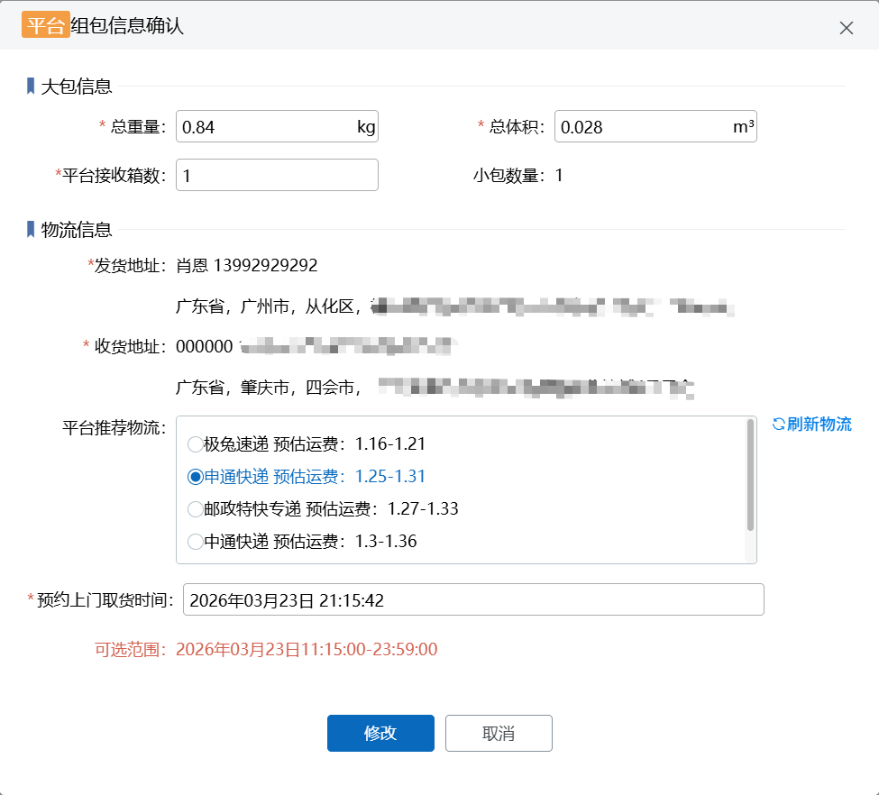

点击【确认】，即可完成大包的创建，并根据后置打印的配置，打印出相应的大包清单（ps：平台组包使用平台物流情况下不支持打印快递单），页面会显示组包成功的大包信息。

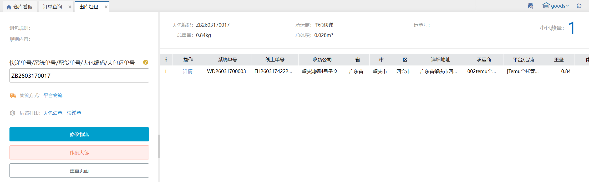

##### Shein全托管
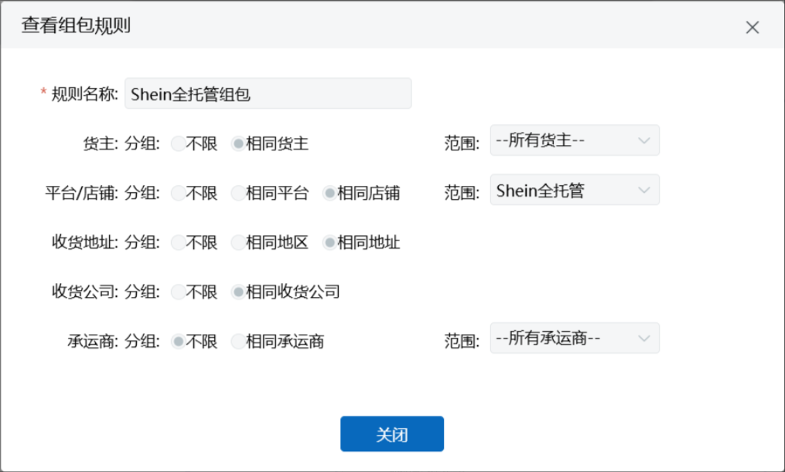

物流方式选择“平台物流”（Shein全托管只能选择平台物流），点击创建大包按钮，会弹出“[平台]组包信息确认”，会显示大包信息，物流信息。物流信息中，SHEIN发货仓和SHEIN发货地可以下拉选择。选择“预约上门取货时间”后，点击【刷新物流】按钮，会显示平台推荐物流，平台推荐物流需要自行选择，选择物流后即可提交创建大包。

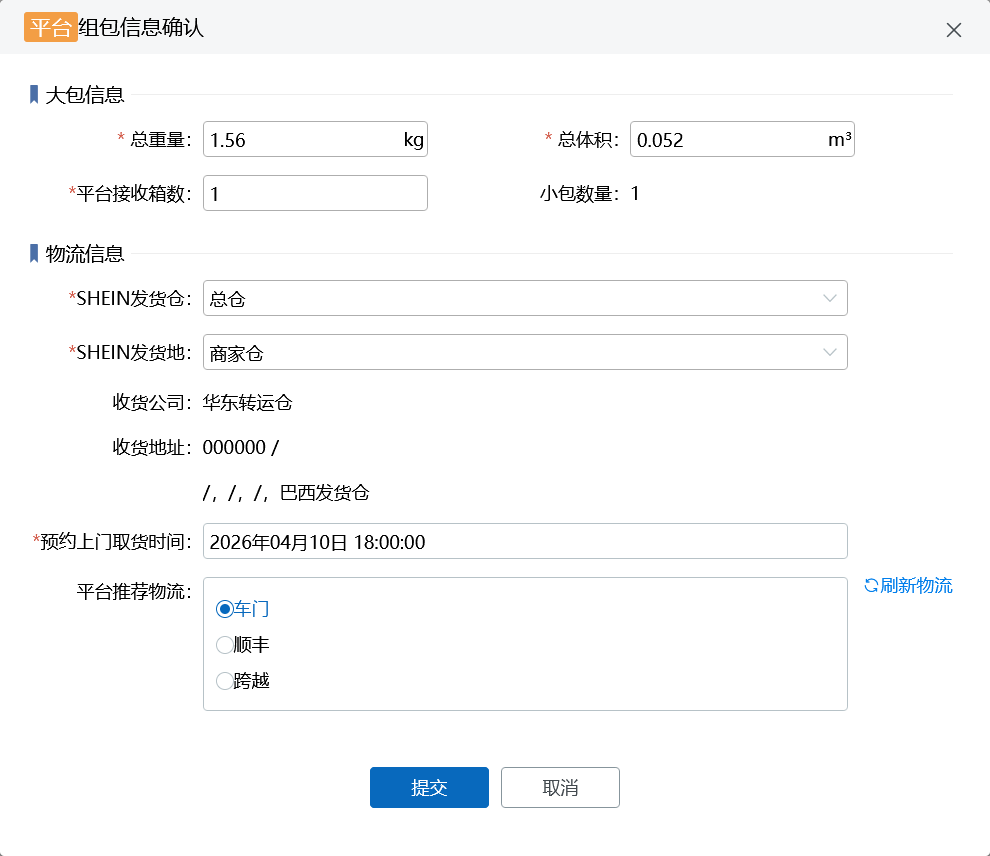

#### 非平台组包
设置自定义规则后，扫描需要组包的订单号/波次号，选择物流方式及后置打印单据类型后，点击创建大包，在弹窗中填写大包、物流等信息后提交，完成创建大包。

物流方式选择“无需物流”，组包确认弹窗仅显示大包信息，无物流信息，创建成功后大包上无承运商和运单号，后置打印出大包清单，无快递单。

物流方式选择“仓库自有物流”，组包确认弹窗显示大包信息和物流信息，发货地址默认带出当前仓地址，可手动修改收货地址和发货地址，承运商手动指定，运单号可以不填，创建成功后大包运单号按所选承运商生成，后置打印出大包快递单和大包清单。

注：组包信息确认弹窗带*为必填项。

大包快递单上系统订单号、运单号、重量、体积显示对应大包编码、大包运单号、大包总重量、大包总体积。

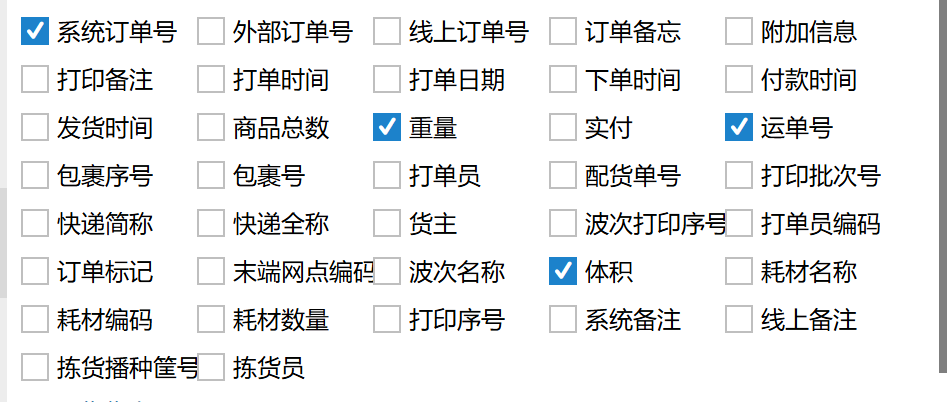

组包创建成功后，订单查询页面显示对应大包信息，并支持查询和导出。

大包生成电子面单后，承运商对账页面显示对应大包信息和单号状态。

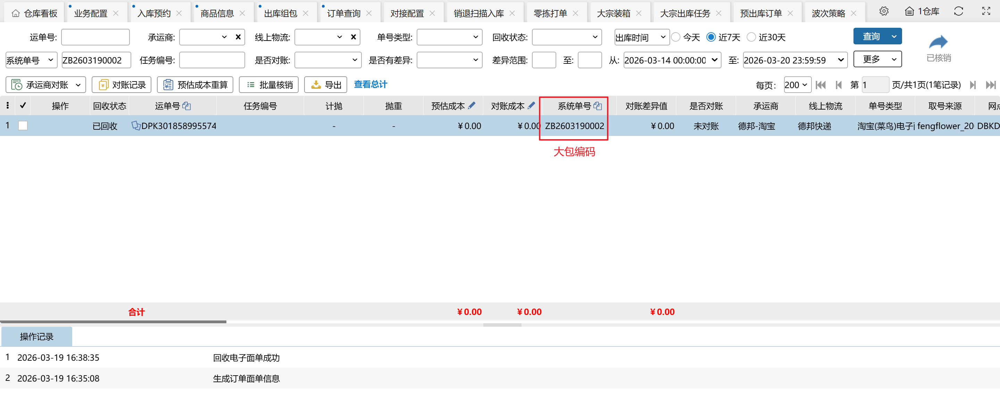

注：组包记录暂不支持承运商对账、预估成本重算、批量核销。

### 修改物流
扫描需要修改物流的大包编码，匹配到数据后先按需选择物流方式，点再击修改物流按钮，在确认弹窗中修改相关信息后确认，修改成功后大包按新的信息生成，后置打印出新的大包快递单和大包清单。

### 作废大包
扫描需要作废的大包编码，匹配到数据后点击作废大包并确认作废。

平台组包不允许作废大包。

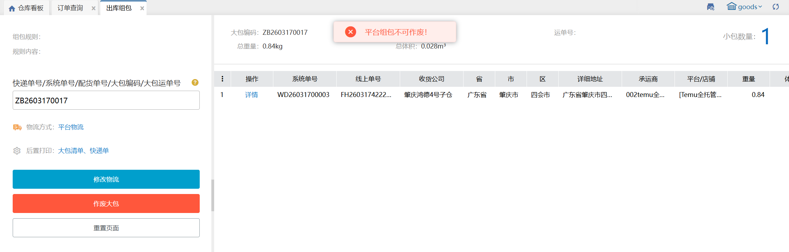

### 重置页面
需要清除页面数据时，可点击重置页面按钮一键清除。

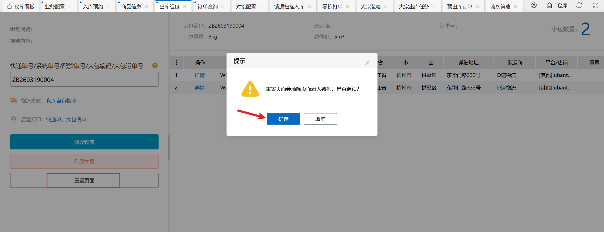

### 补打单据按钮
已创建的大包，可以在系统页面补打该大包的相应单据。扫描已组包完成的大包编码，显示大包信息后，补打按钮可点击。下拉点击可以切换单据类型，可选的单据类型和后置打印中勾选的单据一致，未勾选的单据，补打下拉无法切换。

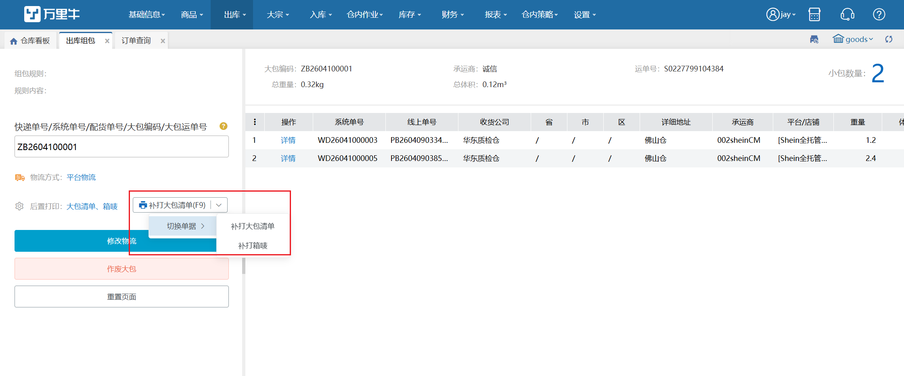

> 更新: 2026-04-10 15:15:55  
> 原文: <https://hupun.yuque.com/unzko7/lsbfg0/kk2dcehd7f76n0sy>