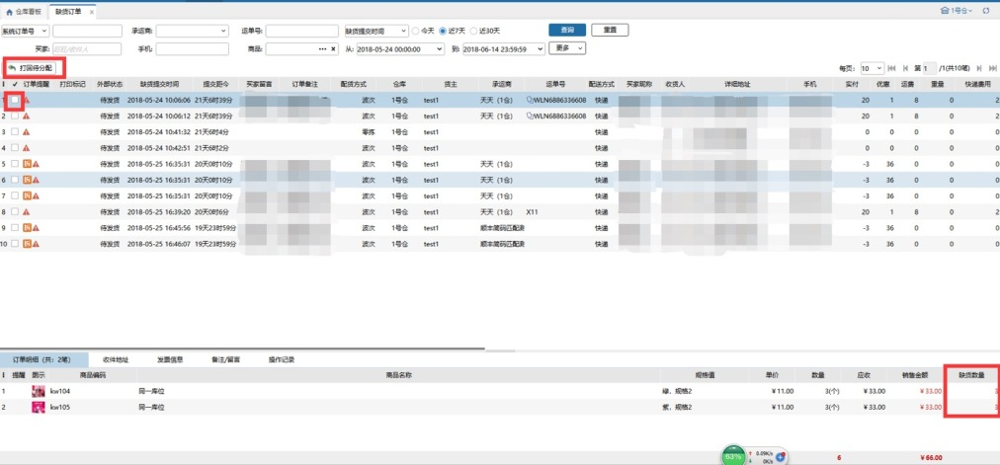
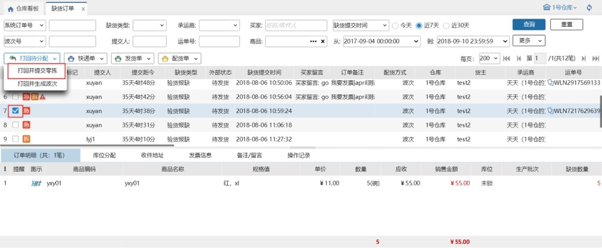
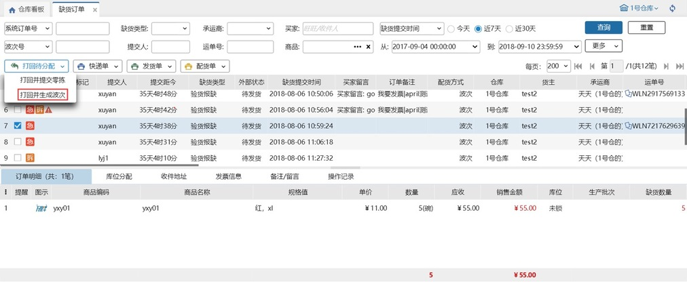
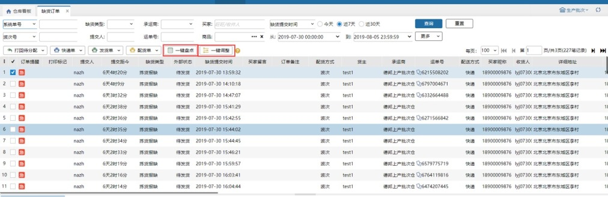
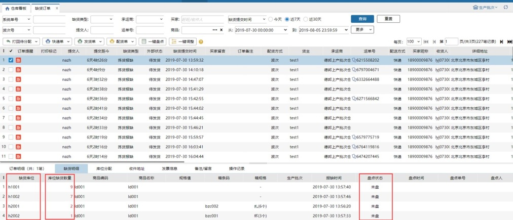

# 出库缺货

### **出库缺货**
在日常作业中，系统考虑到在拣货作业和验货作业中碰到拣货缺货或是验货缺货的情况；故设置缺货订单可以将缺货订单进行提交

### 01.打回待分配
缺货商品处理完成后可勾选相应订单将其打回待分配界面。处理完成是指：缺货商品已经有库存了。

### 02.打回并提交零拣
勾选订单后，将订单重新打到零拣打单。若之前提报缺货订单时，库存未还回，打回零拣打单时会需要还回。

### 03.打回并生成波次
勾选订单后，将勾选订单生成手工波次。若之前提报缺货时，库存未还回，打回并生成波次时会需要还回。支持勾选多个订单。

#### （1）勾选后点击

#### （2）生成手工波次

**提示：**

拣货环节报缺仅支持PDA作业时提报

验货环节PC及PDA均可提报

### 04.一键盘点or一键调整
在缺货明细tab页看到订单中商品XX1在K1、K2..库位缺了多少个，勾选缺货的订单点击一键盘点或一键调整，跳到盘点页面，对库位上的缺货商品进行盘点，差异量根据计算会自动带出来。

**注意**

1.验货报缺或已盘过的缺货订单，不允许盘点和调整。

2.订单上的明细盘点后，缺货明细盘点状态是已盘，并关联盘点单。

3.盘点后，所有订单上有该缺货库位该缺货商品的明细都是已盘。例如：订单01、02、03、04都是缺货库位kw1、商品A1，勾选订单01进行盘点或调整，盘点后，01、02、03、04订单的缺货明细tab页库位kw1+商品A1都是已盘。

4.一键调整限制序列号商品和多个货主的订单一起调整。

5.一键盘点和一键调整限制200个订单500个明细。

6.盘点页面差异量计算公式：库位库存实际数量-（未拣数量-缺货数量）。

> 更新: 2023-12-18 15:40:33  
> 原文: <https://hupun.yuque.com/unzko7/lsbfg0/xfd4h7io1l0eg49l>