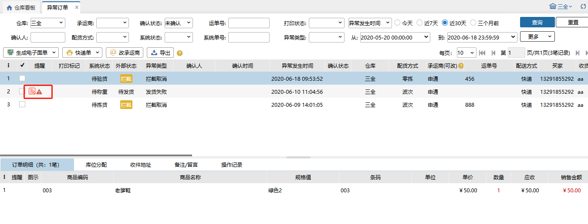
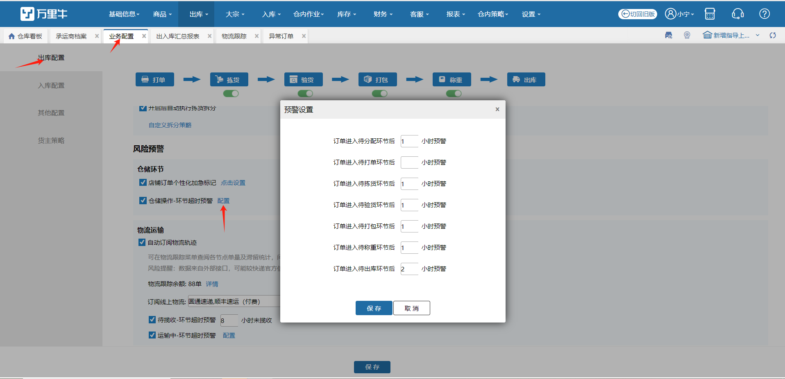
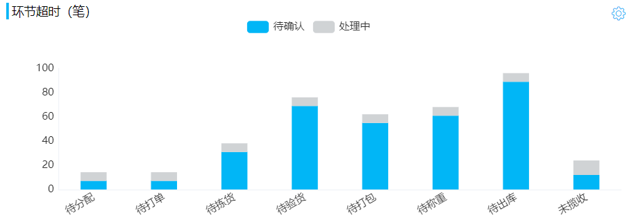
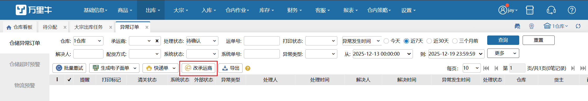

# 异常订单

### 1、仓储异常订单
默认显示异常发生时间为近7天的异常订单列表。异常情况分为：挂起、拦截、发货失败等。

**提示：**

1、挂起：erp在WMS配货页面挂起已经推送到wms的订单，wms订单会有挂起标记，挂起的订单不能移至下一环节。erp订单申请退款，自动会挂起。

2、拦截：erp在WMS配货页面对已经推送到wms的订单打回审核或者重新下单，wms这笔订单会有拦截标记。拦截的订单点击确认拦截后状态变成已关闭。erp订单退款关闭，自动拦截。

3、发货失败：提交至待出库环节的订单会触发发货程序，发货失败则显示在异常订单列表中。用户可以在此页面针对这些订单修改承运商和快递单号。

4、在订单的 操作记录中会显示当前订单异常发生原因，便于分析解决

5、wms的单据正常，但是需要关闭订单。如果是没有超过7天的单子的话，需要找客服去拦截下订单，超过7天的单子可以自己手动拦截下，点下图像书一样的按钮进行拦截。拦截好后，去订单所在的环节操作下确认拦截就可以了。

**自动拦截订单**

自动拦截订单的情况有：

1.  订单退款

2.、部分关闭

3、地址变更

4、备注变更                       

###  2、仓储超时预警
联动业务配置中仓储操作-环节超时预警配置显示，默认显示当前仓库下近7天的环节超时订单。

**提示：**

a.环节预警在业务配置-风险预警-仓储环节中进行设置，保存后立即生效，对符合的订单打上标记，在预警异常中可查询到对应订单。

b.勾选订单或者按查询结果点击通知处理可选择对应的操作员进行处理，确定后订单状态变为处理中，操作员会受到一条提醒通知。

c.环节预警的订单在超时环节进行作业到下一环节后恢复正常，收回超时订单标志，在当前环节长时间不作业又达到环节预警的时间则会称为超时订单。

d.仓库看板中点击环节超时对应环节的数据可点击跳转到仓储超时预警tab查看具体的订单。

注：点击未揽收跳转到物流预警tab。

### 3、物流预警
业务配置中待揽收或运输中环节超时预警有一个配置则异常订单显示物流预警tab。可显示有权限仓库下物流状态超时或问题件订单。

1.订单物流状态“已揽收/未揽收/运输中”，最后更新时间超过X小时（X>设置预警），订单为超时异常；订单物流状态“问题件”，订单为问题件；以上订单进入异常订单-物流预警。

2.异常订单支持点击通知处理，处理状态变更处理中，更新处理人和时间数据；订单去除异常后从此tab移除。

异常变更规则：

例：已揽收订单-超时预警：订单状态“已揽收”，最后更新时间超过X小时。

      无异常、处理状态为空：订单物流状态变为“运输中”或之后非异常物流状态；订单物流状态“已揽收”，最后更新时间已更新，且未超过X小时。

### 4.改承运商
支持在订单上单个修改或批量修改订单承运商，同零拣打单。若修改后订单收件地址属超区，会报错提示。

替换承运商/回收电子面单时，已打印快递单的订单会弹窗提示：该订单已打印快递单，若继续修改请销毁已打印面单；点击继续按钮，替换承运商/回收电子面单，点击取消按钮，不替换承运商/回收电子面单。

> 更新: 2025-12-19 15:14:47  
> 原文: <https://hupun.yuque.com/unzko7/lsbfg0/ag8uluml4lv98fl5>