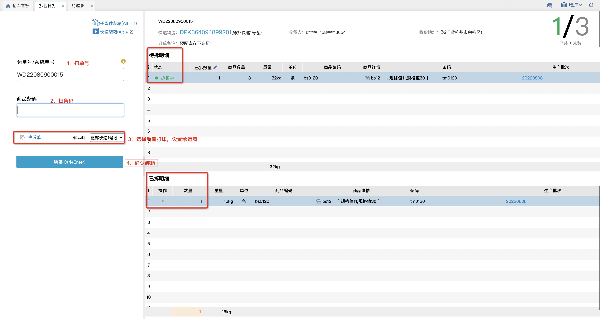
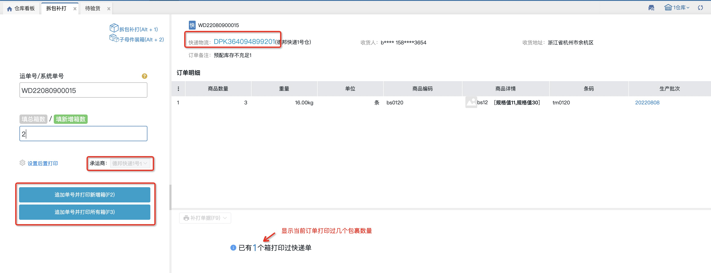

# 拆包补打

### **01.拆包补打**
拆包补打页面可以输入想要拆单的订单进行多次拆单并支持变更快递，设置后置打印后，点击装箱会自动打印快递单。

### **02.拆包装箱**
该功能主要适用于用户在不拆分订单的情况下，将订单用子母件/多包裹的方式发货，支持变更快递单。

1.和拆包补打在同一个菜单下，点击切换或者按快捷键切换

2. 装箱逻辑同拆包补打，只是这里不拆分订单，只是将明细装成一个包裹

3.全部装成包裹完毕后，点击生成子母件/单号就完成了。

4.装箱后，可以点击详情查看当前包裹的明细。       

 

### 03.快速装箱
该功能主要适用于用户在打包后想要追加生成单号或多次追加的情况，支持自定义装箱数量，按钮跟随不同场景变化显示。

1.订单上已有单号或已有多个包裹、且承运商支持追加单号，则支持追加单号，并按新增箱或所有箱打印快递单：

2.订单上已有单号、且承运商不支持追加单号，则支持快速装箱，并按新增箱或所有箱打印快递单：

3.订单上无单号、且承运商不支持追加单号，则支持申请普通单号快速装箱并打印：

4.订单上无单号、且承运商支持追加单号，则支持申请子母件快速装箱并打印：

5.订单已有多个包裹、有单号、且承运商不支持追加单号，则显示追加单号按钮，但不支持追加，点击会报错提示：

### 04.视频录制
视频录制方法和其他页面一致，此处不再赘述，可参考[专题内容](https://hupun.yuque.com/unzko7/lsbfg0/ff462xtrzibtn77z#QTC8K)。

视频记录时间根据拆单顺序有所区别，具体如下：

【拆包补打】模式，第一个拆出订单的开始时间为匹配到订单的时间，结束时间为拆单提交时间；往后每一个拆出订单的开始时间都为上一个订单的拆单提交时间，结束时间为本订单拆单提交时间。

【快速装箱】模式，订单开始时间为匹配到订单的时间，结束时间为装箱成功的时间。

【拆包装箱】模式，订单开始时间为匹配到订单的时间，结束时间为生成子母件/单号成功的时间。

从条码验货跳转到拆包装箱模式进行操作的，视频记录时间和内容根据两个页面的设备配置有所区别，具体如下：

条码验货和拆包装箱页面配置设备一致的：订单开始时间为条码验货页面匹配到订单的时间，结束时间为生成子母件/单号成功的时间，视频内容包括在两个页面操作的内容。

条码验货和拆包装箱页面配置设备不一致的：如果条码验货有设备，则条码验货页面跳转到拆包装箱后，会把设备带出并显示到拆包装箱页面，订单开始时间为条码验货页面匹配到订单的时间，结束时间为生成子母件/单号成功的时间，视频内容包括在两个页面操作的内容。如果条码验货没有设备，则条码验货页面跳转到拆包装箱后，按拆包装箱页面的设备进行录制，订单开始时间为拆包装箱页面匹配到订单的时间，结束时间为生成子母件/单号成功的时间，视频内容仅包括在拆包装箱页面操作的内容。

视频记录归属环节为【拆包补打】，操作员为实际进行拆包补打操作的人员。

**提示**

1、仓库中只要有开启电子面单的承运商，无论订单上的承运商是否开启了电子面单都允许拆单，但是点击装箱时会判断承运商是否开启电子面单，未开启的报错提示，开启的正常拆单。拆包补打的订单必须是待验货、待打包、待称重或待出库环节的订单。

仓库中只要有支持生成子母件承运商开启电子面单无论订单上的承运商是否开启了电子面单都允许装箱，但是点击生成子母件时会判断承运商是否开启电子面单，未开启的报错提示，开启的正常生成子母件。

2、有发票信息（普通发票/电子发票）的订单拆出来的子订单是没有发票信息的。

3、天猫直送（承运商带锁的）、到付件、唯品会订单、已装箱的订单不允许拆包补打。

4、波次中的其中一笔订单拆包补打，这个订单不再属于这个波次。

5、待验货和打包环节的订单拆包补打，拆出来的订单直接提交至下一环节。

6、淘宝平台的订单进行拆包补打时若不进行明细拆出则新生成的最后一张电子面单号会覆盖之前的单号同步至店铺后台，若拆出明细发货，系统则给ERP回传所有运单号并以部分发货形式同步至线上。

7、生产批次管理严格模式下支持生产批次商品；**标准模式下不支持生产批次商品（拆包补打、快速装箱两种不支持；拆包装箱支持，需要先登记批次号才允许拆包）。**

8、不支持外贸订单和锁了规格箱的订单。

9.在仓内策略–业务配置，开启商品条码截取，扫描输入截取的商品条码会与商品信息的条码进行对比校验；

①.选择特殊信息截取，扫描输入++前的条码，系统会与订单商品信息的条码进行对比校验；扫描输入不含特殊字符的全量条码可直接匹配商品，扫描输入包含++字符的全量条码，无法匹配到商品信息。

②.选择条码位数截取，扫描输入前若干位条码，系统会与订单商品信息的条码进行对比校验；扫描输入全量条码，无法匹配到商品信息。

10、在仓内策略–业务配置，开启扫描条码强制提交后，无需点击装箱，扫描wanliniu666可自动装箱。

①生成子母件页面只代替点击装箱的动作，不会代替生成子母件的动作。

> 更新: 2025-05-30 09:14:50  
> 原文: <https://hupun.yuque.com/unzko7/lsbfg0/diel37dq62pgz5dm>