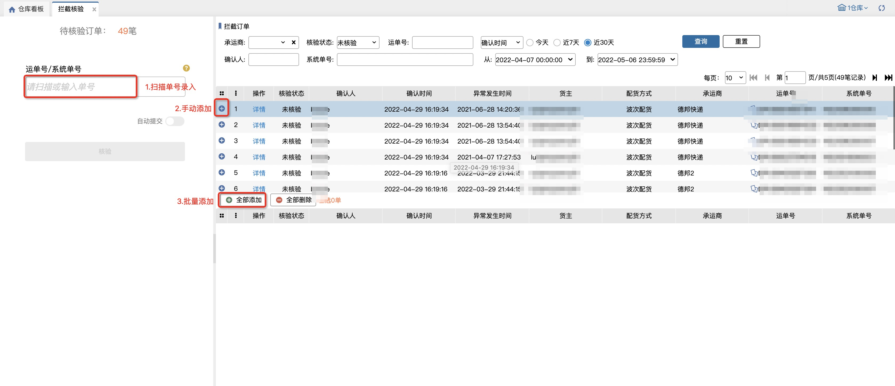

# 拦截验核

用于二次确认当前仓库下已经确认拦截的订单，最多显示近1个月内的订单。

页面默认显示当天确认拦截且未核验过的订单，左侧待核验订单数量跟随右侧查询列表数据同步变化。

数据范围：当前仓库下+已经打印过快递单+被拦截状态+确认拦截的订单

### **01.添加订单**
添加订单有三种方式：扫描单号录入、手动点击加号添加、点击“全部添加”：

添加成功后数据显示在下方列表，可手动点击减号或“全部删除”取消添加：

**注：已添加列表无数据时，核验按钮置灰不可点击，有数据时高亮可点击。**

### **02.核验**
录入需要核验的订单后，点击核验按钮，即可提交核验。提交成功后订单状态变成已核验，已添加列表清空。

### **03.已核验列表**
订单提交核验后，通过“核验状态-已核验”能查询到数据，已核验状态下页面不支持操作，只能查询数据：

> 更新: 2023-12-18 14:27:50  
> 原文: <https://hupun.yuque.com/unzko7/lsbfg0/pohd5m3ehftgqs16>