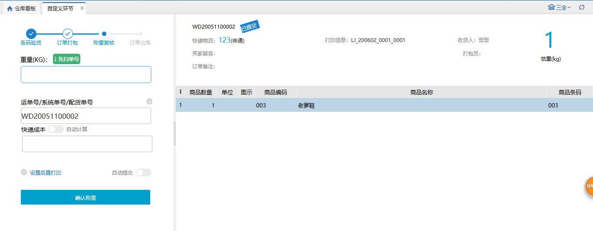

# 自定义环节

### 自定义环节页面适用场景：
1.用户有部分订单想要一次性通过一些环节时，可以在选择得页面扫描并提交，这样就一次性通过了多个环节。

2.用户想要抽查一个波次内的某个订单，就可以开启校验模式，扫描波次后，自动选出波次中的一个订单进行条码验货或者称重操作。提交后，整笔波次提交。（仅支持同品波次和预配波次）

业务配置开关：

#### 01.选择环节
可配置范围：仓库开启的环节中从验货到出库的环节，中间环节之间不能有间隔，选中之后，自定义环节菜单中提交的订单将会直接通过选中的环节。

匹配的订单根据选中环节判断。例：自定义环节为：验货+称重+出库。匹配的订单就是待验货的订单。

1).选择环节包括验货且环节校验功能为条码验货的，序列号录入支持扫商品后连续扫录入和逐个扫商品+序列号录入

#### 02.环节校验功能
不选择环节：所有自定义环节都不用校验，自定义环节菜单将变成批量模式。

选择条码验货：扫描的订单只需要通过条码验货操作就能通过所有自定义环节。选择称重复核同理。

选择条码验货+称重复核：订单需要通过两个环节的校验才能提交所有环节。

#### 03.允许匹配订单
混品波次、同品波次、预配波次、零拣，选中之后，对应波次类型和波次类型下的订单才能被匹配到，混品波次不支持开启校验功能的页面匹配。

#### 04.记录操作员
选中后，仅选中的环节会记录操作员，记录为当前登录账号

 

### 自定义菜单模式：
#### 01批量模式
环节校验均未开启时，进入批量模式

#### 02.校验模式
环节校验功能开启条码验货/称重复核/条码验货+称重复核

a.仅开启条码校验，扫描订单后，需要进行条码验货操作，提交后，订单直接出库。

b.仅开启称重复核，匹配的订单需要做称重操作，提交后所有环节都通过。图中情况匹配待验货的订单，做称重操作提交后出库。

   

 c.条码验货+称重复核，扫描订单后，需要进行条码验货操作，提交条码验货后到称重复核页面，再次提交后，所有环节都通过。

从验货提交到称重：扫描的单号自动带到称重页面，且自动扫描，不能修改扫描的单号，称重后才能提交。

**注意**

在仓内策略–业务配置，开启商品条码截取，扫描输入截取的商品条码会与商品信息的条码进行对比校验；

①.选择特殊信息截取，扫描输入++前的条码，系统会与订单商品信息的条码进行对比校验；扫描输入不含特殊字符的全量条码可直接匹配商品，扫描输入包含++字符的全量条码，无法匹配到商品信息。

②.选择条码位数截取，扫描输入前若干位条码，系统会与订单商品信息的条码进行对比校验；扫描输入全量条码，无法匹配到商品信息。

> 更新: 2023-12-18 15:43:05  
> 原文: <https://hupun.yuque.com/unzko7/lsbfg0/gpx4mitgomuxb8d5>