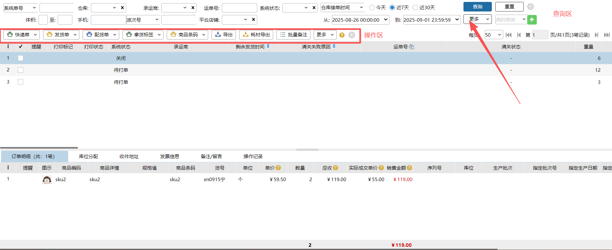
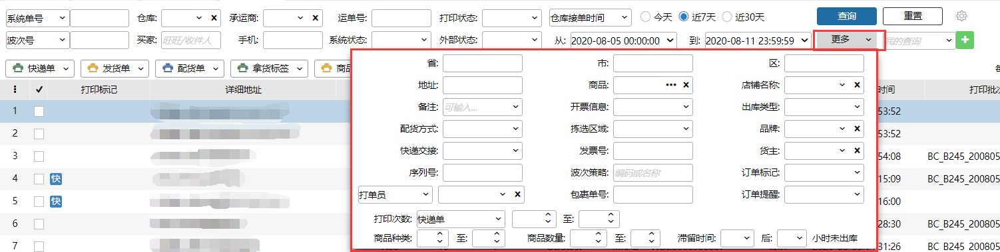
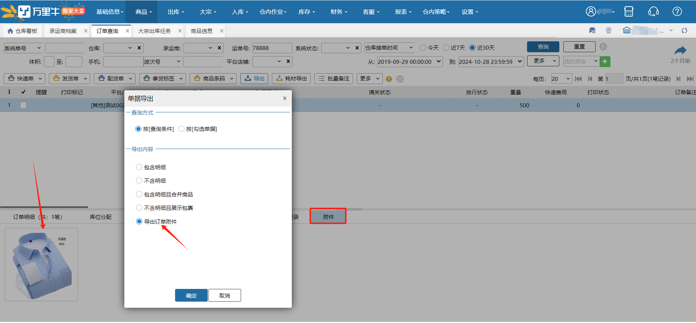
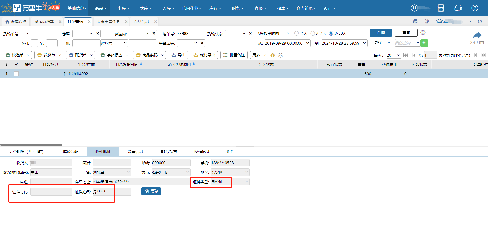
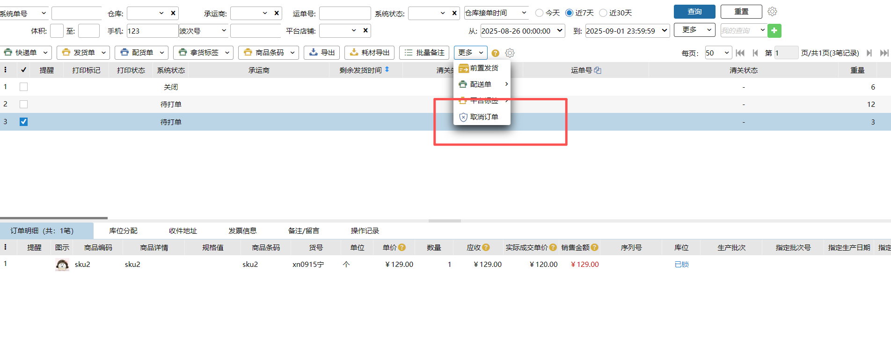

# 订单查询

根据各种条件进行订单查询，查看订单处理状态。可以补打发货单、快递单和导出订单明细。

### 1. 查询
条件支持用户自定义设置，最多10个查询条件，位置是一次从左到右，从上到下排序。                        

### 2.查询条件记忆
例如根据手机号123查询点击我的查询，输入标题名称01，下次进来可以直接在我的查询选择01，查询条件自动带出。

### 3.工具栏按钮支持自动调整位置

### 4.导出
:::color3
应用场景：主要给货主提供对账核对的数据支持。合并了耗材导出和普通导出功能，增加了耗材详情展示，并同步优化了包裹导出逻辑。

:::

订单导出步骤：

1. 进入【订单管理】→【订单查询】页面

2. 查询/勾选需要导出的订单

3. 点击【导出】按钮，选择导出方式：

   - 支持按单据导出（合并耗材）

   - 支持按包裹导出（包含明细）

   - 支持明细平铺显示

注：

①商品合并样式和"不导出明细"选项对行业属性不可选

②耗材的导出合并模式跟随单据/包裹的第一个明细行展示

③如果选择平铺显示，则每行一个，单据行数不够时自动补齐

④导出包裹时，若包裹中有商品则按包裹商品显示（包括耗材）；若包裹中无商品，则在第一行显示订单明细

⑤支持自定义列导出，按照页面上显示的列导出。

### 5.运单号查询支持输入子包裹运单号查询

###  6.订单标记-系统标记-平台标签

接单识别：推扩展字段cerpPrintGoodsLabel有值，识别为平台标签订单。

原其他打印模板->线上发货单改为平台标签。

平台标签支持全局查询、前置打印（波次、零拣、大宗）、后置打印（播种验货，独立播种、条码验货）。

平台标签对订单自动匹配波次、波次策略指定生成、标记订单辅助优先处理、绩效策略都生效。

### 7.订单支持按平台或店铺查询
订单可通过店铺或者平台进行筛选。抖音供销、抖音超市等可通过抖音小店查询。

切换tab时，数据以及勾选会对应清空。兼容保存我的查询条件。

### 8.申请电子箱唛
有包裹的订单支持申请电子箱唛，点击后申请电子箱唛，成功后订单显示标识。

注：若订单有多个包裹，则所有包裹都打上电子箱唛标识后，订单上才显示标识。

     

仅唯品会订单支持申请电子箱唛，否则报错。

未装箱订单不支持申请电子箱唛。

若作废包裹重新装箱，则支持重新申请电子箱唛。

支持部分申请电子箱唛，例：原装箱1、2，申请电子箱唛后又装箱3，则3可申请电子箱唛。

支持补打、后置申请和打印电子箱唛。

PDA暂不支持电子箱唛相关。

### 9.历史库位记录
系统状态为【已完成】的订单，支持查看历史库位记录：

### 10.按订单附件导出
导出新增模式-按订单附件导出，按查询条件或勾选单据，操作后支持去数据中心下载压缩包。

导出数据为订单上附件图片，包括png、jpg等。（支持在大宗出库手动上传附件或由上游推单附件数据）

### 11.清关证件信息
1.开启保税模块，收件人信息处展示证件相关数据（可联系技术开启）。

2.账号有查看敏感信息权限，点击后即可查看全部证件相关信息，否则仅显示加密信息。

3.账号有敏感信息查看权限，导出支持证件信息。

### 12.历史单据
1.历史单据可与正常单据一起查询、操作。

2.历史订单不支持前置发货。

3.历史订单不支持生成电子箱唛。

### 13.取消订单

1.订单查询显示“取消订单”按钮的条件：角色管理权限：有权限+公司下至少有1个无对接货主配置。

2.仅允许取消无对接货主的订单。

3.已出库的订单无法取消。

> 更新: 2026-07-27 17:54:13  
> 原文: <https://hupun.yuque.com/unzko7/lsbfg0/gwfq735st0u01ghx>