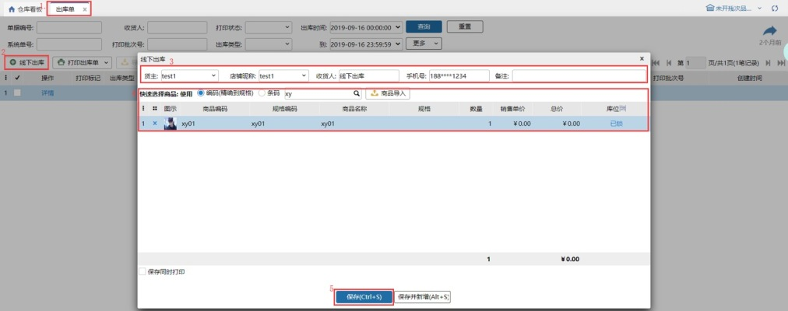
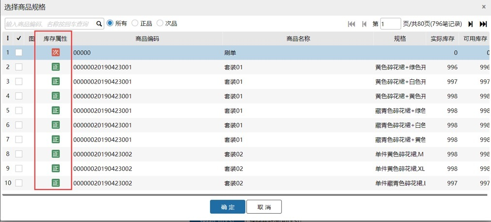

# 出库单

订单出库都会生成一个出库单，也支持直接新增一个线下出库单。

### **1.查询**
通过查询条件快速查询到出库单。

### **2.线下出库单**
线下店铺出售的商品，不需要走销售流程，可以直接增加线下出库单，保存后直接减库存。

业务场景：客户上门提货，不需要走销售流程，直接新增线下出库单。

开关配置：是后台开关，如果需要开启，找客服开启。

#### (1)新增线下出库单
货主：这个线下出库单是要出售哪个货主的商品。

店铺：当前货主的店铺。

收货人：下订单的用户名称或昵称。

手机号：非必填。

备注：非必填。

选择出售的商品，锁定库位，新增后直接扣减库位库存，并通知万里牛erp，万里牛erp会扣减库存且万里牛erp中的出库单中也可以查看到该笔单据。

注：商品编码选择商品时支持模糊查询，暂不支持序列号和生产批次商品。

#### (2)打印出库单
①、销售订单和线下出库单都是可以在出库单里打印的，打印的时候可以先打印预览，然后再打印，也可以直接打印。目前也新增了打印标记，方便用户了解打印情况。

②、线下出库单窗口勾选保存同时打印时，新增线下出库单时也会打印出库单。

#### (3)锁库逻辑
点击一键锁库，选择锁库时的库位类型，锁库时按照库位编码小的>入库批次小的>规格箱>唯一箱>拆零的顺序锁。

4.出库单详情

查看线下出库单锁定库位，方便拿货。

注：只有线下出库单才可以查看库位，其他类型的出库单不能看到库位。

5.商品导入

支持商品导入，最多导入200行，导入时有多行是重复商品，商品数量累加，销售单价取最后一行设置的。

### **3.导出**
支持出库单导出和序列号商品单独导出。

### **4.支持残次品出库**
次品商品库存积累一定程度后，根据不同的业务要求需要将次品进行出库返厂或报废折价处理，鉴于当前市场主流ERP不支持标准的残次品处理流程，我们开放了线下【出库单】这一出库渠道，支持分别选择正次品进行出库

1.通过商品编码添加商品时，可以添加正品和次品，直接选择添加。                        

2.  通过商品条码添加商品，默认添加的时正品，勾选添加次品添加次品。                    

3.锁库时，正品不能锁次品库位和次品库存，次品不能锁正品库存，库位不限。

4.打印支持正品和次品打印，增加库存属性打印项。

5.次品商品的线下出库单WMS里创建完成后是否通知erp，根据选择的次品管理模式。

①.设置次品管理模式是在仓内策略-业务配置-其他配置-开启次品库存管理。

②.选择对内模式，次品商品线下出库单WMS里创建完成后是会通知erp扣减库存和创建出库单。

③.选择半对外模式，次品商品线下出库单WMS里创建完成后不会通知erp扣减库存和创建出库单。

> 更新: 2025-09-01 15:53:26  
> 原文: <https://hupun.yuque.com/unzko7/lsbfg0/tfpk4bz8ehnhdz57>