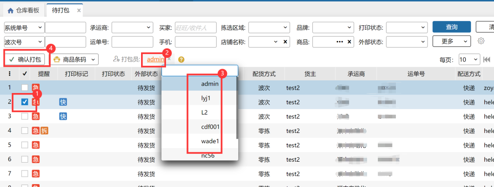

# 待打包

### **01、查询界面**

可在查询界面选择不同条件进行待打包订单查询。（单号支持批量查询，最多200个）

### **02、订单打包**

1. 勾选一个或多个订单点击确认打包即可快速通过打包环节

2. 打包员默认为当前操作员，可点击进行更改选择，选择操作员后相应订单打包绩效将计入该操作员。                     

> 更新: 2024-02-02 16:29:01  
> 原文: <https://hupun.yuque.com/unzko7/lsbfg0/uc54r1q1gc3tnsef>