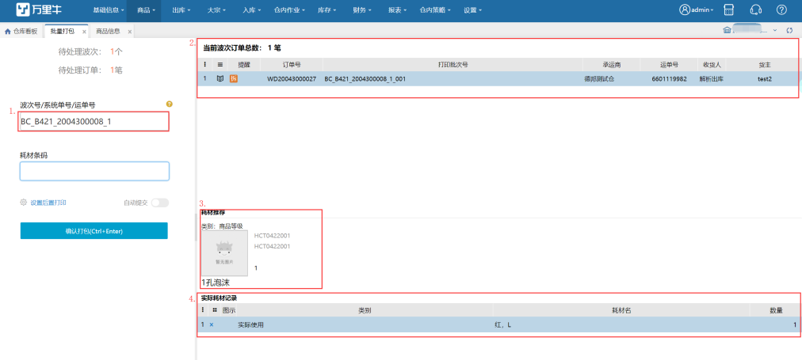

# 批量打包

批量打包页面可输入同品、混品或预配波次号，针对一波订单，批量打包，耗材输入框录入的是一笔订单的耗材，确认打包后，该波次下的所有在打包环节的订单的耗材都更新为此耗材。

1.支持扫描波次号，波次内的系统单号，波次内的运单号匹配波次；扫描波次内的系统单号/运单号，带出波次下所有待打包的订单。

2.当前波次订单总数展示的是波次内待打包的订单笔数。

3.开启耗材管理，设置耗材规则后，会显示系统推荐的耗材。

4.扫描耗材条码支持录入实际使用的耗材。

5.设置后置打印的单据，目前支持快递单、发货单、发票和商品条码的打印，确认打包后若是电子面单快递订单会自动生成单号和打印快递单，若选择发票则可以后置打印发票；选择发货单则可以后置打印发货单；选择商品条码则可以打印出订单中所有商品的条码数量即是商品的数量。

6.开启自动提交后可在扫描运单号后自动提交至下一环节。

7.未开启自动提交时，在仓内策略–业务配置，开启扫描条码强制提交后，无需点击确认打包，扫描wanliniu666可强制提交至下一环节。

①未开启耗材管理时，在运单号扫描框扫描有效；

②开启耗材管理-实际使用时，在耗材扫描框扫描有效。

8.确认打包后，波次内的打包订单全部更新为使用的耗材。

9.耗材管理开启实际使用时，批量打包时，直接确认打包没有扫描实际使用的耗材，取系统推荐的耗材记录在订单上。

> 更新: 2023-12-18 14:03:28  
> 原文: <https://hupun.yuque.com/unzko7/lsbfg0/ouhgvkh4t19hza7b>