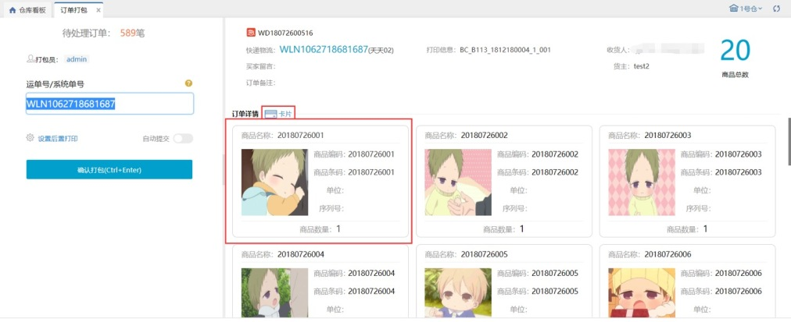

# 订单打包

### **01.订单打包**
1、设置打包员。

2、设置订单商品信息显示的方式：列表和卡片两种，卡片主要用于根据图片区分商品的业务。卡片如下图显示

3、扫描订单的运单号或对于系统单号均可匹配对应订单。

4、设置后置打印的单据，目前支持快递单、发货单、发票和商品条码的打印，确认打包后若是电子面单快递订单会自动生成单号和打印快递单，若选择发票则可以后置打印发票；选择发货单则可以后置打印发货单；选择商品条码则可以打印出订单中所有商品的条码数量即是商品的数量。

5、确认打包后系统会记录当前操作员打包绩效。

6、开启自动提交后可在扫描运单号后自动提交至下一环节。

7、右上角商品总数为当前订单的商品数总和。

8、未开启自动提交时，在仓内策略–业务配置，开启扫描条码强制提交后，无需点击确认打包，扫描wanliniu666可强制提交至下一环节。

①未开启耗材管理时，在运单号扫描框扫描有效；

②开启耗材管理-实际使用时，在耗材扫描框扫描有效。

> 更新: 2023-12-18 14:03:14  
> 原文: <https://hupun.yuque.com/unzko7/lsbfg0/hk2qtnndqicxk422>