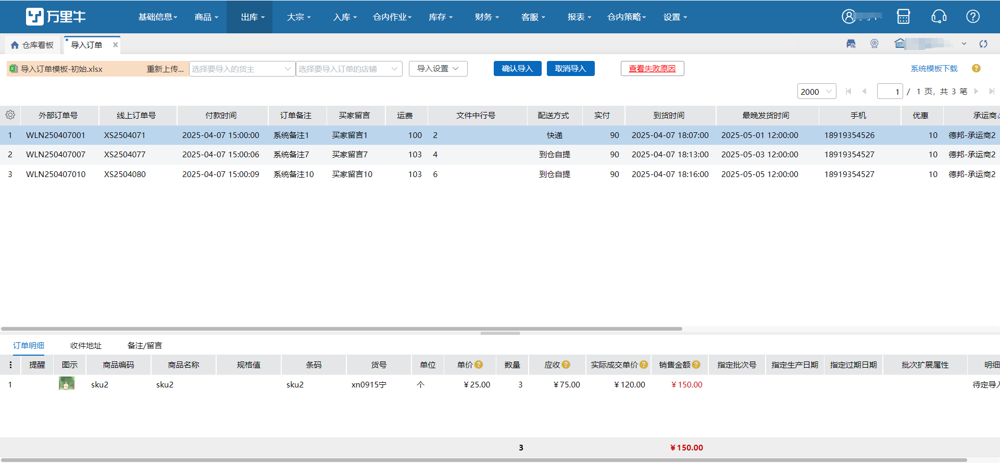
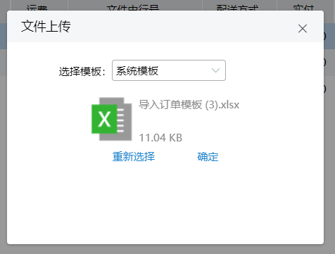
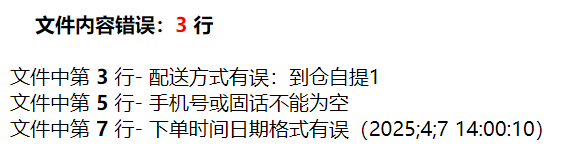
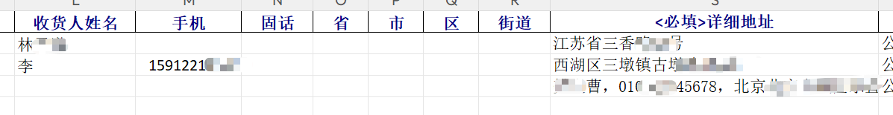
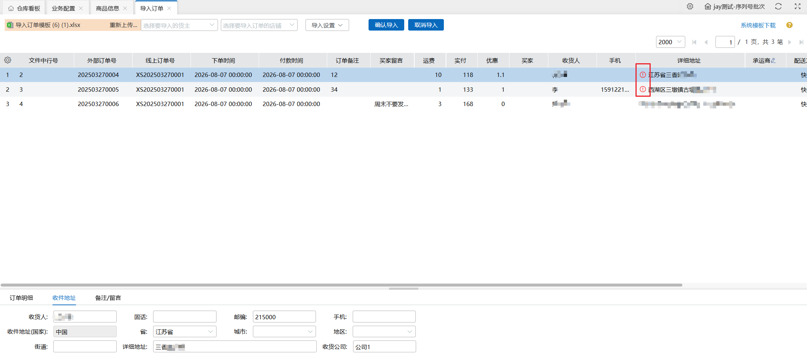

# 导入订单

运用场景：有货主是线下业务，使用的ERP不具备对接能力或没有ERP，需要托管云仓进行发货，固针对此类货主需要有个特定的类型，仅在WMS中进行出入库库存管理。

**基本操作流程：下载模板->导入设置->上传文件->选择货主、店铺->确认导入**

**（菜单由操作员权限控制显示，有权限可查看此菜单）**

### 1.下载模板
点击系统模板下载即可。

### 2.导入设置

a.导入文件：

未设置-excel表格内有外部单号重复则导入报错；已设置-excel表格内有外部单号重复则过滤，不报错且不导入。

b.确认订单导入

未设置-页面数据有外部单号与系统内已有外部单号重复则报错；已设置-页面数据有外部单号与系统内已有外部单号重复则过滤，不报错且不导入订单。

### 3.上传文件

a.点击确定则上传文件，支持重新选择文件上传。

b.导入有报错时弹窗，或点击按钮可查看错误原因。

c.承运商、收件人信息、备注支持界面手动修改。

注：导入行无主体信息，仅有商品信息，判断为上一行订单的明细。（即支持1笔订单多个明细进行导入）

d.导入任务可在数据中心->数据导入查看。

### 4.货主、店铺
a.需先选择货主才可选择店铺。

b.货主可选范围：启用中+货主授权本仓+对接配置：无对接+角色权限、补充权限内设置货主数据，以上条件取交集；店铺可选范围：当前货主下的店铺。

c.确认导入订单前必选货主+店铺。

### 5.确认导入
a.点击确认导入，订单导入wms系统内。

b.有失败订单点击按钮可查看错误原因，且失败订单支持再次确认导入。

c.点击取消导入，自动清除页面上所有数据信息。

d.导入任务可在数据中心->数据导入查看。

### 6.详细地址解析
导入模板变更：省/市/区/收件人/固话/手机，列不再是必填，详细地址列成为必填，增加必填校验。当省/市/区列均没有填写内容，导入时会去解析详细地址，将解析后的省市区内容填写到相应的预览信息中，同理收件人/固话/手机也是，如果没有解析内容，则导入到预览中，显示为空，省市区有内容为空时，详细地址会打红色提醒标记提醒需要人工手动填入。

新导入模板

> 更新: 2026-08-17 11:55:22  
> 原文: <https://hupun.yuque.com/unzko7/lsbfg0/nv9oiqnedsx6n06n>