# 待分配

## 订单池
erp推送到wms的订单首先是到待分配环节。符合仓内策略–波次策略的订单会留在待分配页面等待自动生成波次，波次生成后订单在波次打单页面；不符合任何策略的订单则自动打到零拣打单；用户可以勾选某笔订单操作打到零拣打单环节和手动生成波次操作。

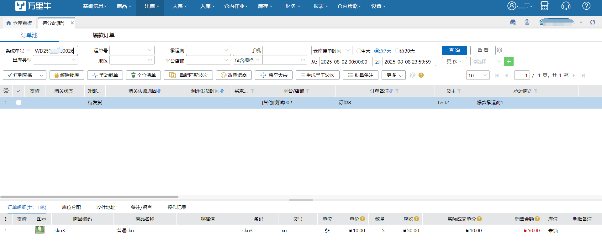

### **1.打到零拣打单**
不符合任何波次策略的订单系统会自动打回零拣打单环节；对于符合波次策略的订单会等待自动生成波次，用户若不希望生成波次，则勾选这笔订单，点击打到零拣打单按钮，此订单就到零拣打单环节了。具体操作如下图所示：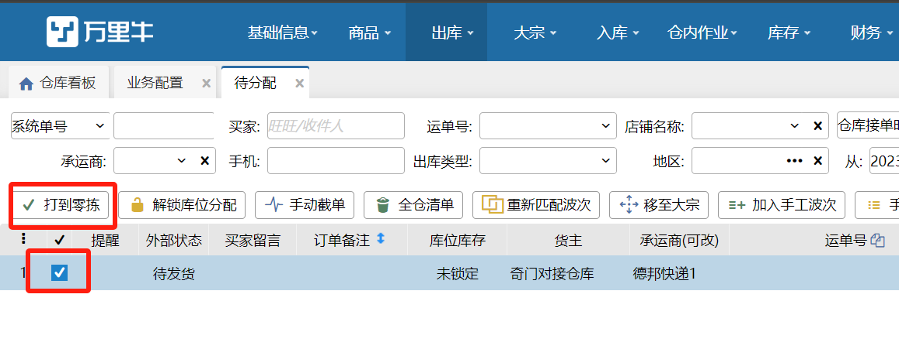

### **2.手动截单**
当待分配列表订单数量很多，但是订单还没达到时间去自动生成波次的时候，用户可点击生成截单波次按钮，选择需要执行的货主、店铺、波次策略和截单下限数量点击生成，生成截单波次任务，可以在系统中任务查看，当任务执行完成后待分配页面所有符合勾选策略的订单会生成波次，订单会去波次打单环节。具体操作步骤如下图：

#### 根据策略名称、策略编码、波次类型等进行筛选
其中：按“货主”查询，订单数只显示当前货主的订单，生成波次时也只会捞取这部分订单进行生成。生效订单中的“货主”不生效。

#### 按波次策略
勾选需要的策略后点击生成即可：

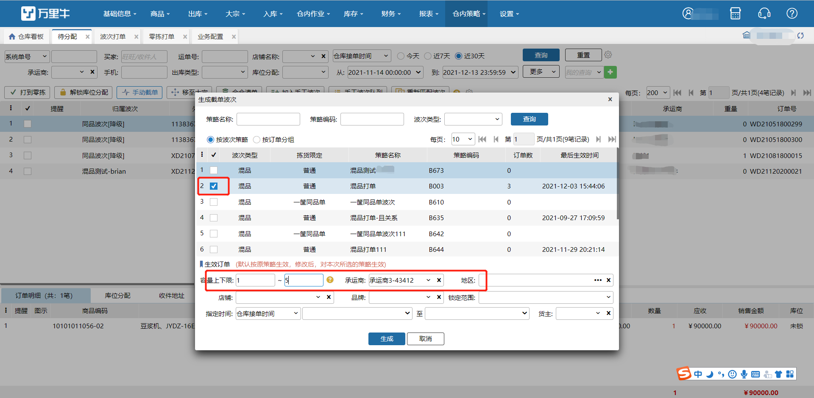

#### 修改生效订单内容生成截单波次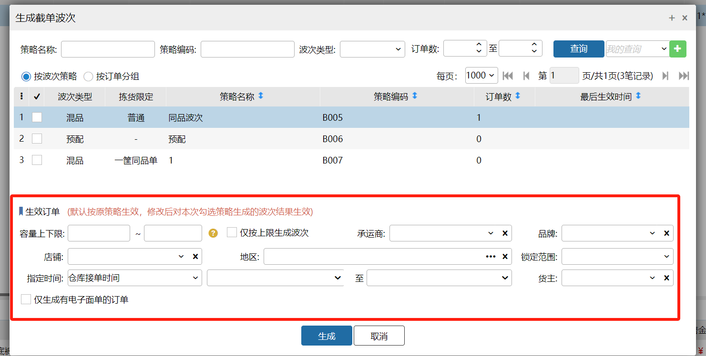

生成波次后可在系统任务中查看任务状态,如下图：

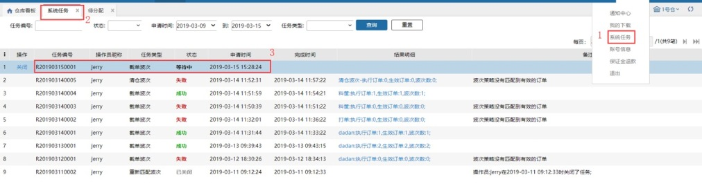

①.截单下限指截单后波次订单数量下限，为避免截单后单个波次的订单数量太低可自行调整，截单下限默认为空，截单上限为截单后波次订单数量上限，不填默认按波次策略内的上下限生成，勾选仅按上限生成余数不会生成波次。

②.执行订单范围：选择货主、店铺确认和指定的时间范围后，截单波次页面会刷新波次策略所属的订单数。只统计归属选择的货主、店铺、指定的时间范围内和波归属次策略的订单，生成波次时也只有这些订单可以生成。

#### 指定锁库范围
①.不勾选锁定范围，锁库逻辑和之前一样，全仓下按照库位分配偏好锁库。

②.勾选锁定范围，锁库逻辑是在锁库范围下的库区按照库位偏好锁库。

③.锁定范围与波次策略设置的拣选区域不一致，则不进行锁库且不生成截单波次。

④.订单符合同品锁存储库位的波次策略且设置了锁库范围，则设置的锁定范围无效，仍按照全仓下效率优先锁存储库位。

⑤.爆品订单且设置了锁定范围，锁库逻辑是在锁库范围下的库区按照库位偏好锁库。

⑥.预配波次且设置了锁定范围，仍按照预配波次策略设置库位锁库。

4.新增我的查询选项，可保存之前的查询项，仅对下方生效订单条件+策略名称+编码+波次类型筛选有效

#### 按订单分组
左侧列表显示A+N波次和同品波次策略，右侧显示符合对应策略的订单分组，勾选分组后点击生成波次，每次只对一个策略生成波次：

其中：

1)鼠标hover在商品图片上，可查看大图和商品名称

2)点击A项商品详情可在弹窗中查看具体A项商品信息

3)分组数量指符合这个A项的订单数量。

4)截单下限指截单后波次订单数量下限，为避免截单后单个波次的订单数量太低可自行调整，截单下限默认为1。

生成波次后可在系统任务中查看任务状态，如下图：

### **3.生成手工波次**
用户也可通过待分配的查询条件自动筛选，选择要生成一个波次的订单，生成手工波次。具体操作步骤见下图。

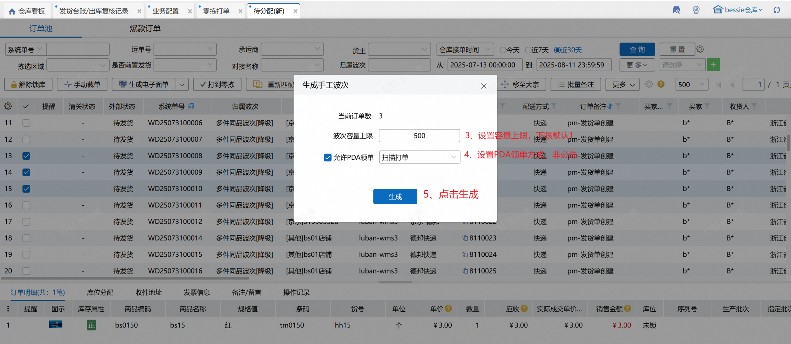

**提示：**

1、手工波次队列的订单必须快递公司的打印模板相同，才能生成一个手工波次。

2、若有订单原本配货方式是零拣的（不符合任何波次）订单，生成了手工波次，那么这边订单的配货方式变成波次，最长等待时间是60min。

3、挂起的订单不会生成手工波次。

4、库存不足的订单不会生成手工波次，可以选择跳过失败订单继续，锁库失败的订单不生成波次，锁库成功的订单正常生成波次。

5、PDA领单方式，可选项：扫描打单/料框拣货/领单播种拣货

### **4.解锁库位分配**
在待分配订单中，系统会锁定订单商品库存，当某些库存不足需要优先其他订单发货或者已锁定库存需要做解锁进行其他仓内作业的可通过解锁库位分配来完成。

步骤如下，先选中需解锁订单，再单击解锁库位分配按钮，确认即可，如图：

### **5.生成清仓波次**
当待分配列表订单数量很多，但是订单还没达到时间去自动生成波次的时候，用户通过勾选波次策略和设置容量，点击生成，生成清仓波次任务，可在系统任务中查看，当任务完成后符合勾选策略的订单全部生成清仓波次。具体操作如下图：

波次类型支持混品、同品和预配

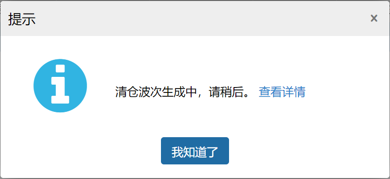

确认生成后可在系统任务中查询任务状态，

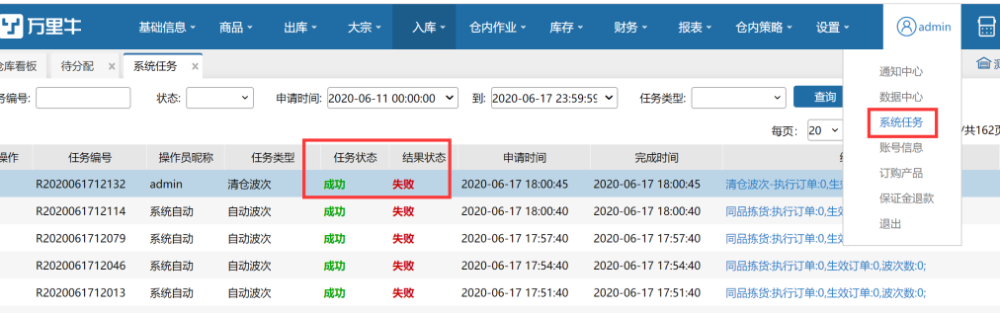

指定锁库范围

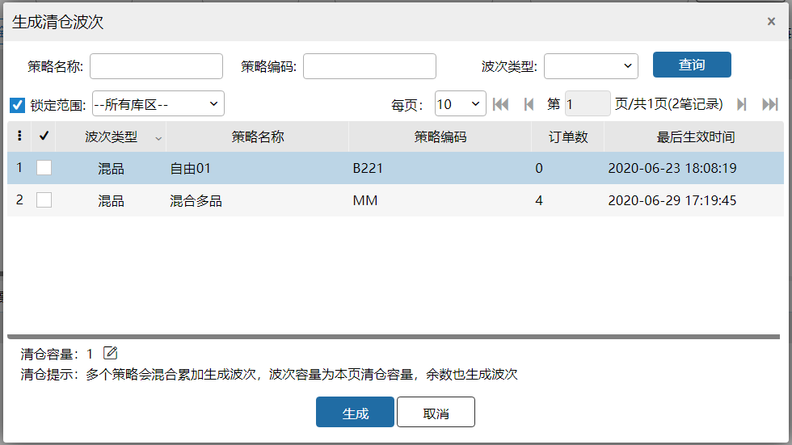

①.不勾选锁定范围，锁库逻辑和之前一样，全仓下按照库位分配偏好锁库。

②.勾选锁定范围，锁库逻辑是在锁库范围下的库区按照库位偏好锁库。

### **6.解锁指定区域**
爆品锁到爆品区锁定失败时，可以解锁指定区域，解锁后再次锁库时允许锁到非爆品区。

注：必须先设置好仓内策略-区域匹配规则后，才能操作解锁指定区域

### **7.重新匹配波次**
订单在待分配中，落单匹配到的波次不是想要的波次，调整波次优先级后可以重新匹配波次，不需要重新下单。不用勾选订单，是针对于待分配中的所有订单，直接点击重新匹配波次，生成重新匹配波次任务，任务执行完成后订单上的归属波次会更新更新掉。具体操作如下图：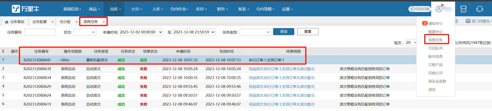

### **8.移至大宗**
用户设置大宗策略时设置错，订单都跑到待分配了，可以通过该功能把这些订单移至大宗，不用再从erp那边重新下单了，减少路径。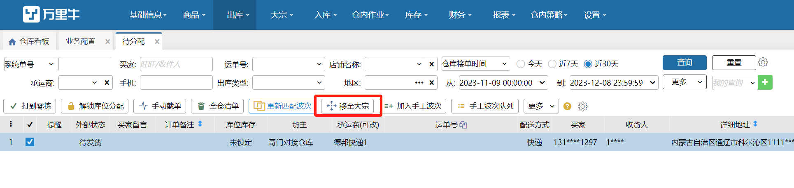

### **9.打回审核**
有货主开启接单审核的仓库，在打到零拣下方有“打回审核”的按钮，可以把订单打到“订单审核”页面，未开启接单审核的货主订单也可以打回。

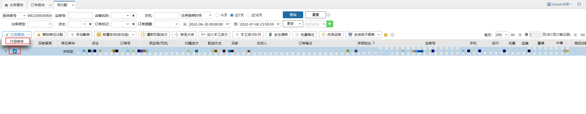

### 10.改承运商
支持在订单上单个修改或批量修改订单承运商，同零拣打单。若修改后订单收件地址属超区，会报错提示。

替换承运商/回收电子面单时，已打印快递单的订单会弹窗提示：该订单已打印快递单，若继续修改请销毁已打印面单；点击继续按钮，替换承运商/回收电子面单，点击取消按钮，不替换承运商/回收电子面单。

### 11.查询项优化
1.运单号可以根据有无运单号进行查询，页面包括预出库和待分配。

2.查询项“订单异常分类”改成：包含异常/排除异常，可以在预出库订单、待分配、零拣打单、波次打单、待拣货、待验货等页面查出包含/排除指定异常订单。

3.货主查询项支持显示当前环境剩余单量

## 爆款订单
背景：直播、爆款等业务叠加快递价格及重量区间不断压缩，越来越多的商家在走爆款模式。同样也有越来越多的小商家委托三方云仓进行发货。致使云仓订单结构更多的侧重于爆品、单品结构。复杂订单出现的占比持续降低。

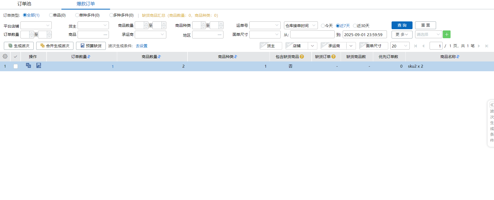

### 1.查询条件
(1).订单类型、缺货商品统计：根据查询条件统计数据，每次点击查询后数量变更。

(2).缺货商品统计：勾选商品点击去补货，自动跳转至待分配商品统计，勾选商品并弹窗补货。

### 2.设置方案

(1).支持快捷选择前6种方案，下拉会显示全量方案。

(2).点击保存为常用方案，保存成功且会设置为默认方案。

方案只是快速带出显示的作用，实际生成波次的容量和领单类型以右侧界面上实际填写的为准。

(3).支持删除方案。

### 3.生成波次
(1).支持点击工具栏生成、合并生成，以及表格列进行单个分组生成波次。

### 4.计算缺货
(1).需手动点击操作栏按钮或表格列，会自动计算当前缺货订单数、缺货商品数量。

(2).缺货订单点击弹窗待分配条件查询，支持查看和修改订单数据。

(3).缺货商品数点击自动跳转至待分配商品统计，勾选商品并弹窗补货。

### 5.分组条件

(1).支持手动选择分组拆分条件，选择后表格列末端新增对应分组拆分条件的列。分组后勾选多个组合合并生成波次，波次内订单会按照页面顺序进行排序。

（2).支持记忆在操作员上。

### 6.表格列快捷跳转
(1).点击订单数量、缺货订单、优先订单数，弹窗待分配条件查询，支持查看和修改订单数据。

(2).点击缺货商品数，自动跳转至待分配商品统计，勾选商品并弹窗补货。

(3).部分列支持全局排序。

(4).支持自定义列。

(5).选择分组条件、查询项，筛选后结果，点击数量跳转至“待分配条件订单查询”内会自动带入筛选条件。

> 更新: 2026-08-17 14:05:15  
> 原文: <https://hupun.yuque.com/unzko7/lsbfg0/ow8unkls4z7dpqys>