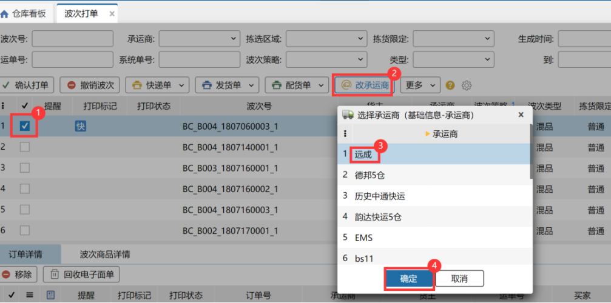
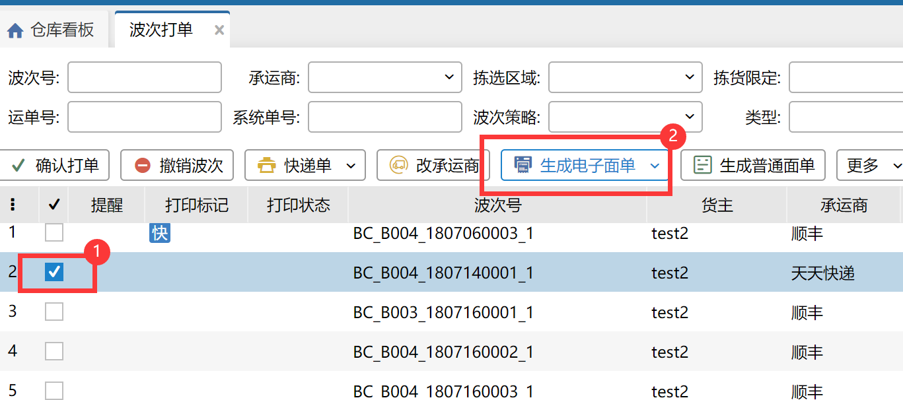
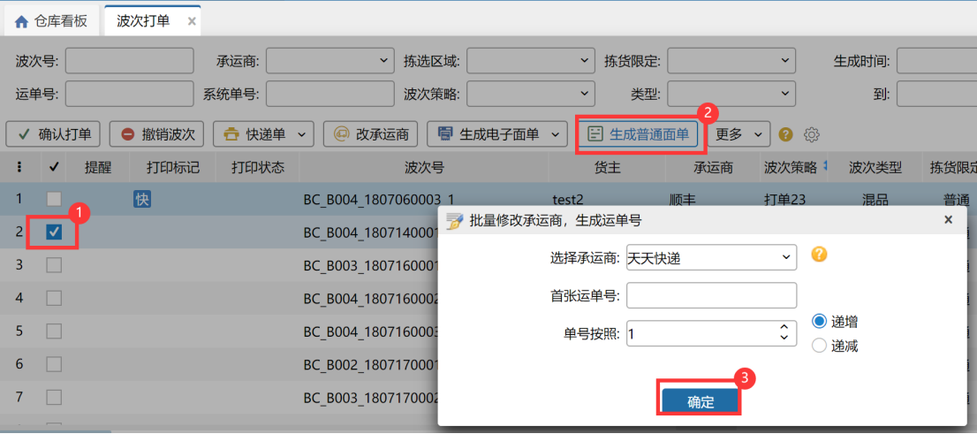
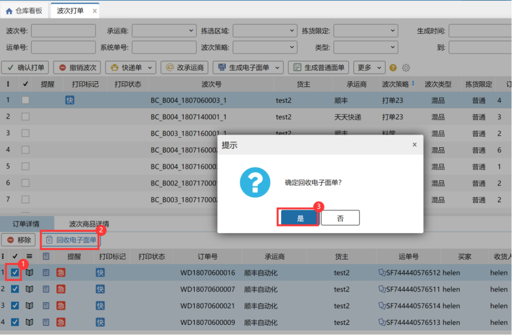
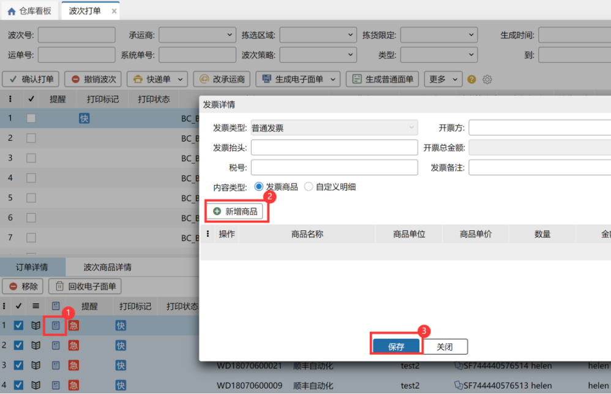
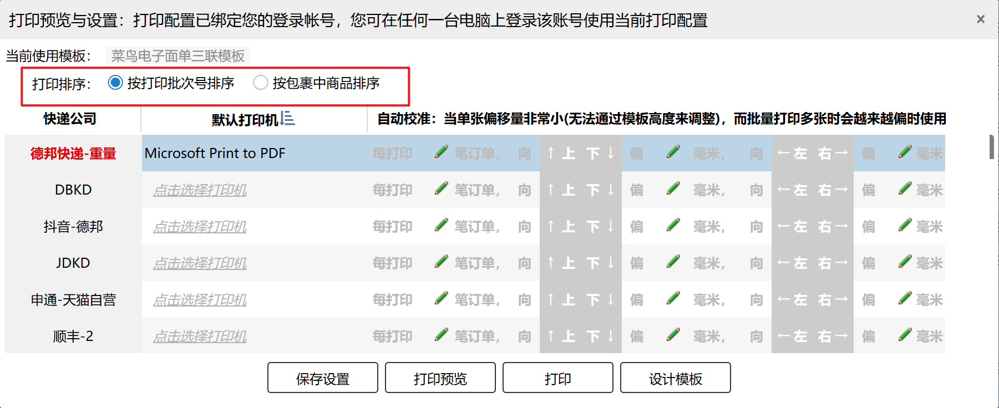
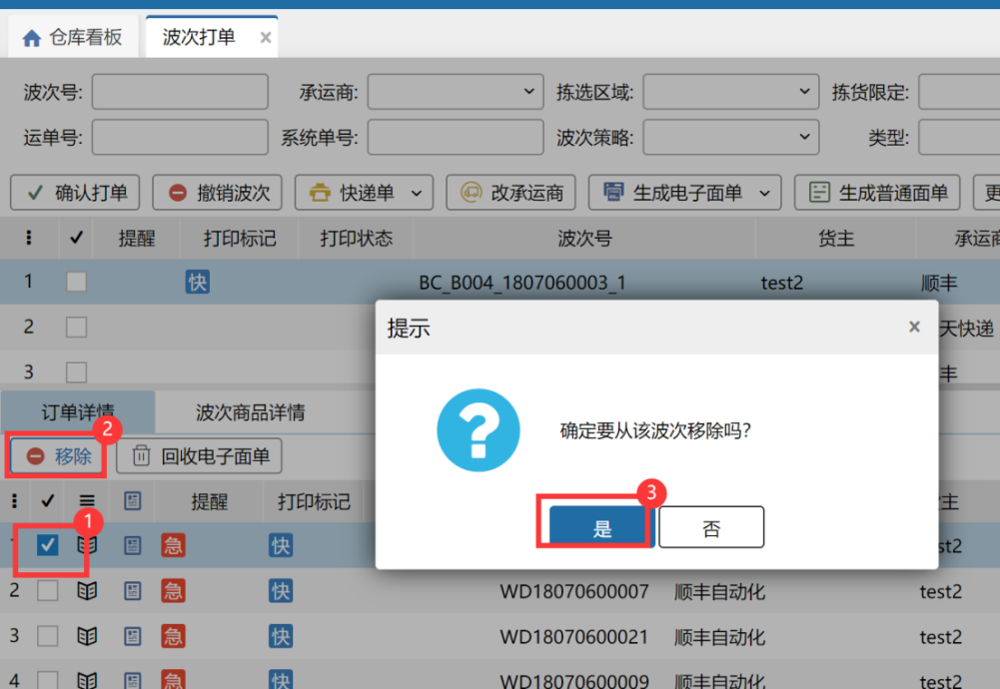
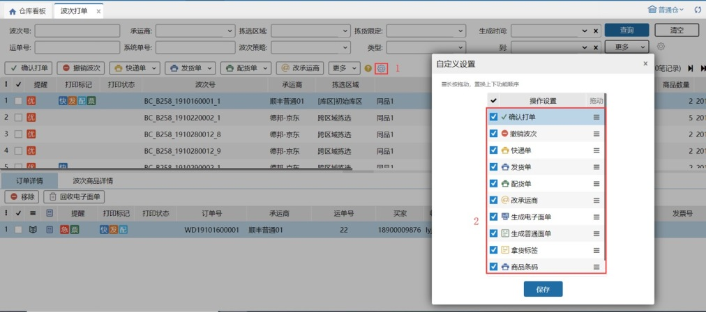
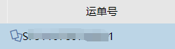
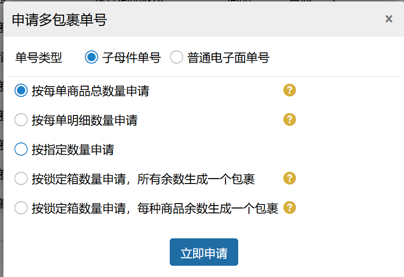

# 波次打单

波次打单页面显示的是一波波分类好的订单。用户可以在此页面针对一波订单生成单号和打印单据。

### **01.改承运商**
如下图所示可修改一个波次订单的承运商。

替换承运商/回收电子面单时，已打印快递单的订单会弹窗提示：该订单已打印快递单，若继续修改请销毁已打印面单；点击继续按钮，替换承运商/回收电子面单，点击取消按钮，不替换承运商/回收电子面单。

提示

订单是指定承运商（有锁标记），则不允许修改承运商与零拣打单同理。

### **02.生成普通单号**
若订单的承运商开启了电子面单，则勾选此订单，点击生成电子面单按钮即可。

若订单的承运商无电子面单，则可直接键入快递单号列输入单号，或者点击生成普通面单按钮，快速生成单号。生成普通面单的操作步骤见下图。

提示

1、勾选一个波次，这个波次有电子面单和普通面单订单，则点击生成电子面单，只会更新电子面单的订单单号；同理点击生成普通面单，只会更新普通面单的订单单号；

2、勾选一个波次，这个波次只有两个不同承运商的普通面单订单，点击生成普通面单，可手动选择快递公司，只会更新选择的承运商订单单号。

### **03.回收电子面单**
当订单有生成电子面单，则可以勾选订单进行回收电子面单。回收电子面单时只支持勾选同一个波次中的订单进行回收。

### **04.新增发票**
erp推送到wms的订单，若买家临时想要开发票，用户可在此环节找到此订单，点击发票信息标记，填写正确的信息后点击保存。保存的发票信息自动同步记录至发票打印页面。具体操作步骤见下图。

### **05.打印单据**
勾选某个波次点击相应按钮，即可打印快递单、发货单、配货单、发票、拿货清单。

快递单两种打印排序：

①按打印批次号排序：按波次中订单打印批次号排序

②按包裹中商品排序：按波次中子包裹商品数量及编码排序

排序规则：包裹中商品数量为1（含无包裹订单）>包裹中数量大于等于2（含无包裹订单）>包裹号/系统订单号>订单归属平台。

例：波次订单：

订单1：包裹ZX01001：商品a*1；包裹ZX01002：商品b*1  
订单2：包裹ZX02001：商品a*1；包裹ZX02002：商品c*1

订单3：包裹ZX03001：商品a*2；包裹ZX03002：商品a*1、b*1

订单4：包裹ZX04001：商品a*1；包裹ZX04002：空

订单5：订单号：ZX05001，无包裹，商品a*1

订单6：订单号：ZX06001，无包裹，商品a*3

快递单打印排序结果：

包裹ZX01001

包裹ZX02001

包裹ZX04001

包裹ZX04002

订单5：ZX05001

包裹ZX01002

包裹ZX02002

包裹ZX03001

包裹ZX03002

订单6：ZX06001

### **06.移除订单**
若用户不想要一个波次中的某笔订单，可勾选这笔订单，点击移除按钮，这笔订单就会到待分配环节。

提示

若波次仅剩下一笔订单，则这笔订单不允许移除。用户可勾选此波次，点击撤销波次。

### **07.撤销波次**
若用户对生成的波次不满意，可以整笔作废。作废的波次订单都会到待分配环节。

### **08.确认打单**
勾选波次，点击确认打单按钮，该波次的所有订单就提交到下一环节。

提示

订单从待分配到波次打单环节，会根据仓内策略--仓库规则--作业规则，分配商品的库位。

### **09.查询项自定义设置**
查询条件支持用户自定义设置，最多8个查询条件，位置是依次从左到右，从上到下排序。生成时间从XX到XX两项固定不能选择。

### **10.工具栏按钮自定义设置**
工具栏的按钮支持自动调整位置。

### **11.录入序列号**

①.标准模式：录入序列号必须是当前商品未锁定的。

②.简洁模式：录入序列号可以是当前商品未锁定的，也可以是系统中不存在的。录入系统中不存在的后，该序列号自动添加当前商品的库存总量里且是锁定状态。

### 12、提升优先级
勾选指定波次后，点击“提升优先级”按钮，可以给波次打上“优”标记，在领取波次时可以优先领取。

### ** 13.自动替换拦截订单**
当波次中的部分订单被拦截时，系统自动从待分配、预出库页面寻找符合该波次策略（生成该波次时的策略）的同品订单进行替换，替换之后被拦截订单关闭，新的订单锁库记录继承被拦截订单的锁库记录。允许替换的波次需符合以下条件：待打单波次、未拆分且未打印单据（包括快递单、发货单、发票）

其中：

(1)以生成该波次时的波次策略为依据来寻找可替换订单，如：生成波次时策略设置为A，生成波次后修改了策略设置为B，在找可替换订单时，会找符合策略A的订单，不会找符合策略B的订单。

(2)若波次策略指定承运商范围仅为承运商为空，则当有订单发生拦截时，不会替换同品订单到波次中；若波次策略指定承运商范围包含承运商为空，则当有订单发生拦截时，不会替换承运商为空的同品订单到波次中，只会替换有承运商的订单到波次中。

### 14.生成电子面单

1.生成电子面单：点击后订单生成普通电子面单号。

2.申请多包裹单号：按申请类型及方式生成子母件单号或普通多包裹电子面单号。

(1)按每单商品总数申请：系统自动计算订单内商品总数，根据总数自动生成对应包裹数。

(2)按每单明细数量申请：系统自动计算订单内商品明细数量（同sku多明细算1条），根据数量自动生成对应包裹数。

(3)按指定数量申请：需手动填写要生成的包裹数量。

(4)按默认箱/锁定箱数量申请，所有余数生成一个包裹：如订单锁定5个箱子，其中2种商品有若干散件，则申请6个单号。

默认箱/锁定箱关联业务配置-商品多单位管理开关：

        开启出库换算模式->显示按默认箱数量申请，剩余商品生成1个包裹

        开启全流程箱规模式->显示按锁定箱数量申请，剩余商品生成1个包裹

根据对应模式+订单，系统自动计算生成x个包裹。

注：使用后包裹明细分摊结果将按计算结果分配。

a.默认箱计算：未锁定/已锁定订单，看商品有无设置多单位。

若已设置则订单内单sku商品总数/默认箱比值，取整作为包裹数，余数计入尾箱。

若未设置则不计算，直接计入尾箱。

例：商品1默认多单位1:2，商品2无多单位；订单1：商品1-5个，商品2-2个

共生成包裹数：3个。包裹1：商品1-2个；包裹2：商品1-2个；包裹3：商品1-1个，商品2-2个

b.锁定箱计算：

未锁定订单，不计算，直接计入尾箱。

已锁定订单，锁定库存形态为规格箱/唯一箱，1箱=1个包裹，其余拆零直接计入尾箱。

例：商品1箱规1箱4个；订单1：商品1-7个

未锁定-共生成包裹数：1个。

已锁定（锁1规格箱；1唯一箱：箱内2个；1拆零）-共生成包裹数：3个。

包裹1：1规格箱；包裹2：1唯一箱；包裹3：拆零1个

(5)按默认箱/锁定箱数量申请，每种余数生成一个包裹：箱数计算逻辑同(4)，剩余商品按不同sku生成不同包裹。如订单锁定5个箱子，其中2种商品有若干散件，则申请7个单号。

3.追加子单号：支持追加的快递已有单号点击可以追加生成指定数量的子母件。

> 更新: 2026-04-14 10:49:48  
> 原文: <https://hupun.yuque.com/unzko7/lsbfg0/geqydgi9oms6malu>