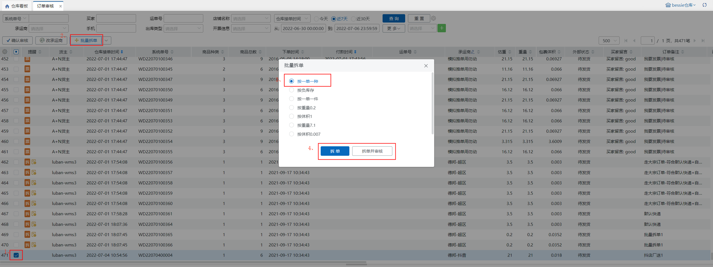
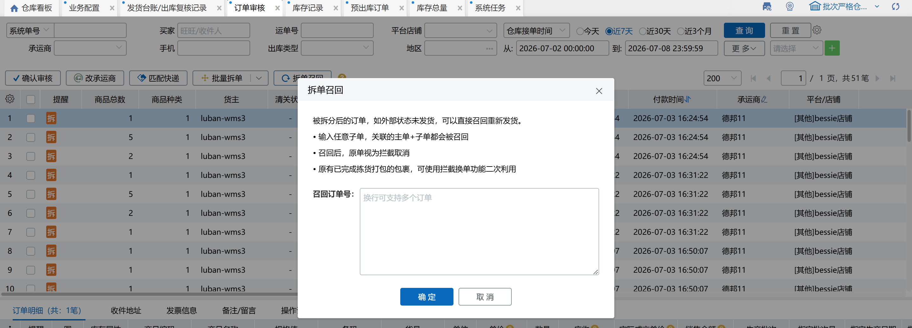
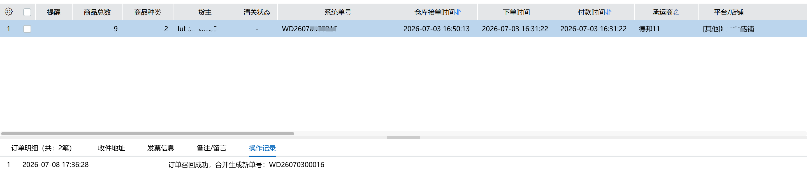

# 订单审核

订单审核在现有出库流程前增加了审核环节，订单落单后会先进入订单审核页面，支持手工拆单、修改承运商、确认审核，该页面关联业务配置-货主策略-开启接单审核开关，开启后显示显示此菜单页面。

### 01.确认审核
勾选订单后点击确认审核，若仓库未开启缺货接单，则订单根据仓库有无大宗策略、是否开启缺货接单等配置进入待分配、预出库或大宗出库页面；

若仓库开启缺货接单，则无论订单是否缺货都会先进入预出库页面，根据订单排序规则进入队列。

### 02.改承运商
支持在订单上单个修改或批量修改订单承运商，同零拣打单。若修改后订单收件地址属超区，会报错提示。

替换承运商/回收电子面单时，已打印快递单的订单会弹窗提示：该订单已打印快递单，若继续修改请销毁已打印面单；点击继续按钮，替换承运商/回收电子面单，点击取消按钮，不替换承运商/回收电子面单。

### 03.匹配快递
勾选订单后点击按钮，指定订单走快递匹配逻辑，页面会提示处理成功的订单数据，这些订单在后续出库流程中不再走快递匹配逻辑。

### 04.批量拆单
若在业务配置中未设置批量拆单策略，点击批量拆单会提示先去设置，点击会跳转到业务配置页面：

若已设置拆单策略，则弹窗显示策略名称，选择某个策略后，点击“拆单”，则订单按照策略规则拆出新订单，若点击“拆单并审核”，则拆出订单后自动确认审核，订单打到下个环节。

注：

手动批量拆单后点击“拆单”按钮，不会自动提交订单；

手动批量拆单时只看策略上的拆分条件，不限平台/店铺、承运商条件。

### 05.手工拆单
手工拆单只能对单笔订单进行拆单，若多选会报错提示，勾选订单后点击手工拆单，显示拆单弹窗：

其中：

(1) 上边列表显示的是该订单中所有的商品明细，下边列表显示的是拆出明细，上边列表已拆明细显示在下边列表中，下边列表明细删除后数量会加到上边列表中

(2) 拆出缺货订单可以将订单中所有缺货明细一键拆出，该按钮关联缺货接单开关，若该订单所属货主开启，则显示按钮，否则不显示

(3) 不能将所有明细全部拆出，否则会报错提示

(4) 可用库存是该明细库存总量的可用数量

(5) 拆单成功后，列表自动刷新订单数据

**注意：**

(1) 不符合拆单的情况：一单一件、货到付款、外贸等加快递锁的订单、天猫直送、唯品会、外贸订单；

(2) 批量拆单时，若勾选订单中有部分不符合拆单条件，则允许拆单的拆单成功，不允许拆单的弹窗列表提示；

(3) 拦截订单直接关闭，挂起订单不允许操作，操作时会报错提示。

### 06.拆单召回

:::color3
场景：拆单召回功能主要应用于订单自动拆单后需要调整的场景。当拆单规则有误需要重新拆分，或订单已拆成多个子订单使用子母件面单后需要更换快递公司时，原有功能无法支持批量操作。该功能通过一键将已拆分的子订单合并还原为原始订单，取消子母件关系，使订单恢复到可重新拆单或换快递的状态，避免人工逐单处理，保障订单履约的灵活性。

:::

在输入框中输入已拆订单单号后，点击确定，可将该订单关联的所有主子单都召回，还原到拆单前状态。

注：

拆出订单已发货时，不支持召回；

通过手工拆单、批量拆单（自动、手动）拆出的订单，支持召回。

> 更新: 2026-07-08 17:39:25  
> 原文: <https://hupun.yuque.com/unzko7/lsbfg0/cp3sf0sasnlh7q5z>