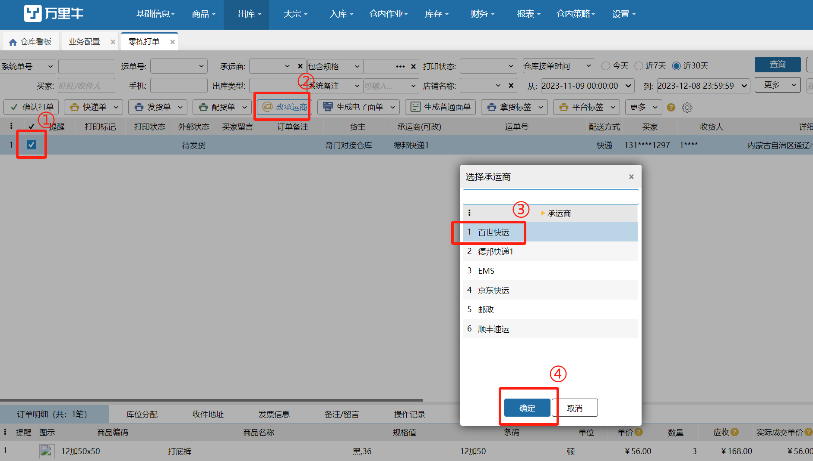
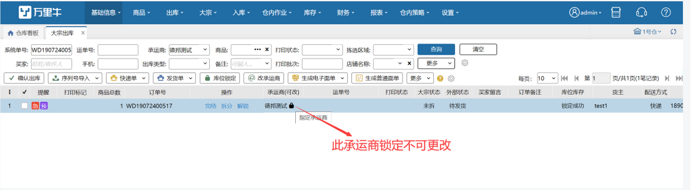
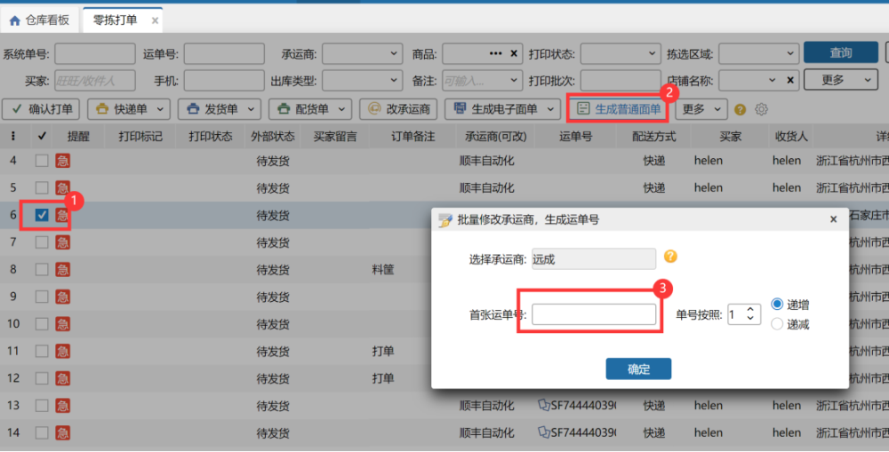
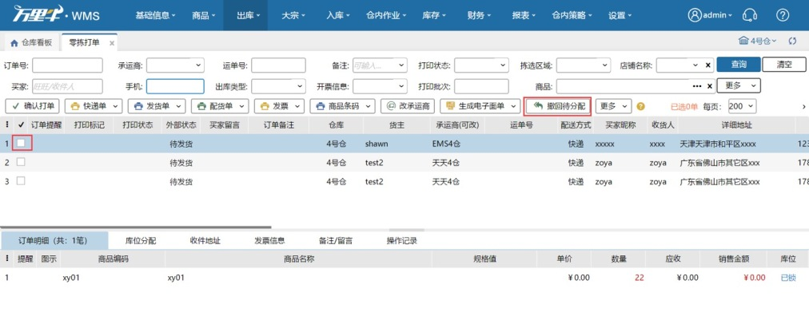
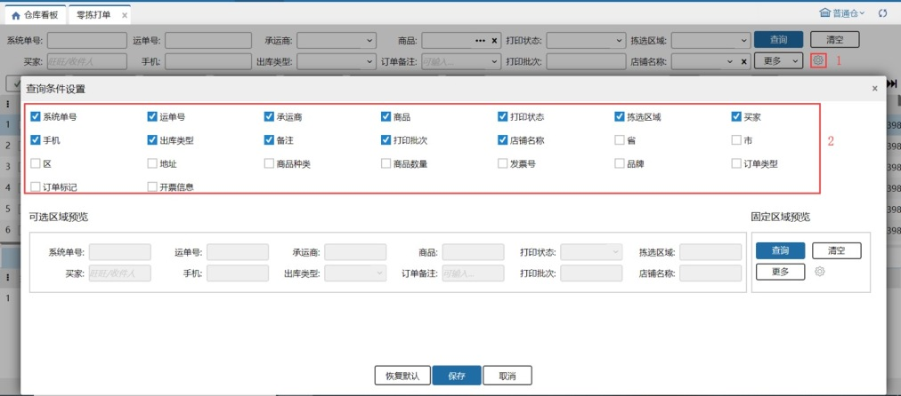
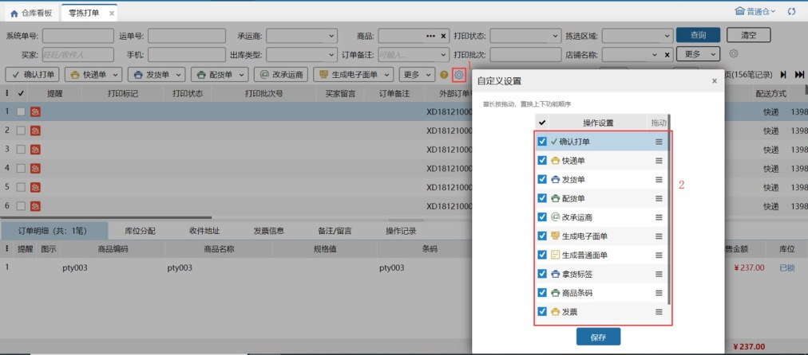
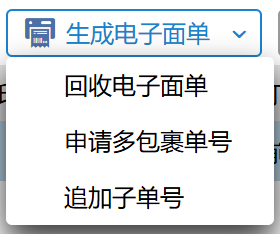

# 零拣打单

零拣打单环节主要是给用户提供针对零散件进行生成单号和打印单据操作。

### **01.修改承运商**
订单的承运商列有锁，表示指定承运商，不可修改此订单承运商。若无锁标记，则可勾选订单更换订单的承运商信息。具体修改步骤见下图。

替换承运商/回收电子面单时，已打印快递单的订单会弹窗提示：该订单已打印快递单，若继续修改请销毁已打印面单；点击继续按钮，替换承运商/回收电子面单，点击取消按钮，不替换承运商/回收电子面单。 

注：目前外贸订单和得物订单（部分模式）均锁定承运商，不支持更改。

### **02.生成普通单号**
若订单的承运商开启了电子面单，则勾选此订单，点击生成电子面单按钮即可。若订单的承运商无电子面单，则可直接键入快递单号列输入单号，或者点击生成普通面单按钮，快速生成单号。生成普通面单的操作步骤见下图

### **03.回收电子面单**
若订单已经生成了电子面单，则点击这边的回收电子面单，电子面单将会被回收，该笔订单可以生成其他的单号。此处支持批量选中订单再回收。若订单被拦截确认关闭，则电子面单会被自动回收。

### **04.新增发票**
erp推送到wms的订单，若买家临时想要开发票，用户可在此环节找到此订单选中，点击发票信息，填写正确的信息后点击保存。保存的发票信息自动同步记录至发票打印页面。

### **05.打印单据**
勾选某笔订单点击相应按钮，即可打印快递单、发货单、配货单、发票、拿货标签等。

### **06.确认打单**
勾选订单点击确认打单按钮，订单就提交到下一环节。

### **07.撤回待分配**
勾选订单点击打回待分配，订单将会回到待分配。

打回待分配之后，若匹配到波次，重新根据波次策略生成波次。等待超时时间依旧是订单接单时间+波次的最长等待时间。

若匹配到预配波次，将会清除之前的锁定，在匹配到的预配波次生成时锁定预配库位，生成预配波次。

### **08.查询项自定义设置**
查询条件支持用户自定义设置，最多12个查询条件，位置是依次从左到右，从上到下排序。

### **09.工具栏按钮自定义设置**
工具栏的按钮支持选择需要的功能按钮，以及拖动调整先后顺序。

### **10.录入序列号**

①.标准模式：录入序列号必须是当前商品未锁定的。

②.简洁模式：录入序列号可以是当前商品未锁定的，也可以是系统中不存在的。录入系统中不存在的后，该序列号自动添加当前商品的库存总量里且是锁定状态。

注:待分配、预出库订单、零拣打单和波次打单页面勾选单笔/多笔订单进行打印快递单、生成电子面单、前置发货等操作后仍保留勾选状态，方便查看操作是否生效及下一步操作

### **11.生成电子面单**

1.生成电子面单：点击后订单生成普通电子面单号。

2.回收电子面单：对已生成单号/子母件的订单点击后回收电子面单成功并清空对应运单号。

3.申请子母单号：按申请类型及方式生成子母件单号或普通多包裹电子面单号。

(1)按每单商品总数申请：系统自动计算订单内商品总数，根据总数自动生成对应包裹数。

(2)按每单明细数量申请：系统自动计算订单内商品明细数量（同sku多明细算1条），根据数量自动生成对应包裹数。

(3)按指定数量申请：需手动填写要生成的包裹数量。

(4)按默认箱/锁定箱数量申请，所有余数生成一个包裹：如订单锁定5个箱子，其中2种商品有若干散件，则申请6个单号。

默认箱/锁定箱关联业务配置-商品多单位管理开关：

        开启出库换算模式->显示按默认箱数量申请，剩余商品生成1个包裹

        开启全流程箱规模式->显示按锁定箱数量申请，剩余商品生成1个包裹

根据对应模式+订单，系统自动计算生成x个包裹。

注：使用后包裹明细分摊结果将按计算结果分配。

a.默认箱计算：未锁定/已锁定订单，看商品有无设置多单位。

若已设置则订单内单sku商品总数/默认箱比值，取整作为包裹数，余数计入尾箱。

若未设置则不计算，直接计入尾箱。

例：商品1默认多单位1:2，商品2无多单位；订单1：商品1-5个，商品2-2个

共生成包裹数：3个。包裹1：商品1-2个；包裹2：商品1-2个；包裹3：商品1-1个，商品2-2个

b.锁定箱计算：

未锁定订单，不计算，直接计入尾箱。

已锁定订单，锁定库存形态为规格箱/唯一箱，1箱=1个包裹，其余拆零直接计入尾箱。

例：商品1箱规1箱4个；订单1：商品1-7个

未锁定-共生成包裹数：1个。

已锁定（锁1规格箱；1唯一箱：箱内2个；1拆零）-共生成包裹数：3个。

包裹1：1规格箱；包裹2：1唯一箱；包裹3：拆零1个

(5)按默认箱/锁定箱数量申请，每种余数生成一个包裹：箱数计算逻辑同(4)，剩余商品按不同sku生成不同包裹。如订单锁定5个箱子，其中2种商品有若干散件，则申请7个单号。

4.追加子单号：支持追加的快递已有单号点击可以追加生成指定数量的子母件。

> 更新: 2026-04-14 10:50:21  
> 原文: <https://hupun.yuque.com/unzko7/lsbfg0/fy3tr1zb3mu04q74>