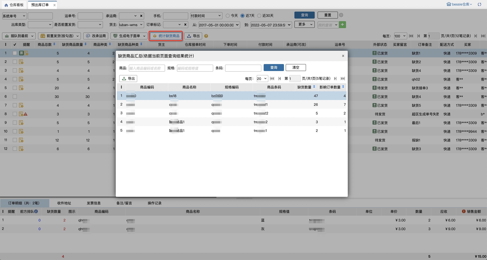

# 预出库订单

未开启缺货接单时，商品可用库存不足时拒单；对应货主开启允许缺货接单后，在无限制接单或可接单库存充足的情况下，有明细缺货的订单会进入预出库订单页面，按照排序规则升序显示订单。等缺货商品到货后，按照顺序分配给优先级最高的订单，订单库存充足后进入出库流程。

### 01.订单数据显示
订单默认按照业务配置中选择的排序规则显示数据，货主查询项必选，默认显示当前仓库下开启缺货接单的第一个货主。

订单层级：缺货商品数量：该订单下总共缺货的sku数量；

缺货商品种类：该订单下总共缺货的商品种类。

订单明细层级：前方排队：指当前订单前同一sku还有多少等待进入出库流程的数量，点击查看队列详情，可以看到排在前面的具体订单和缺货数量；

缺货数量：当前sku无可用库存的数量

### 02.插队功能
插队分两种：插队到最前、排队到最后；有两个操作入口：订单列表页面操作栏按钮、队列详情窗口操作按钮

①插队到最前

在订单列表页面，勾选需要插队的订单后，点击插队到最前按钮即可，支持批量操作，插队的订单始终在最前面。

队列详情窗口，无需选择订单，直接点击插队到最前按钮即可，对当前查看的这个订单生效，仅支持单个操作。

②排队到最后

在订单列表页面，勾选需要插队的订单后，点击排队到最后按钮即可，支持批量操作，插队的订单始终在最后面。

队列详情窗口，无需选择订单，直接点击排队到最后按钮即可，对当前查看的这个订单生效，仅支持单个操作。

### 03.前置发货功能
有两种方式：按勾选、按查询

①按勾选前置发货，需要先勾选订单再点击按钮。

②按查询前置发货，点击后对当前查询条件下的所有查询结果进行前置发货操作，操作成功后外部状态会显示通知成功的标记，可以通过“是否前置发货”查询到对应数据

### **04.订单流转**
①库存到货后，会优先分配给优先级高的订单，订单库存充足后，会自动流转到待分配页面，或根据大宗策略进入大宗出库页面。

②订单拦截后，会自动关闭，在订单查询页面可查到对应数据，不在预出库订单页面显示。

### **05.改承运商功能**
订单层级支持手动修改承运商，或批量勾选订单进行批量修改。超区替换、3PL快递匹配对预出库订单生效。

替换承运商/回收电子面单时，已打印快递单的订单会弹窗提示：该订单已打印快递单，若继续修改请销毁已打印面单；点击继续按钮，替换承运商/回收电子面单，点击取消按钮，不替换承运商/回收电子面单。

### **06.生成电子面单**
①手动生成电子面单：勾选订单后点击按钮生成。

②自动生成电子面单：业务配置指定预出库环节自动生成电子面单后，订单落单后能自动生成电子面单。

### **07.导出**
导出支持包含明细、不包含明细。

### **08.统计缺货商品**
此功能用于汇总**当前页面查询结果下**缺货明细的数量和影响订单数量：

其中：

(1)列表无数据时，按钮置灰，有数据时可点击汇总

(2)缺货数量指该商品规格缺货数量合计数，影响订单数量指该商品规格缺货时所在订单合计笔数

(3)弹窗汇总结果是在当前页面查询结果下计算的

(4)汇总结果支持导出

### **09.有货拆单**
勾选订单后点击按钮，可以批量将订单中有货部分拆出并提交到下个环节，缺货部分留在预出库页面。

> 更新: 2025-12-19 15:05:31  
> 原文: <https://hupun.yuque.com/unzko7/lsbfg0/egblaakszoxzhgps>