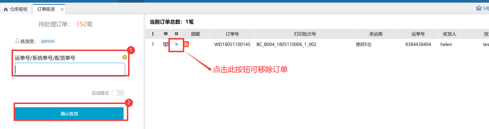
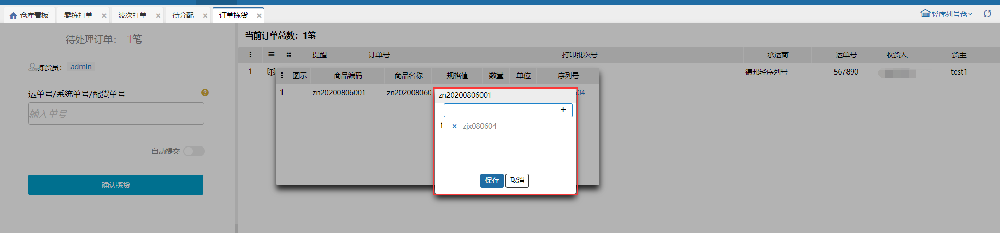

# 订单拣货

订单拣货环节，用户可输入快递单号、系统单号、配货单号，批量进行确认拣货。若扫描的订单有不想确认拣货的，可点击移除按钮将订单移除。

**提示：**

1、配货单号：波次订单的配货单号是波次号；零拣订单的配货单号是打印配货单显示的配货单号。

2、确认拣货后订单就移至下一环节，订单锁定的库位库存实际数量会减少，锁定数量会增加，订单的快递成本会自动计算。

3、若用户不需要此环节，则可在仓内策略--业务配置页面，关闭此环节。

4.序列号录入

①.标准模式：录入序列号必须是当前商品未锁定的。

②.简洁模式：录入序列号可以是当前商品未锁定的，也可以是系统中不存在的。录入系统中不存在的后，该序列号自动添加当前商品的库存总量里且是锁定状态。

> 更新: 2023-12-18 13:48:24  
> 原文: <https://hupun.yuque.com/unzko7/lsbfg0/ucg6z67z11akbyol>