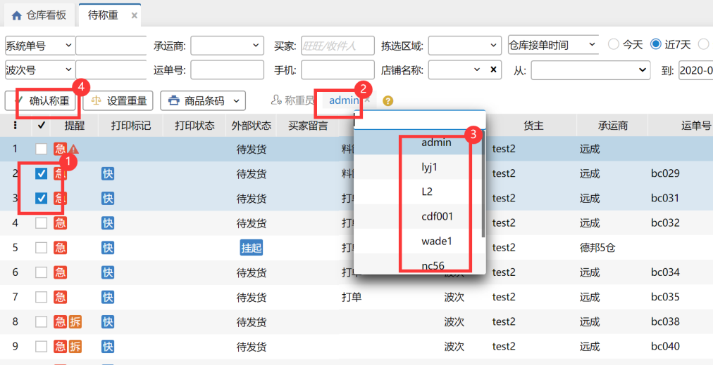

# 待称重

### **02、待称重订单查询**

订单根据待称重界面筛选查询条件进行查询，如不选择条件系统默认显示所有当前待称重订单。

### **02、批量设置体积重量**

1、首先勾选待操作订单；

2、点击设置重量，在弹出对话框中输入该笔/多笔订单的重量、体积、快递成本等，点击确认保存。如不设置系统默认为0.每次设置仅对当前勾选订单有效；

3、快递成本不输入则系统根据运费规则自动计算。

### **03、订单称重**

1、勾选需要称重的订单；

2、称重员默认为当前登录账号的操作员，可点击进行更改选择，选择操作员后相应订单称重绩效将计入该操作员；

3、点击确认称重订单进入下一环节。

### 04、重量校验
1.关联业务配置称重复核校验。

已设置校验，单笔/批量修改订单重量不符合校验值时提示--称重重量与订单估重不符，超出允许范围+/-XXkg/%（或估重为0校验），能否修改成功关联是否有强制提交称重权限。

> 更新: 2023-12-27 10:51:59  
> 原文: <https://hupun.yuque.com/unzko7/lsbfg0/ykziwmz3g5ui80wa>