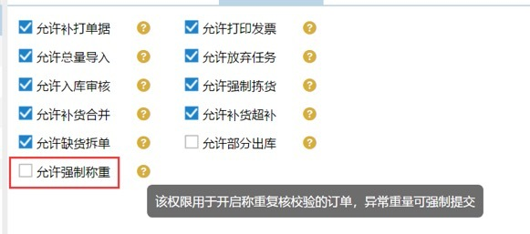
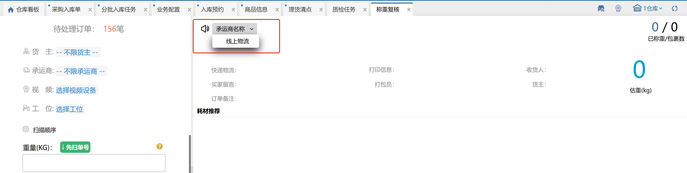

# 称重复核

### **01.称重**
称重复核环节，用户输入重量，输入单号敲击回车，即可见到订单信息，点击确认称重，订单就提交至下一环节。

多种选择

1、先扫单号，还是先称重；（点击先扫单号即可切换）

2、自动计算，还是人工计算；  
（自动计算会根据商品信息界面设置的商品重量，或称重环节的重量和快递运费设置，自动计算快递成本；人工计算，需要自己输入快递成本并回车）

3、小诀窍

a、快递单号可以借助条码扫描枪进行快速输入。

b、重量信息可以借助与“万里牛”直接对接的电子秤，可自动称取重量并回写到系统中。

c、快递成本在系统获取到重量数值后，根据预先设定的公式规则自动计算。参见[承运商档案](https://hupun.yuque.com/unzko7/lsbfg0/iki7tkd119nq1bpe)。

### **02.自动计算重量**
自动计算重量，首先要在商品信息里设置商品的重量，然后设置承运商档案的运费规则。根据商品的重量和预设的运费规则自动计算出重量和快递成本，而不需要开启称重环节。

提示

#### (1)称重两种方式
a、自动称重：需开启称重环节，连接电子秤或手动输入重量；

b、自动计算重量：不需要开启称重环节，设置商品重量，确认审核后自动计算重量；

#### (2)如何自动计算重量和快递成本
a、自动计算重量： 确认审核后，会根据商品明细的重量自动计算出商品的总重量；

b、自动计算快递成本：确认配货后，会根据设置的运费规则自动计算出快递成本；

#### (3)重量哪里看
a、打单配货环节：打印预览发货单可以看到商品的总重量；

b、发货环节：可以看到商品的总重量；

c、订单查询：查询系统状态是打单配货的，可以看到商品的总重量；

#### (4)重要
设置了商品重量，自动称重，就不要开启称重环节了，否则称重的时候会覆盖之前自动计算的重量。

#### (5)提示
a、开启称重后置打印，则电子面单快递订单确认称重后会自动生成单号和打印快递单，若选择发票则可以后置打印发票。

b、在设置-流程配置页面，开启称重复核校验，重量超过误差范围的订单会有提示。

c、开启自动提交，订单在确认称重后会自动提交至下个环节。

### **03.称重复核**
1、关联业务配置称重复核校验

已设置校验，订单称重时重量不符合校验值则提示--称重重量与订单估重不符，超出允许范围+/-XXkg/%（或估重为0校验），能否继续提交称重关联是否有强制提交称重权限。

2、操作员权限：强制提交称重权限

若没有允许强制称重权限，订单重量和估重的差值大于校验值时，无法提交称重。

### 04.语音播报
开启语音播报后，默认按线上物流播报，可切换为承运商名称。

注：关联后台开关，未开启时只能选择【线上物流】。

> 更新: 2026-07-21 10:50:25  
> 原文: <https://hupun.yuque.com/unzko7/lsbfg0/ks7ols31xl9k42y5>