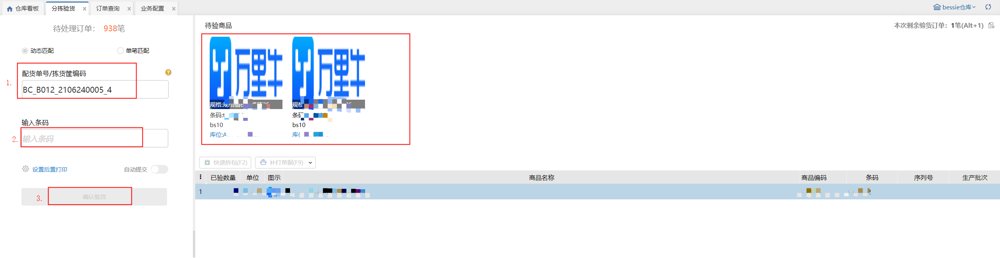
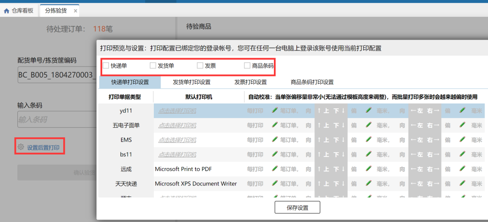
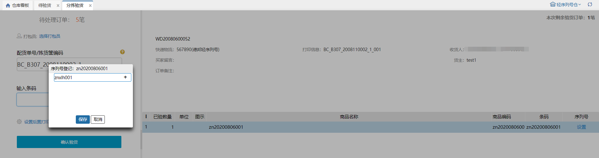
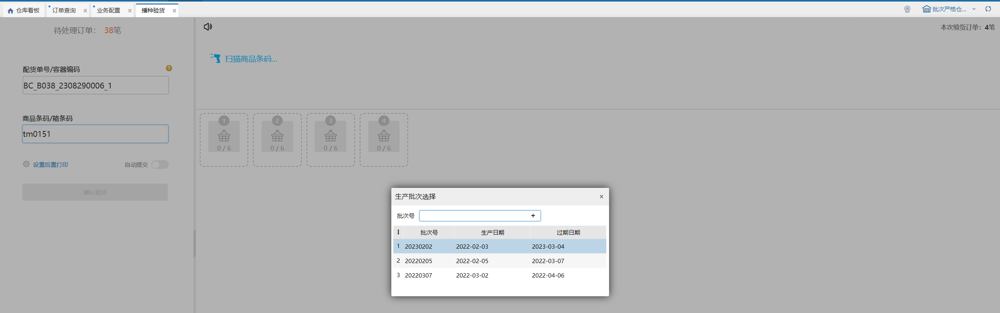
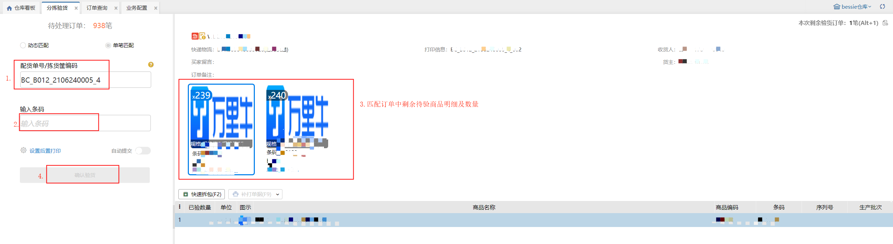
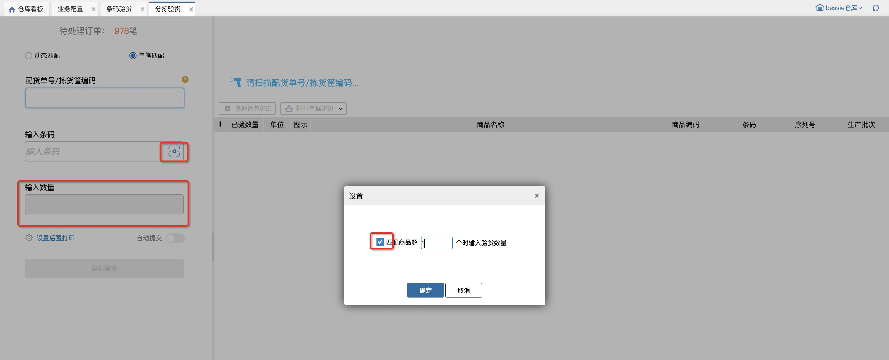
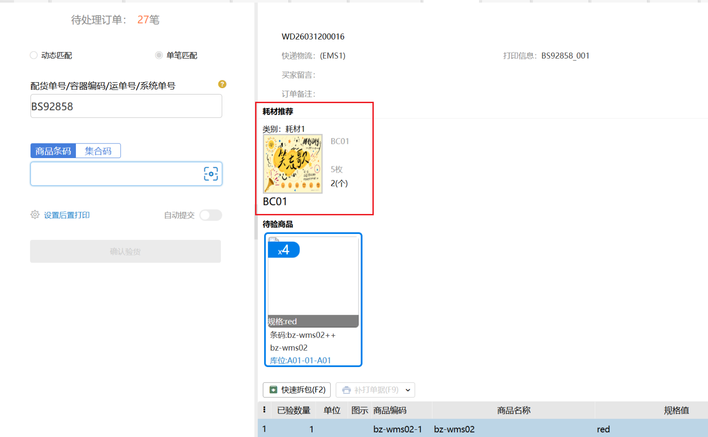
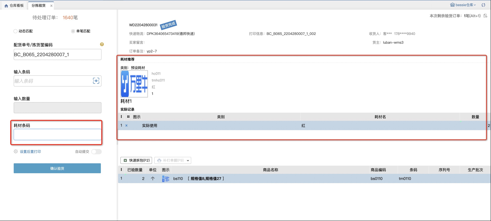
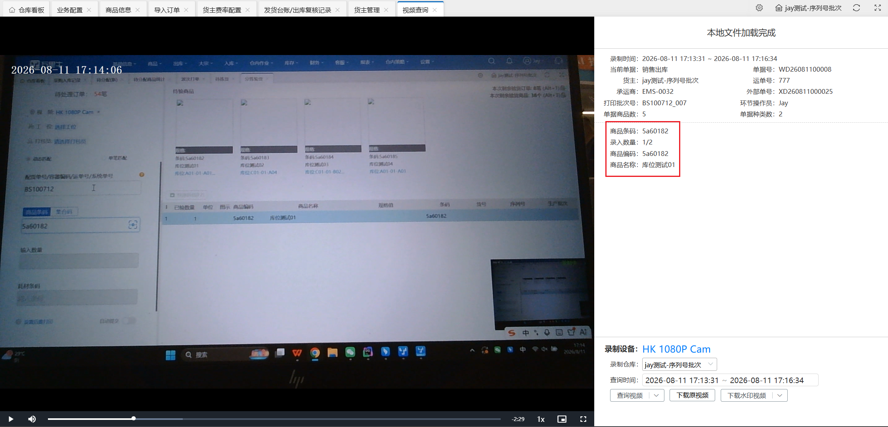
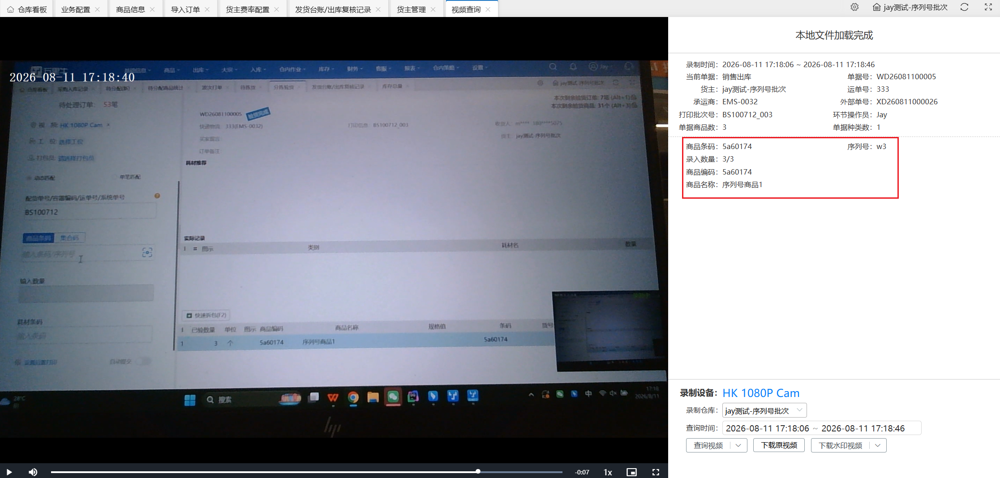

# 分拣验货

分拣验货，可以帮助用户盲扫商品来验货，当扫到的商品有匹配上订单后，确认验货按钮就会高亮，用户点击确认验货就可以完成该笔订单的验货环节。

### 01、默认为动态匹配
扫配货单号和商品条码后，右侧显示匹配到的波次中待验商品明细和数量

设置后置打印环节，可选择打印快递单、发货单和发票等：

**提示：**

1. 首先应该扫描配货单号或者波次号，则会显示出来该配货单有多少笔订单是待验货的；

2. 扫描商品条码，则右边有显示出来有匹配商品的待验货商品，用户可以进行参考，下面会显示已验货的数量；

3. 开启自动提交功能，表示当一个订单的所有商品都确认验货后会自动提交订单到下个环节，不需要用户去手动点击确认验货按钮；

4. 后置打印，开启后确认验货后若是电子面单快递订单会自动生成单号和打印快递单，若选择发票则可以后置打印发票；

5. 在仓内策略–业务配置，开启商品条码截取，扫描输入截取的商品条码会与商品信息的条码进行对比校验；

①.选择特殊信息截取，扫描输入++前的条码，系统会与订单商品信息的条码进行对比校验；扫描输入不含特殊字符的全量条码可直接匹配商品，扫描输入包含++字符的全量条码，无法匹配到商品信息。

②.选择条码位数截取，扫描输入前若干位条码，系统会与订单商品信息的条码进行对比校验；扫描输入全量条码，无法匹配到商品信息。

6.在仓内策略-业务配置，开启赠品类型商品免验货，商品类型是赠品的，确认订单后赠品类型的商品已验数量自动填充。

1）订单中的商品类型都是赠品时，商品都不免验，需要依次验货；

2）订单中序列号商品是赠品时，序列号商品不免验，需要手动验货；

例如：波次包含两个订单：订单01：普通商品A（赠品）2个，普通商品B（赠品）3个；

订单02：普通商品C 2个，普通商品B（赠品）3个；

订单03：序列号商品D（赠品）2个，普通商品B（赠品）3个；

验货时，订单01 商品A、B都需要验货；订单02 商品B免验，只需验商品C；订单03 商品B免验，只需验序列号商品D

7.录入序列号

1）标准模式：录入序列号必须是当前商品未锁定的。

2）简洁模式：录入序列号可以是当前商品未锁定的，也可以是系统中不存在的。录入系统中不存在的后，该序列号自动添加当前商品的库存总量里且是锁定状态。

3）简洁模式：不支持序列号匹配商品。

8.验货核对批次

①.手动选择核对

扫描商品条码后，若有多个批次号，则弹窗选择生产批次并填写数量，若只有1个批次号，则直接增加已验数量：

②.扫描批次号核对

每次扫描生产批次商品，都会弹窗选择生产批次，可以手动输入批次号+回车，或者双击选中批次号：

9.集合码录入

具体内容参考[业务配置](https://hupun.yuque.com/unzko7/lsbfg0/caki7lz4105n2vpg#CKIQO)。

### 02、单笔匹配
扫配货单号和商品条码后，右侧显示匹配到的单笔订单信息和待验商品：

注：匹配订单规则：

①.顺序逻辑为波次订单商品总数由少到多推荐，即单笔先完成

②.若波次中订单商品数量一致的，按打印批次号顺序完成

2.1 输入数量

商品条码开启输入数量设置后，左侧显示“输入数量”文本框，该输入框可用于快捷填写已验数量。

当扫码商品条码剩余可验数量<=指定数量时，输入数量框置灰，当扫码商品条码剩余可验数量>指定数量时，输入数量框默认为1，可手动修改，填写数量n后回车，对应sku已验数量+n

注：该配置记忆在仓库+操作员上

3、耗材使用

业务配置-开启耗材管理，设置耗材登记环节为“验货”时，支持在分拣验货页面显示推荐耗材或录入实际使用耗材：

3.1 按耗材推荐：在扫描商品条码匹配到待验订单后，就根据耗材规则显示耗材推荐信息

+ 

3.2 按实际使用：订单所有明细验货完成后，页面上显示推荐耗材数据，并支持录入实际使用耗材：

4、万能码提交

若当前仓库开启扫描条码强制提交开关，商品条码、耗材条码扫描框支持扫描wanliniu666强制提交或跳转到下一个扫描框。

5.集合码录入

具体内容参考[业务配置](https://hupun.yuque.com/unzko7/lsbfg0/caki7lz4105n2vpg#CKIQO)。

### 03、支持视频监控显示商品明细
同条码验货，视频监控记录会显示扫描的商品明细（商品名称、条码、数量、批次信息、序列号）

普通商品

批次号商品

序列号商品

> 更新: 2026-08-17 13:48:19  
> 原文: <https://hupun.yuque.com/unzko7/lsbfg0/bbx4n7cxh33h2zhe>