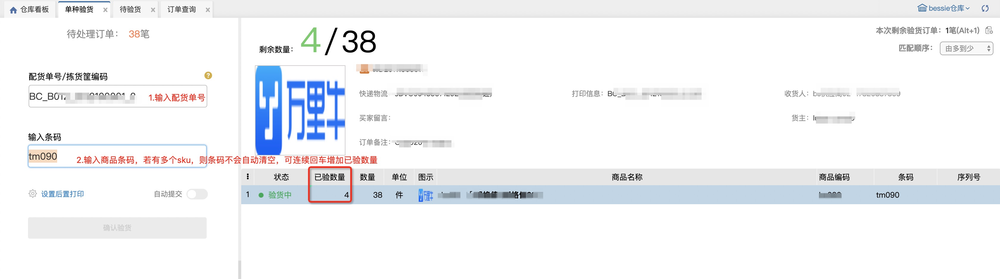
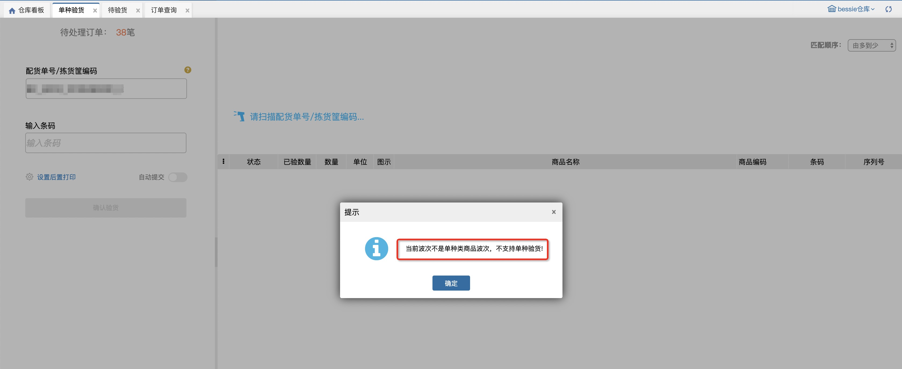

# 单种验货

单种验货页面专用于满足单种类不限数量的波次验货，单种类波次的概念：非预配/同品/自由波次、且规格种类1-1 商品种类1-1 的波次。

具体操作步骤如下：输入配货单号->输入条码->确认验货

扫描波次号时会判断是否为单种类的波次，否则报错提醒如下：

**注意：**

1.支持配置验货单据查找顺序（如数量大的优先）;

2.快速跳转中验货环节增加单种验货，支持快速跳转

> 更新: 2023-12-18 14:00:58  
> 原文: <https://hupun.yuque.com/unzko7/lsbfg0/axgc1987rimmk2u4>