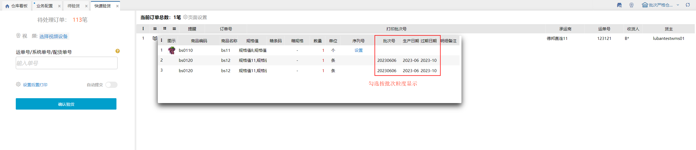

# 快速验货

快速验货页面，可以扫描多个单号进行快速验货。操作步骤见下图。

**提示：**

1、仓内策略--流程配置，开启快速验货后提交至待出库，订单确认验货后可直接触发发货，并提交至待出库环节。

2、扫描的多个单号，有一笔订单想要移除，则点击移除按钮即可。

3、开启页面上的后置打印，确认验货后若是电子面单快递订单会自动生成单号和打印快递单，若选择发票则可以后置打印发票或选择发货单进行打印。

4、录入序列号

①.标准模式：录入序列号必须是当前商品未锁定的。

②.简洁模式：录入序列号可以是当前商品未锁定的，也可以是系统中不存在的。录入系统中不存在的后，该序列号自动添加当前商品的库存总量里且是锁定状态

5、页面设置

勾选验货明细按批次粒度显示，有锁定多个批次的明细会按照不同批次分多条数据展示

> 更新: 2023-12-18 14:02:28  
> 原文: <https://hupun.yuque.com/unzko7/lsbfg0/doib8dv17aamv5ep>