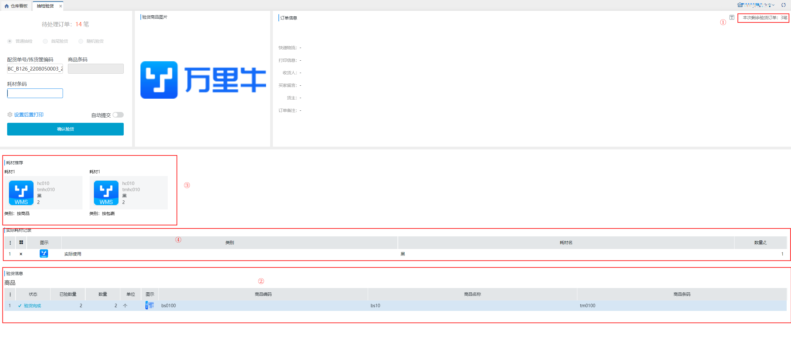
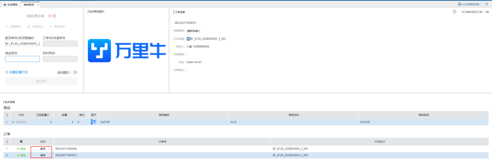
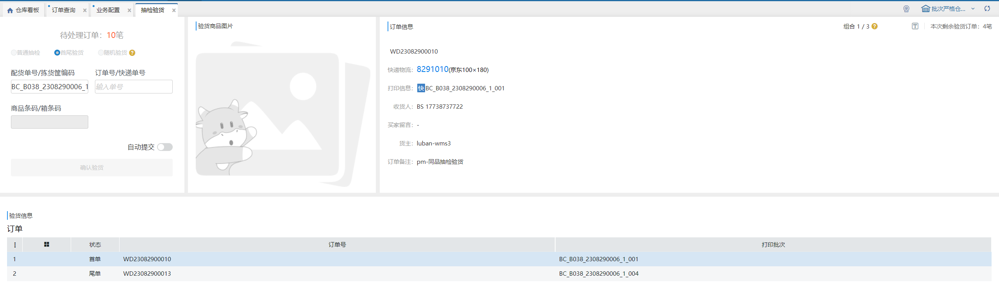

# 抽检验货

同品、预配波次有大批量相同明细的单据，如若批量验货则容易出现整个波次拿错货的情况，所以需要对其中一单进行抽查检验，由于同品订单在打印时往往是连着打，那么撕单时就可能撕错，就导致发错货，因此在抽检的时候抽检方式也需要多样化。

1.点击抽检验货按钮，扫描同品/预配波次的波次号匹配订单。

①待处理订单：同品/预配波次的订单数。

②可选择验货模式有：普通抽检、首尾验货、随机验货，作业模式记忆为仓库+操作员上。

③输入框：普通抽检不显示订单号/快递单号，右边订单信息为空；未开启耗材管理-实际使用-验货环节，不显示耗材条码输入框。

④设置后置打印：支持后置打印快递单、发货单、发票、商品条码、平台标签。

⑤自动提交：开启耗材管理-实际使用-记录多个耗材，自动提交不生效。

⑥补打单据：支持补打快递单。

2.选择验货模式

1）普通抽检

场景：无需确认订单，直接验其中一单的商品

①波次中共3笔订单，每笔订单明细均为bs0100：数量2个。

②扫描商品条码，验货波次的其中一单。

③商品验货完成，显示推荐耗材。

④可输入耗材条码，在实际耗材记录中展示。

⑤确认验货，提交整笔波次验货完成。

2）首尾验货

场景：需要扫描波次首单和尾单，然后再扫商品验货，主要预防撕错单

①扫描波次后，订单信息显示首单信息，需先完成首尾单校验，再验商品。

②其他操作与普通抽检一致。

3）随机验货

场景：打单贴单人较多，随机扫几个看看单子对不对，主要预防撕错单+打印中途换纸+一个波次多人操作人工分错等

①扫描单号后，可录入一笔或多笔波次内任意订单的系统单号/运单号匹配订单，录入后订单显示完成，再验商品。

②其他操作与普通验货一致。

3.验货核对批次

开启验货核对批次-抽检验货后，验货步骤分为校验订单--核对批次两个步骤，其中校验订单的方式和上述三种模式一致，核对批次的方式如下，以首尾验货为例。

①.手动选择核对

扫描波次后，订单信息显示首单信息，需先完成首尾单校验，再验商品：

扫描商品条码后，若有多个批次号，则弹窗选择生产批次，选择后增加已验数量，若只有1个批次号，则直接增加已验数量：

每个组合核验完成后，会自动切换显示下一个组合，并刷新“组合”和“本次剩余验货订单”数据，直到最后一个组合核验完成后，可以录入耗材或提交整个波次。

组合：指在波次订单中，如果商品批次号不同，那么订单中出现不同的批次搭配都记为一种组合。

例：波次中有4个订单，订单1 明细a 锁定批次01 数量1 批次02 数量2，订单2 明细a 锁定批次01 数量3，订单3 明细a 锁定批次01 数量2 批次02 数量1，订单4 明细a 锁定批次01 数量1 批次02 数量2

上述波次共有3个组合：组合1：明细a 锁定批次01 数量1 批次02 数量2，共2个订单；组合2：明细a 锁定批次01 数量3，共1个订单；组合3：明细a 锁定批次01 数量2 批次02 数量1，共1个订单

②.扫描批次号核对

扫描波次后，订单信息显示首单信息，需先完成首尾单校验，再验商品

每次扫描生产批次商品，都会弹窗选择生产批次，可以手动输入批次号+回车，或者双击选中批次号：

每个组合核验完成后，会自动切换显示下一个组合，并刷新“组合”和“本次剩余验货订单”数据，直到最后一个组合核验完成后，可以录入耗材或提交整个波次。

> 更新: 2024-11-18 16:48:02  
> 原文: <https://hupun.yuque.com/unzko7/lsbfg0/skagrpfegnetmcgp>