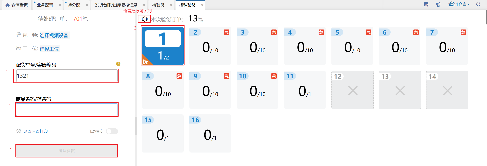
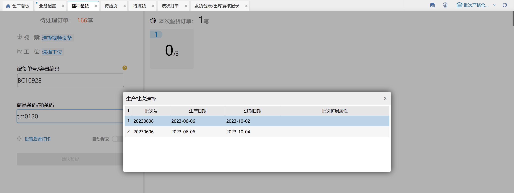
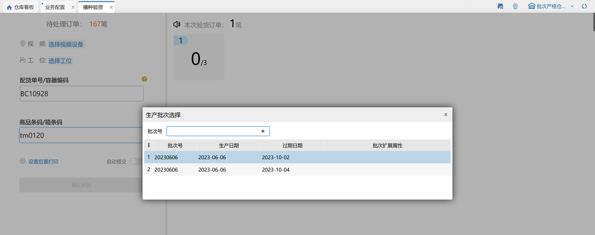

# 播种验货

播种验货，可以帮助用户使用料框模式盲扫商品来验货，当扫到的商品匹配上订单后，对应的框号会在右侧显示，用户只需要将商品放入对应的播种框中。

具体页面如下：

**提示：**

1. 首先应该扫描配货单号或者波次号，则会显示出来该配货单有多少笔订单是待验货的；

2. 扫描商品条码，则右边有显示出来对应的料筐号，且下面对应的播种框下的数字会改变，用户只需将商品放入对应的播种框中即可；

3.播种验货需要一个播种里的所有订单都验货完成才允许提交至下个环节；

4.开启页面上的后置打印，确认验货后若是电子面单快递订单会自动生成单号和打印快递单，若选择发票则可以后置打印发票；

5.在仓内策略–业务配置，开启商品条码截取，扫描输入截取的商品条码会与商品信息的条码进行对比校验；

①.选择特殊信息截取，扫描输入++前的条码，系统会与订单商品信息的条码进行对比校验；扫描输入不含特殊字符的全量条码可直接匹配商品，扫描输入包含++字符的全量条码，无法匹配到商品信息。

②.选择条码位数截取，扫描输入前若干位条码，系统会与订单商品信息的条码进行对比校验；扫描输入全量条码，无法匹配到商品信息。

6.在仓内策略–业务配置，开启验货前置发货，则确认验货后订单会通知对应erp显示发货。

7.若操作员验货到一半因为各种原因无法继续验货，则在刷新页面后重新输入配货单号，系统会提示“是否继续上一次操作”，若点击是则继续上次操作，点击否则需要重新验货。

8.PC端如验货一半因为各种原因无法继续验货，可在PDA上通过播种验货功能继续验货。

9.语音播报可关闭。

10.录入序列号

①.标准模式：录入序列号必须是当前商品未锁定的。

②.简洁模式：录入序列号可以是当前商品未锁定的，也可以是系统中不存在的。录入系统中不存在的后，该序列号自动添加当前商品的库存总量里且是锁定状态。

11.验货核对批次

①.手动选择核对

扫描商品条码后，若有多个批次号，则弹窗选择生产批次，选择后增加已验数量，若只有1个批次号，则直接增加已验数量：

②.扫描批次号核对

每次扫描生产批次商品，都会弹窗选择生产批次，可以手动输入批次号+回车，或者双击选中批次号：

> 更新: 2025-04-29 16:17:45  
> 原文: <https://hupun.yuque.com/unzko7/lsbfg0/ipamxiqqed6l9gf1>