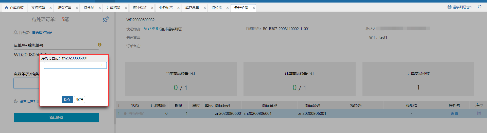
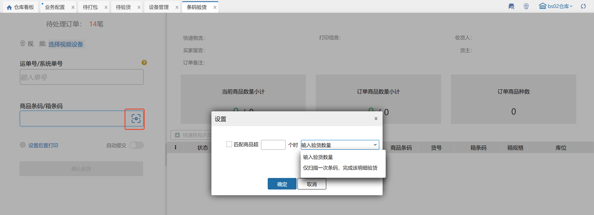
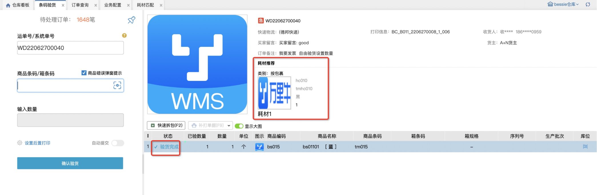
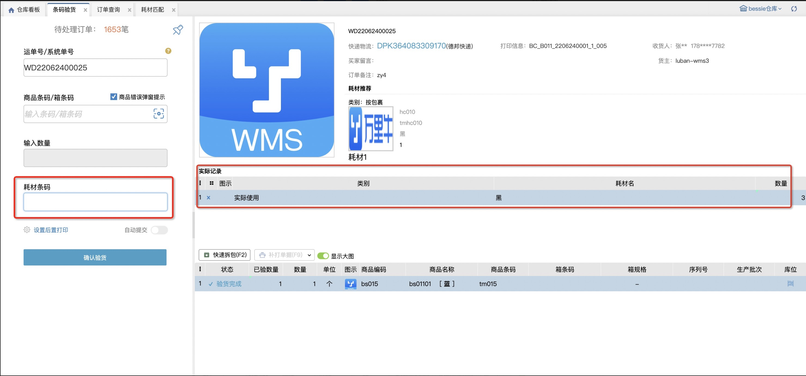
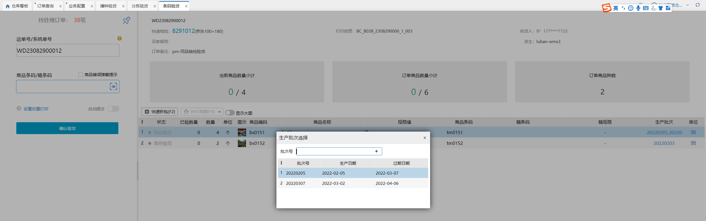
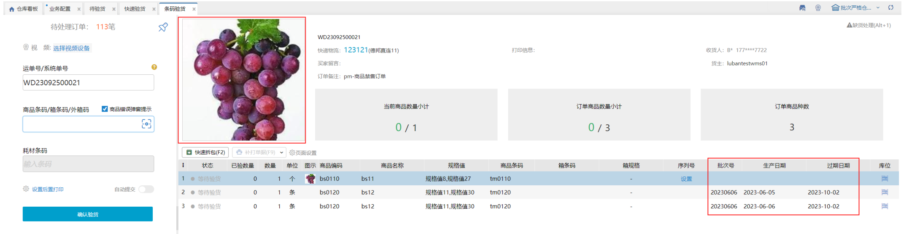
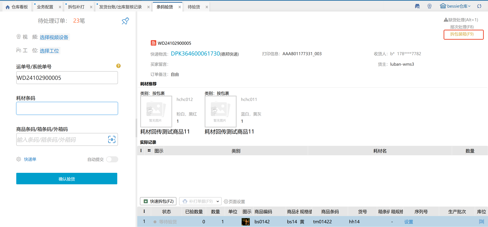

# 条码验货

条码验货环节，方便用户扫描订单的商品。具体操作如下图所示。

### 1.条码截取
在仓内策略–业务配置开启商品条码截取，扫描输入截取的商品条码会与商品信息的条码进行对比校验；

①.选择特殊信息截取，扫描输入++前的条码，系统会与订单商品信息的条码进行对比校验；扫描输入不含特殊字符的全量条码可直接匹配商品，扫描输入包含++字符的全量条码，无法匹配到商品信息。

②.选择条码位数截取，扫描输入前若干位条码，系统会与订单商品信息的条码进行对比校验；扫描输入全量条码，无法匹配到商品信息。

### 2.后置打印
开启后确认验货后若是开启电子面单的快递订单会自动生成单号和打印快递单，若选择发票则可以后置打印发票。

### 3.自动提交
若开启，当所有已验数量等于所有商品数量时，会自动提交至下一环节。

### 4.强制提交
当已验数量小于商品数量时，点击确认验货可强制提交至下一环节；在仓内策略–业务配置，开启扫描条码强制提交后，无需点击确认验货，扫描wanliniu666可强制提交至下一环节。

### 5.赠品免验
在仓内策略--业务配置，开启赠品类型商品免验货，扫描系统订单号或运单号，赠品类型的商品已验数量自动填充。

### 6.条码验货报次
#### 6.1 报次配置
业务配置-其他配置-次品库存开启订单验货报次开关，条码验货显示报次按钮。若订单只锁了规格箱不允许报次；若订单锁规格箱+零散的允许报次；点击报次按钮或F8进入报次页面。

#### 6.2 报次页面
①.选择处理方式仅报次或报次并拆单。

②.设置残次品存放库位和剩余非残次品存放库位；残次品库位选择除了异常暂存库位和工位，其他的都支持；剩余非残次品存放库位只能选择异常暂存库位。

③.报次数量设置，序列号商品的报次数量不可编辑，扫描序列号后会自动增加报次数量；非序列号商品的报次数量可以正常编辑。

#### 6.3 打回待分配逻辑
①.未勾选复核库存总量/库位库存不足，执行缺货上报，正常打回待分配且订单缺货了也不会通知erp缺货；

②.勾选复核库存总量/库位库存不足，执行缺货上报，打回待分配时若缺货会提示库存总量/库位库存不足，点击确定按钮打回待分配并通知erp缺货；

点击取消按钮不报次；

点击取消并打印按钮不报次但打印单据，打印单据是根据后置打印设置的单据，若没有开启则不显示取消并打印按钮，若选择快递单或发票，订单没有运单号或发票信息也不显示取消并打印按钮。

③.打回待分配时订单被挂起，确认异常后仍可以打回待分配；打回待分配时订单被拦截，确认异常后订单关闭。

④.打回待分配时订单中的商品会报次，报次数量即报次页面填写的数量且正次转换和库存调整都会自动新增一个单据。

### 7.录入序列号
①.标准模式：录入序列号必须是当前商品未锁定的。

②.简洁模式：录入序列号可以是当前商品未锁定的，也可以是系统中不存在的。录入系统中不存在的后，该序列号自动添加当前商品的库存总量里且是锁定状态。

（1）录入序列号适配采集器

前置条件：序列号录入方式选择【扫商品后连续扫序列号录入】时，增加子项：录入后统一校验序列号有效性

勾选后，在录入序列号时不校验有效性，点击保存&<u>已验数量=应验数量</u>时统一校验。若录入序列号都通过校验，则弹窗关闭，序列号录入到明细行；若录入序列号部分/全部未通过校验，则弹窗保留，以列表形式报错，且列表错误序列号标红(有多行重复序列号，首行不标红，其余行标红报错)

### 8.输入数量设置
①输入验货数量

商品条码开启”输入验货数量“设置后，左侧显示“输入数量”文本框，该输入框可用于快捷填写已验数量。

当扫码商品条码剩余可验数量<=指定数量时，输入数量框置灰，当扫码商品条码剩余可验数量>指定数量时，输入数量框默认为1，可手动修改，填写数量n后回车，对应sku已验数量+n

②仅扫描一次条码，完成该明细验货

商品条码开启”仅扫描一次条码，完成该明细验货“设置后，左侧不显示”输入数量“文本框，扫描条码后自动填充已验数量=数量，明细标记为验货完成。

**注：**

(1)条码验货页面，若未开启允许验货编辑数量，开启设置也不显示输入框

(2)该配置记忆在仓库+操作员上

### 9.序列号录入方式设置
设置中可勾选序列号录入方式，按扫商品后连续扫序列号录入或者逐个扫商品+序列号录入。

①扫商品后连续扫序列号录入：扫商品条码后显示序列号弹窗，可录入多个序列号，每次录入时校验序列号有效性；

②扫商品连续扫序列号录入+录入后统一校验序列号有效性：扫商品条码后显示序列号弹窗，可录入多个序列号，点击保存时校验序列号有效性；

③逐个扫商品+序列号录入：扫商品条码后录入一个序列号就自动关闭序列号录入弹窗，再次扫商品条码会重新弹出序列号录入弹窗。

注：开启商品序列号管理+选择序列号出库登记环节：验货才显示序列号录入方式

### 10.配置扫描顺序
前提：业务配置-开启耗材管理，设置耗材登记环节为“验货”，按实际使用录入耗材。符合前提配置时，页面可配置扫描顺序，否则不支持配置。

### 11.业务配置-开启耗材管理
（1）设置耗材登记环节为“验货”时，支持在条码验货页面显示推荐耗材或录入实际使用耗材：

（2）按耗材推荐：

一订单所有明细验货完成后，页面上显示推荐耗材数据以供参考：

（3）按实际使用：订单所有明细验货完成后，页面上显示推荐耗材数据，并支持录入实际使用耗材：

### 12.验货核对批次
①.手动选择核对

扫描商品条码后，若有多个批次号，则弹窗选择生产批次，选择后增加已验数量，若只有1个批次号，则直接增加已验数量：

②.扫描批次号核对

每次扫描生产批次商品，都会弹窗选择生产批次，可以手动输入批次号+回车，或者双击选中批次号：

### 13.页面配置
①启用商品大图：勾选后高亮行明细商品图片会显示大图模式，未勾选时显示小图模式。

②验货明细按批次粒度显示：勾选验货明细按批次粒度显示，有锁定多个批次的明细会按照不同批次分多条数据展示

开启显示大图+按批次粒度显示明细效果如下：

未开启显示大图+按批次粒度显示明细效果如下：

### 14.跳转拆包装箱

从条码验货跳转到拆包补打页面需要符合以下条件：

+ 当前操作员有拆包补打页面权限
+ 当前扫描单号有匹配的订单，且未提交验货

快捷键F9或点击按钮可以跳转到拆包补打页面【拆包装箱】模式，系统会自动把单号、录入耗材（若有）、待验明细、已验明细（若有）带到拆包装箱页面。

注：对于不支持拆包装箱的订单，跳转到拆包补打页面后会自动判断并提示，不影响跳转功能。

### 15.集合码录入
具体内容参考[业务配置](https://hupun.yuque.com/unzko7/lsbfg0/caki7lz4105n2vpg#CKIQO)。

> 更新: 2025-12-19 16:30:24  
> 原文: <https://hupun.yuque.com/unzko7/lsbfg0/pa13n9t9mgwrhbgx>