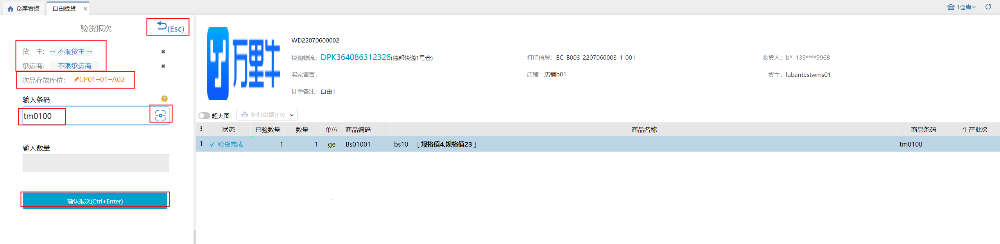
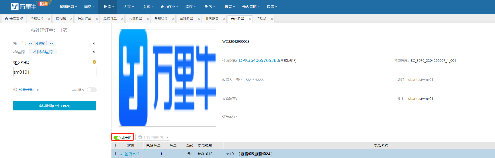

# 自由验货

业务场景：针对一种一件的商品，特别是服装相关行业（订单比例可大于60-70%），希望有比目前系统更加相对便捷简单的拣货、验货方式。希望可以在验货的时候直接扫描商品条码，系统自由匹配订单后置打印出快递单。

自由验货，通过操作员手拿实物去扫商品条码匹配订单，进行验货并后置打印快递单。

具体页面如下：

 

1.先选择货主和承运商，默认选择是不限货主、不限承运商。

2.扫描商品条码，匹配订单并自动验货，提交验货并打印快递单。

3.待处理订单数，是处于待验货且是归属自由波次下的订单数。

4.扫码设置，开启后，若输入条码能够匹配到的订单数量>设定值，则输入数量输入框可编辑，默认数量为1，且页面显示符合订单数量，供用户参考，若输入数量>符合订单数量，报错提示：

5.生产批次商品，先选择批次再匹配订单，选择的批次是处于待验货且归属自由波次的订单中该商品的批次。例如a商品有01、02、03、04，处于待验货的自由波次有a商品的2笔订单分别是批次01和04，处于待验货的非自由波次有a商品1笔订单批次是02，自由验货，扫描商品a选择批次页面显示01、04。商品明细的生产批次不能修改只能查看。

6.序列号商品，先扫描序列号再匹配订单，商品明细的序列号可以修改。

7.开启条码截取，选择商品再匹配订单，选择的商品是处于待验货且归属自由波次的订单中商品。例如xy01、xy02、xy03、xy04，处于待验货的自由波次中订单的商品有xy01、xy04，扫描xy，选择商品页面显示xy01、xy04。

8.扫描商品条码，拦截的订单会匹配到；挂起的订单会匹配到，确认异常后，就不会匹配了，恢复异常后仍可以匹配到。

9.扫描商品，匹配顺序是标记订单（加急>天猫直送>COD订单>预售订单）>付款时间。

10.自由验货报次                     

10.1 业务配置-其他配置-次品库存开启订单验货报次开关，自由验货显示切换按钮。                   

10.2 验货报次页面，选择货主；设置次品存放库位；扫描次品条码或序列号。                   

10.3 确认报次按钮逻辑校验                 

①.未勾选复核库存总量/库位库存不足，执行缺货上报，正常报次且订单缺货了也不会通知erp缺货；              

②.勾选复核库存总量/库位库存不足，执行缺货上报，确认报次时若缺货会提示库存总量/库位库存不足，点击确定按钮打回待分配并通知erp缺货；点击取消按钮不报次；点击取消并打印按钮不报次但打印单据，打印单据是根据后置打印设置的单据，若没有开启则不显示取消并打印按钮，若选择快递单或发票，订单没有运单号或发票信息也不显示取消并打印按钮。                 

③.确认报次时订单被挂起，确认异常后仍可以打回待分配；确认报次时订单被拦截，确认异常后订单关闭。

④.确认报次时订单中的商品会报次，报次数量即报次页面填写的数量且正次转换和库存调整都会自动新增一个单据。                

11.换货处理：验货时发现商品污损不可出库，通过换货处理打回待分配重新锁库、拣货，正常出库。

11.1换货数量不可编辑。

11.2提交换货后，订单打回待分配，换货的商品还回异常暂存库位。

11.3拣选库位+存储库位的可用库位库存不足，提示是否继续执行换货操作；选择是则继续打回，否则取消换货，关闭弹窗。

12.录入序列号

12.1标准模式：录入序列号必须是当前商品未锁定的。

12.2简洁模式：录入序列号可以是当前商品未锁定的，也可以是系统中不存在的。录入系统中不存在的后，该序列号自动添加当前商品的库存总量里且是锁定状态。

12.3简洁模式：不支持扫描序列号匹配订单。

13.支持超大图显示，默认关闭，订单详情增加店铺名称。

14.同时开启赠品免计算和免验情况下，普通商品1个加其他是赠品支持订单进入自由波次，且自由验货被匹配到。

1）扫描普通商品带出订单，扫描赠品不支持匹配订单，赠品显示已验。

2）赠品为序列号/轻批次商品可以在明细上设置修改，设置完成后显示验货完成，可以提交。

3）批量提交显示符合数量为赠品也一致的数量。

> 更新: 2023-12-18 13:59:17  
> 原文: <https://hupun.yuque.com/unzko7/lsbfg0/czhq7ccedbey1vtn>