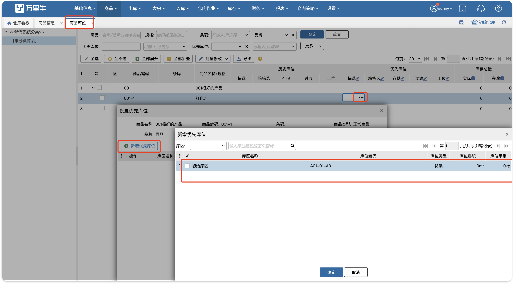
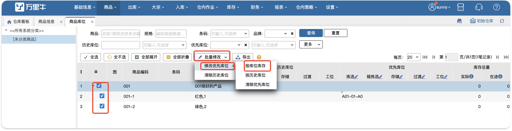
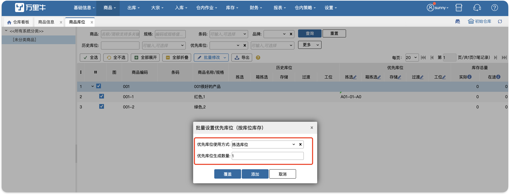
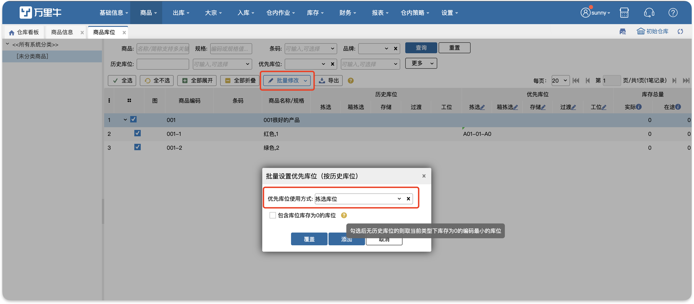
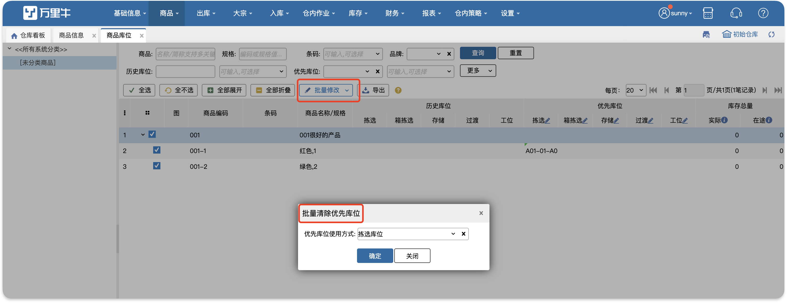
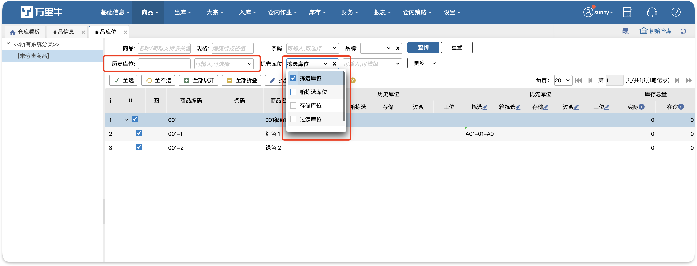
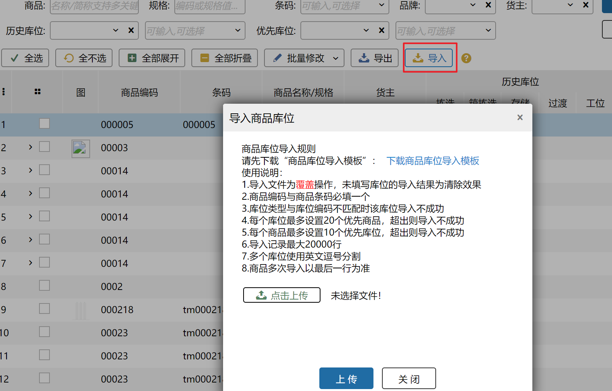

# 商品库位

该页面功能是给商品设置优先库位。商品设置优先库位后，系统在指导上架和补货时将会推荐该商品放在优先库位上。

支持给商品设置拣选、存储、过渡、工位四种优先库位，每种库位类型最多设置20个优先商品，每个商品最多设置对应类型的10个库位。

### 1.单个sku设置
点击sku上库位类型，显示商品信息，点击新增库位，显示对应类型的库位。可通过选择库区定位库位，也可直接查询库位编码。

### 2.批量设置
批量设置可勾选多个商品，同时给商品设置优先库位，设置规则有库位库存和历史库位。

#### 01.批量按库位库存设置
支持批量给商品设置有库存的库位为优先库位，一次最多设置10个。

批量添加将会在原有设置的优先库位基础上添加库位，若添加后库位超过十个会报错提示只设置库位到十个，设置库位时根据库位编码从小到大排序。

批量覆盖则是将库位全部更新为新的库位。

#### 02.批量按历史库位设置
历史库位：商品在该库位曾经存在过且现在不存在。当sku的历史库位存在时，每种类型最终只会设置一个历史库位，该历史库位是最近存在过该sku的库位。

库位库存为0的库位仅会在历史库位不存在的时候被设置

#### 03.批量清除优先库位。
   选择商品和需清除的库位使用方式，确定后会清掉商品的优先库位。

### 3.查询
可查询有历史库位和无历史库位的sku，查询后可批量设置。

可查询有优先库位和无优先库位的sku，对无优先库位的sku一键设置优先库位。也可根据商品的在途库存和库存总量来设置优先库位

### 4.导入
商品优先库位支持通过导入方式填充，要求按使用说明填写导入文件：

 

 

> 更新: 2024-10-25 11:40:28  
> 原文: <https://hupun.yuque.com/unzko7/lsbfg0/wsg57ixeg30wlavp>