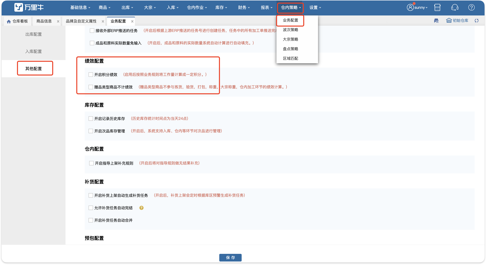
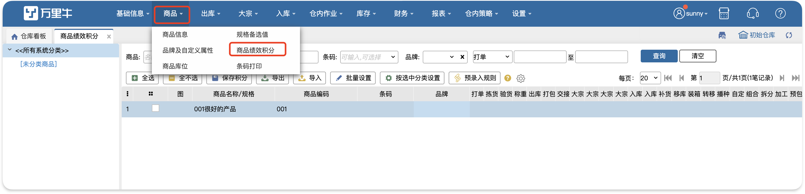
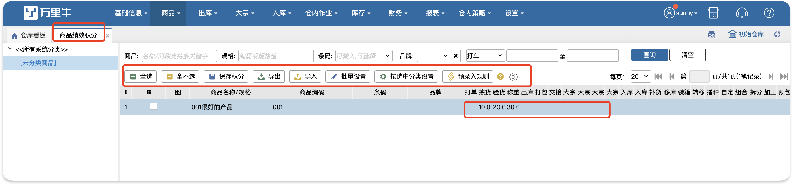
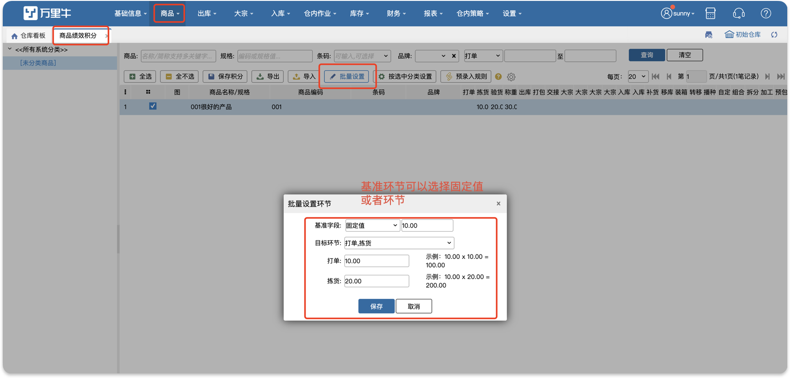
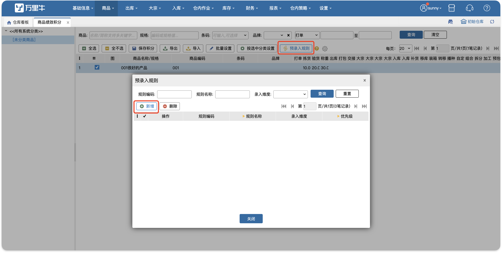
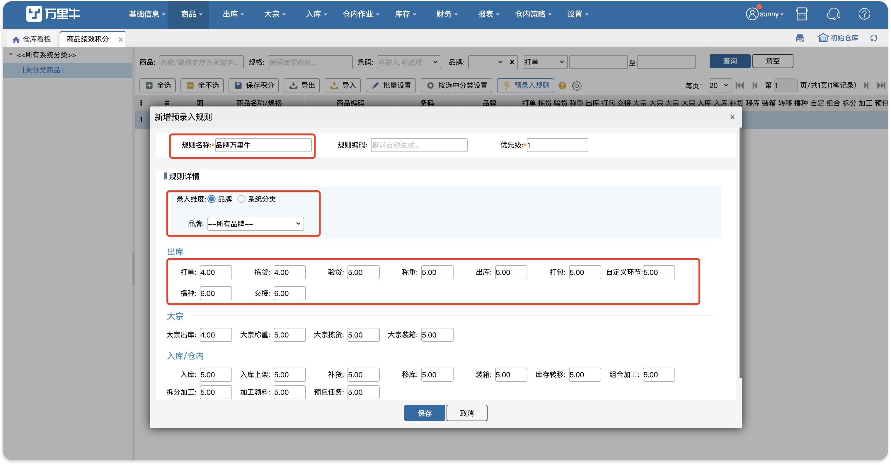
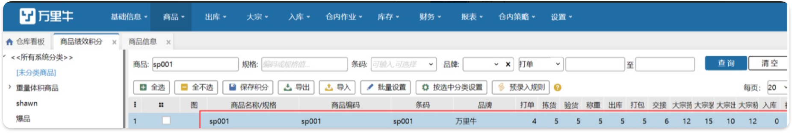

# 商品绩效积分

在业务配置-其他配置项中勾选了开启积分绩效，保存并退重新登录后，此页面会出现。商品绩效积分页面是用来设置每个商品对应不同环节的积分，设置成功后，在绩效明细报表和绩效统计报表中能查询到对应的积分统计。

### 1.设置
1) 勾选商品，点击批量设置；或者选中分类，点击按分类批量设置；

2) 基准字段，选择固定值，再勾选目标环节，对应商品对应环节的积分将根据固定值按比例设置；

3) 基准字段，选择环节，再勾选目标环节，对应商品对应环节的积分将根据基准环节的数值按比例设置；

4) 页面中修改某sku对应环节的绩效配置，修改后点击保存积分才会生效。

**提示：**

1.支持跨页勾选商品进行批量设置；

2.未设置积分的环节，绩效统计默认为0；

3.修改了sku的积分，会在操作日志中显示修改的记录；

4.固定值仅支持输入1的整数倍，输入小数将自动进行四舍五入计算；

5.基准字段选择“清空”，会清空勾选商品目标环节的积分值。

### 2.预录入规则
使用场景：入库的一批商品中无法识别哪些是未设置绩效积分的新品，从而不能及时维护新品的商品绩效积分，导致绩效计算不准确。提前设置好积分规格，当系统中新增商品后，自动匹配符合的规则，自动填入新品的绩效积分。

具体操作步骤如下：

新增预录入规则，输入规格名称后选择录入维度，在对应的环节中录入绩效积分，点击保存即可。

如上图所示设置好预录入规则：品牌万里牛后，erp推送新品或wms新增商品sp001，品牌为万里牛，商品绩效积分页面查询商品sp001，已匹配到预录入规则，自动带出规则中的绩效积分。

**注意：**

1.规格名称最多可以8个汉字；

2.录入维度有3种，商品的品牌、商品所属货主、商品的系统分类；

3.一个预录入规则只能选择一种录入维度；

4.两个规则中同一录入维度下选择不能重复。例如：预录入规则1选择录入维度品牌，品牌选择万里牛，保存后，新增预录入规则2，选择录入维度：品牌，品牌选择万里牛、新品两个选项，因为规则1已选择品牌万里牛则会提示录入维度重复，不允许新增预录入规则2。

                      

 

> 更新: 2026-04-28 18:05:11  
> 原文: <https://hupun.yuque.com/unzko7/lsbfg0/bpggc7xo8bfc73xk>