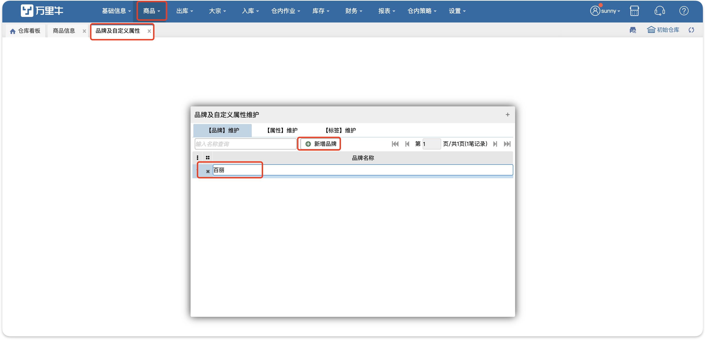
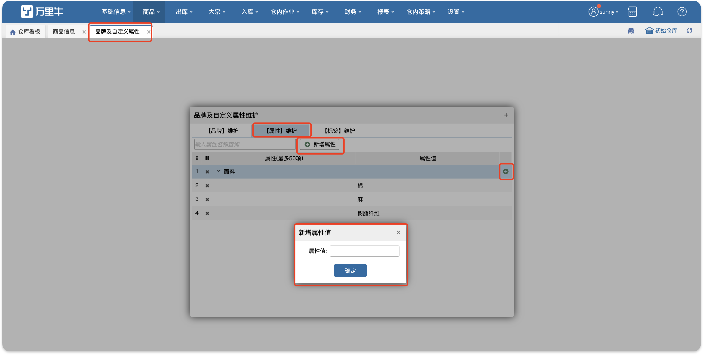
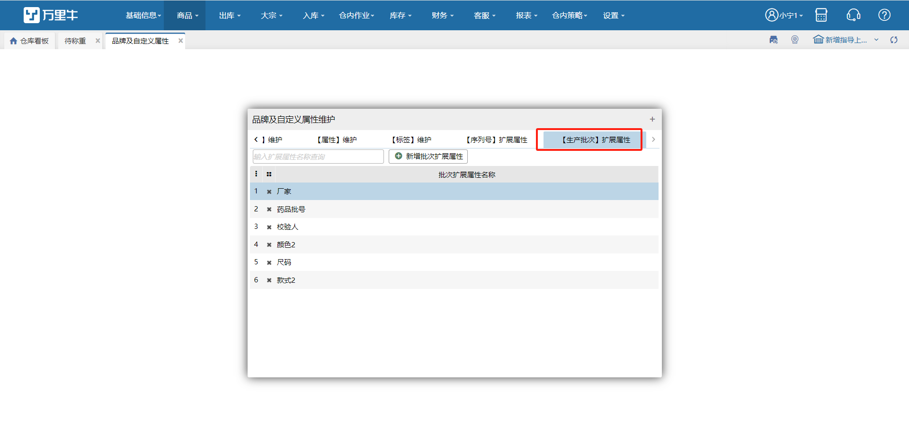
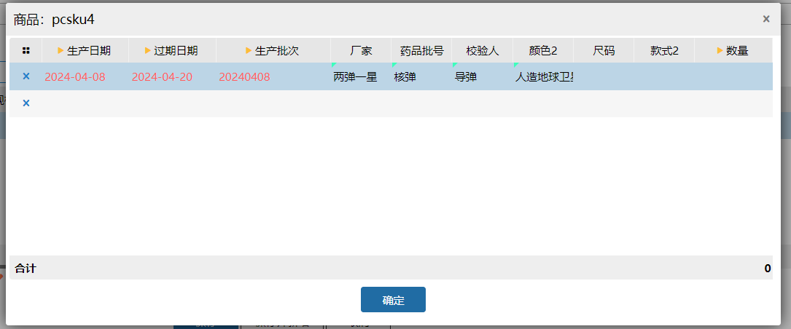
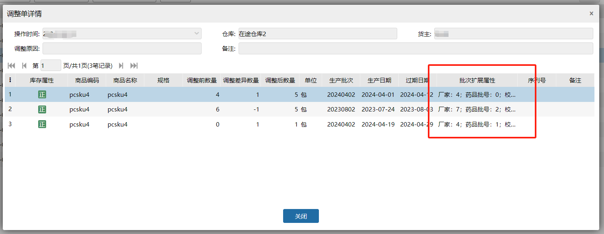

# 品牌及自定义属性

### 1.功能介绍
在此界面维护商品品牌类目以及属性，维护好可以在商品信息界面进行选择，提高工作效率。

### 2.新增品牌
点新增品牌，输入品牌名称，然后点下空白的地方就会自动保存了。如果想删除这个品牌，可以点前面的【X】操作即可。

### 3.自定义属性维护
先新增属性，添加好属性后添加属性值。这里添加好后在商品信息界面就可以直接选择了。属性值是可以进行修改的。

### 4.生产批次扩展属性
tab不关联生产批次开关显示，支持新增/编辑/删除批次扩展属性。

属性名不支持重复，最大支持添加10个批次扩展属性。

注：已使用的扩展属性不可删除，仅支持修改。

添加批次扩展属性后，在WMS系统中入库、出库、盘点、调整等地方可用到。

最小粒度：生产批次号+生产日期+过期日期+批次扩展属性唯一

> 更新: 2024-05-06 17:17:04  
> 原文: <https://hupun.yuque.com/unzko7/lsbfg0/hlqhxb79s5nz78n5>