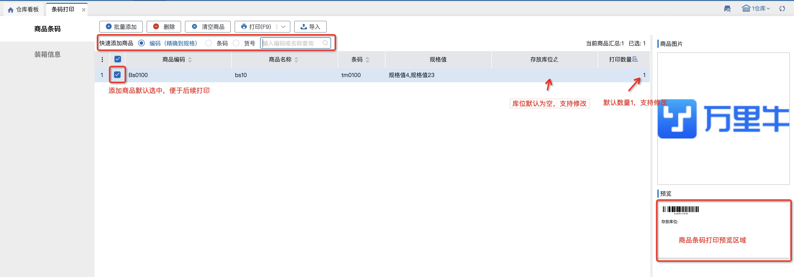
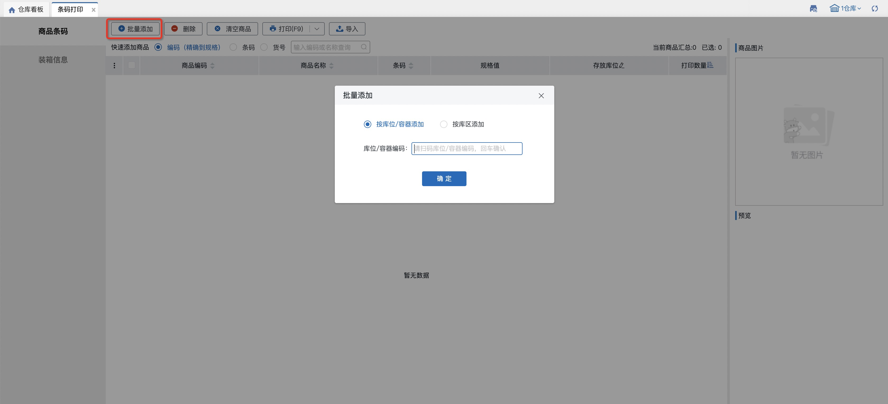
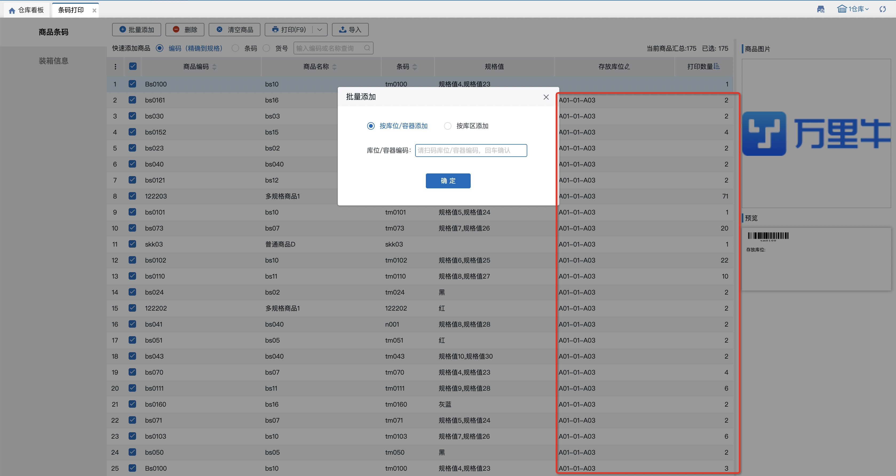
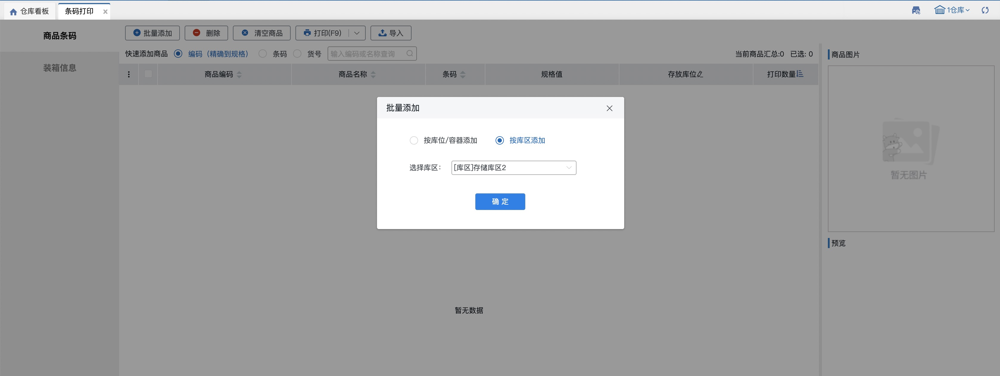
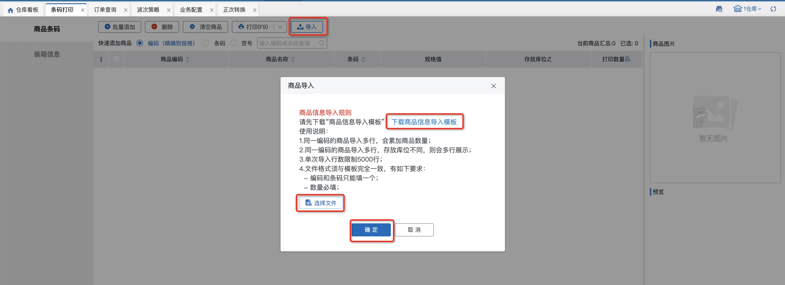
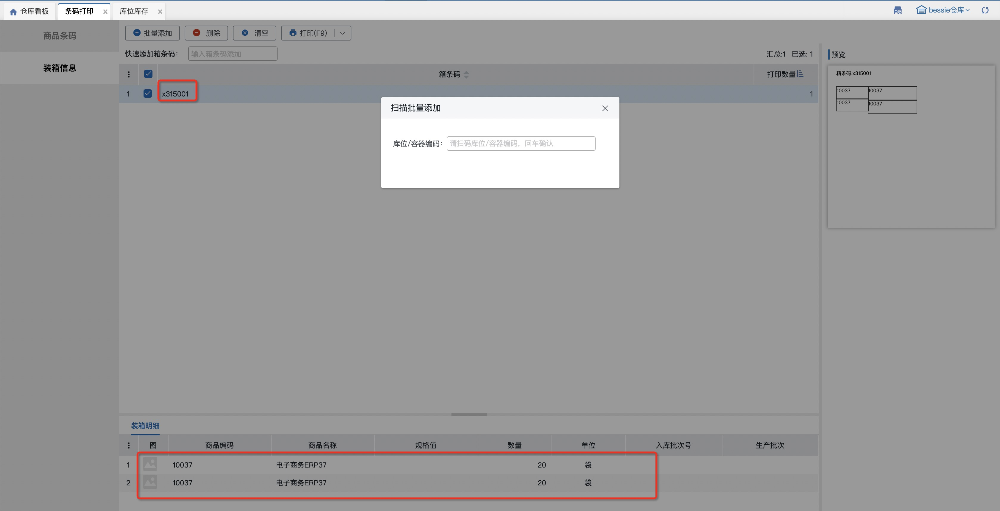
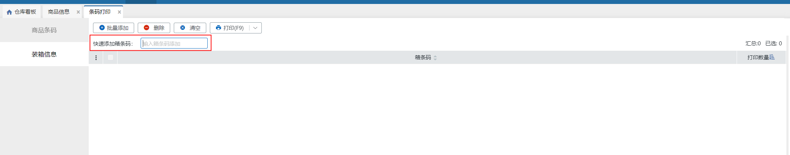

# 条码打印

### 1.商品条码
#### 01.快速添加商品
按编码、条码、货号添加：

#### 02.按库位/容器添加
输入库位/容器后，回车/确定，列表带出该库位/容器上的所有sku及实际数量：

#### 03.按库区添加
勾选指定库区后点击确定，列表带出该库区上的所有sku及实际数量：

#### 04.导入添加
先下载导入模板，填写后上传导入，导入成功的会显示在列表中，导入失败的可查看具体失败原因。

#### 05.删除
先勾选需要删除的记录，再进行删除。

#### 06.清空商品
不需要勾选，默认清空列表所有数据。

#### 07.打印
先勾选需要打印的sku并填写打印数量，支持打印预览，未勾选的sku不会打印。

注：通过页面添加或导入的数据，如果有多条sku+存放库位一致的数据，系统会自动合并数据并将打印数量累加；如果是页面上手动修改的数据，不会自动合并。

### 2.装箱信息
#### 01.按库位/容器添加
若扫描库位上有箱库存，扫描后会带出箱条码和箱数，底部显示箱明细；若无箱库存，则不带出箱条码。

#### 02.快速添加箱条码
按箱条码添加：扫描规格箱/唯一箱/多单位条码后带出箱内明细

> 更新: 2023-12-21 18:07:55  
> 原文: <https://hupun.yuque.com/unzko7/lsbfg0/shg2zavwi8zv4543>