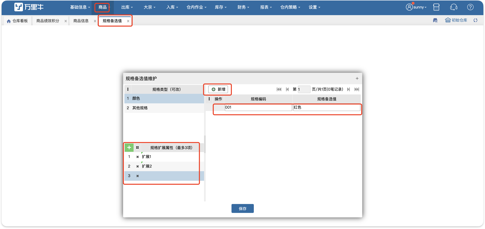

# 规格备选值

### 1.功能介绍
规格备选值的设定与商品信息相关，维护的规格类型对应商品信息处的规格下面的字段。

### 2.增加规格备选值
1.选中需要的规格类型，在右侧添加规格编码和规格备选值并进行保存，规格类型可以根据自己的需要进行修改。

2.如果规格编码和规格备选值需要删除的话，点击前面的“×”。

3.增加规格扩展属性，最多支持添加三条。

a.添加后保存，商品信息处新增/修改页显示规格扩展属性列，规格扩展属性有几个就增加几列显示。

b.商品导入的导入模板增加已设置的规格扩展属性列。

c.商品条码模板上新增规格3、4、5的打印项。

d.万里牛直连新增商品同步到WMS。

(1).ERP传规格值1、规格值2、规格值3、规格值4、规格值5，WMS正常接收，显示5个。

(2).若WMS添加规格扩展为2个，ERP传规格扩展为3个，WMS正常接收，显示2个（第5个舍弃显示）。

(3).若WMS添加规格扩展为3个，ERP传规格扩展为2个，WMS正常接收，显示2个（第5个显示为空）。

> 更新: 2023-12-21 18:04:56  
> 原文: <https://hupun.yuque.com/unzko7/lsbfg0/nzy64tg8hp9zthbz>