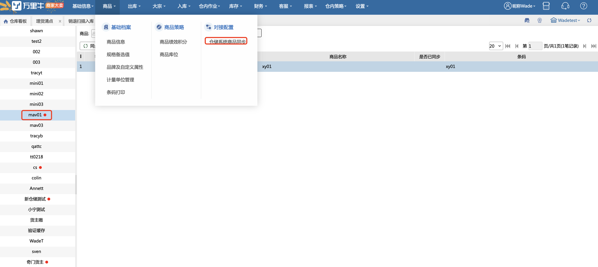

# 仓储系统商品同步

仓储系统商品同步页面，用于从wms同步商品信息到万里牛erp系统中。页面左侧显示货主，右侧显示对应货主下可同步的商品信息：

注意：

1.该页面有后台开关；

2.在wms中修改商品部分字段（包括：长宽高、体积、重量、自定义属性、外贸扩展字段）后，会在此页面显示对应商品或规格信息；

3.同步方式有3种：同步勾选商品、同步未同步商品、同步所有商品；

4.“是否已同步“列显示该行数据的同步状态：空--未同步，x--同步失败，√--同步成功；

5.系统每晚自动跑批清除同步成功的数据；

6.货主下有可同步商品时，货主上有红点标记；无可同步商品，则货主上无红点。

> 更新: 2024-11-14 10:44:02  
> 原文: <https://hupun.yuque.com/unzko7/lsbfg0/tutmpdtourx60zhf>