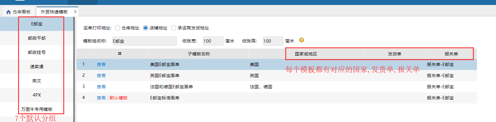
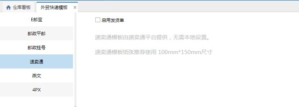
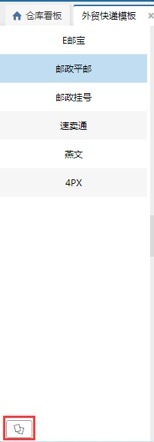
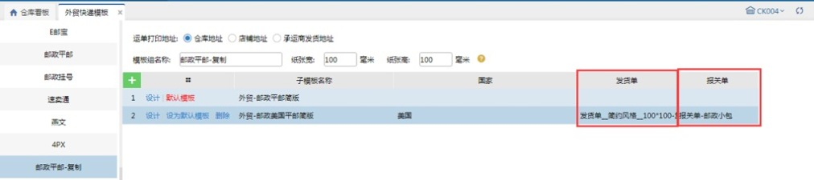
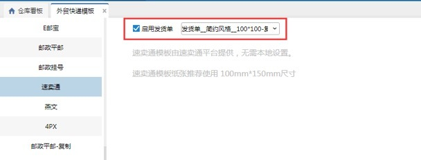
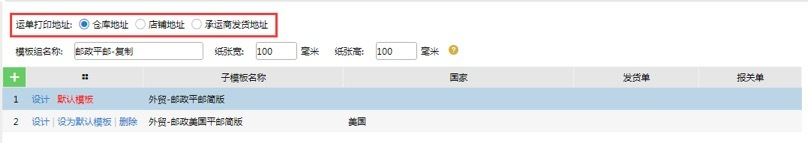
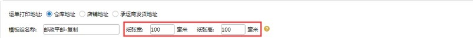
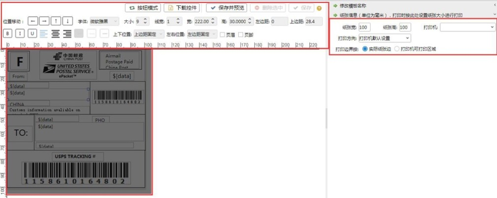
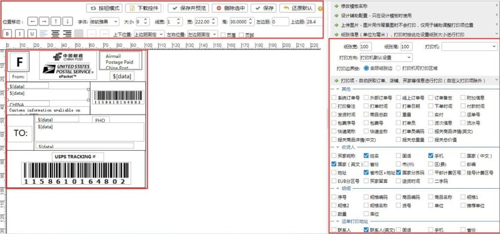

# 跨境快递单模板

系统已有6个默认分组E邮宝、邮政平邮、邮政挂号、速卖通、燕文、4PX、万里牛专用模板，每个分组下有默认的系统模板，每个模板有对应的国家、发货单、报关单。

注：

万里牛专用模板不能查看模板。

### 1.默认分组
1.  E邮宝、邮政平邮、邮政挂号、燕文、4px分组下只有运单打印地址可以更改，模板、国家、发货单、报关单只能查看不能编辑

2.  速卖通，只能更改发货单，其他都不显示，如图所示：                       

### 2.复制
默认分组下的模板对应模板、国家、发货单、报关单都不能编辑，若需要修改模板/国家/发货单/报关单，可以复制分组，进行修改模板/国家/发货单/报关单，复制按钮在分组的左下角如图所示：

注意：速卖通分组不能复制

### 3.设置发货单和报关单
非速卖通的分组复制出来后才可以手动修改发货单和报关单。

速卖通直接在默认分组中设置发货单，不能设置报关单。

### 4.打印配置
#### 01.运单打印地址
发货地址可以根据实际的地址勾选仓库地址/店铺地址/承运商发货地址。                  

 

#### 02.纸张信息
设置纸张大小，默认是100*100

#### 03.模板设计
预设分组只能查看；复制出的分组，可以根据业务需要修改打印项和打印项位置。

①、预设分组      

②、复制出的分组

> 更新: 2023-12-22 11:10:33  
> 原文: <https://hupun.yuque.com/unzko7/lsbfg0/knwa7l0r0vtr8xsf>