# 仓库库位

系统中仓库库位一共分为3级区分，分别为区域-库区-库位；

### 1.区域
如图所示，仓库下的一个平面仓（一层）建议编为一个区域。

功能：用于业务隔离，不同区域下系统在业务处理上有区别，如补货上架只会在同区域内生成自动任务，防止跨层作业等。

### 2.库区
橙色虚线标记的区，用来区分实际作业中的功能划分。

功能：用于业务区分，如区分大货整存区，小件的拣选区，包装复核等功能区域；用于工作分配，系统中出库订单、补货作业等均会标记该作业的库区，用于根据库区来分配工作；

### 3.库位
蓝色实线标记的区，如图中整存区一个托盘为一个地堆库位，拣选区的一个货架上的每个格子，也为一个库位；

功能：用来标记货品在仓库中精准位置，库位是仓库中最小的定位标志；

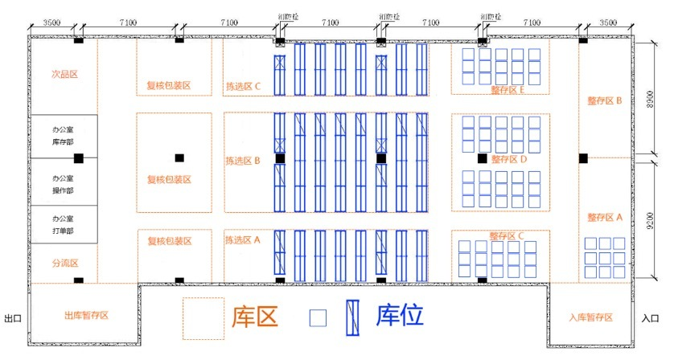

新增区域操作如图：

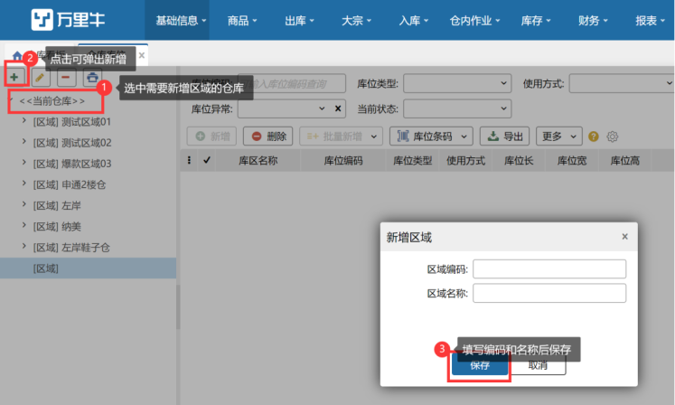

新增库区操作如图：

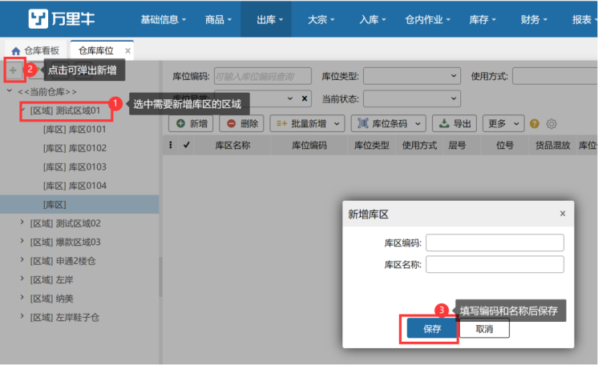

提示：

先在当前仓库下增加区域，然后在区域下增加库区。

新增库位操作如图：

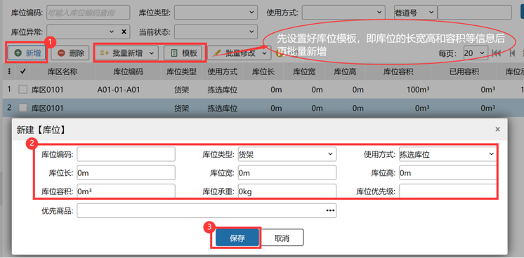

库位条码打印

先选中需要打印的条码再点击库位条码按钮即可

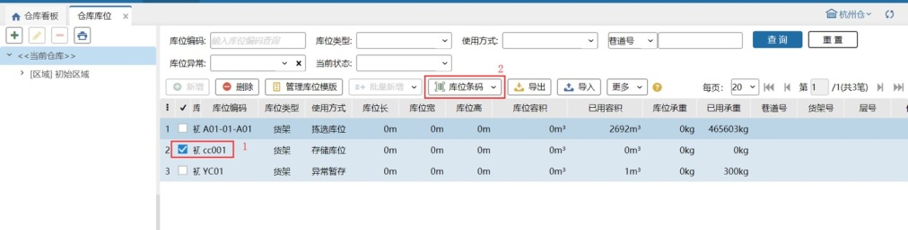

也可以点击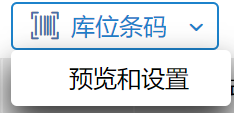进行上图所示模板设计及预览功能。

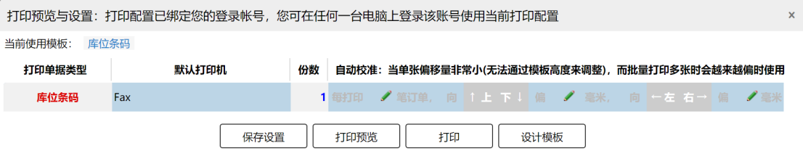

##### 01.库位使用方式
系统中库位有多种功能区分，用来区分不同的库位用途。

拣选库位：系统中订单出库时，锁定库位只会锁定该类型库位；

箱拣选库位：用于存放整箱货物，满足订单出库时拆零和货箱分开拣货的需求；

存储库位：补货上架的来源库位，自动补货任务时系统将会从存储库位补货到拣选库位；

预配库位：波次策略中配合仓库预打包作业，用于直接分配订单到指定的预配库位上；

异常暂存：该库位用于操作员操作订单时，订单被拦截取消后，货品放置到该库位下；

过渡库位：用于仓库进出库时，用于过渡的库位，系统在执行相关作业完成后（检验等）生成移库任务；

工位：用于标记操作员在当前功能区下的位置，支持监控位配置；

次品库位：只可存放库存属性为次品的商品，用于存放入库、仓内操作时发现的残次品；

##### 02.库位容积及限重
系统自动生成补货上架、移库等仓内作业任务时，会根据当前库位的剩余容积及重量来判定上架商品的数量。

##### 03.库位优先商品
系统自动生成补货上架时，如该库位有优先商品，则会优先上架此商品到该库位，次品库位不支持设置优先商品，进行扫描录入的时候支持条码截取。

##### 04.已用容量更新
库位会更新已用的容积、承重。

##### 05.使用方式
修改库位使用方式

①.存储库位变更为其他使用方式，要看下是否有订单锁定、补货任务锁定、移库任务锁定、加工单锁定、移库任务目标库位的在途，若存在其中一种情况则会显示修改失败。

②.拣选库位变更为其他使用方式，要看下是否有订单锁定、加工单锁定、补货任务目标库位的在途、移库任务目标库位的在途，若存在其中一种情况则会显示修改失败。

③.预配库位变更为其他使用方式，要看下是否有订单锁定、加工单锁定、预配波次占用，若存在其中一种情况则会显示修改失败。

④.过渡库位变更为其他使用方式，要看下是否有订单锁定、移库任务锁定、加工单锁定、移库任务目标库位的在途，若存在其中一种情况则会显示修改失败。

⑤.箱拣选库位、工位、异常暂存库位更为其他使用方式，都要看下是否有订单锁定、加工单锁定，若存在其中一种情况则会显示修改失败。

⑥.次品库位变更为其他使用方式，要看下是否有移库任务锁定，有则修改失败。

⑦.其他库位变更使用方式为次品库位，要看下该库位是否有正品库存、是否设置优先商品，有其中一个则修改失败。

注：查看库位库存锁定信息，可在系统库存-库位库存中查看，如下图（点击数量可查看具体单据信息）：

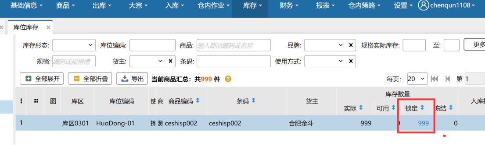

##### 06.排除指导余量or排除指导历史
开启排除指导余量or排除指导历史，指导时排除该库位。

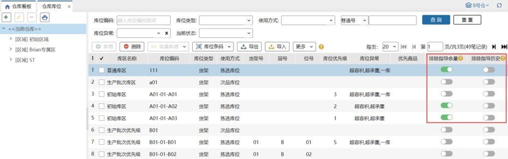

##### 07.货品混放
设置库位上是否允许存放多种商品，设置为是，此库位上允许存放多种商品，设置为否，此库位上只能存放一种商品。

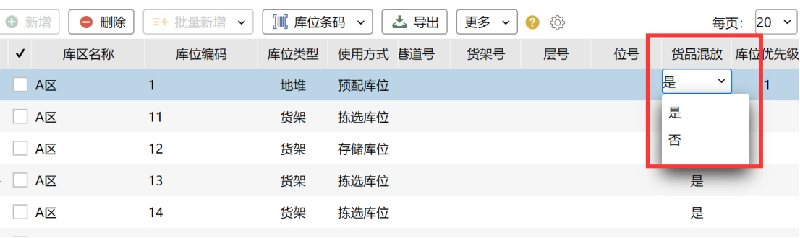

注意：

1.过渡库位、异常暂存库位必须设置允许货品混放，不可设置为否。

2.库位的货品混放设置为否后，在进行入库、移库、盘点、指导上架，补货上架、仓内加工等作业时，选择目标库位时会判断库位是否允许货品混放。目标库位不允许混放且库位上有其他商品时，则跳过此库位。

3.唯一箱不可与其他货品/箱子混放。

注意：库存移动、补货等将唯一箱从存储库位移动到拣选库位拆箱上架，拣选库位的拆零商品和唯一箱的箱内商品一致时，正常操作移库、补货任务。

4.规格箱和散件商品一致时不算混放 。              

##### 08.库位标签
普通波次策略分组条件中增加了“库位标签”，通过给不同库位设置库位标签，来达到带有指定库位标签的库位生成到相同波次的目的。

###### ①.维护库位标签
库位标签支持新增、删除、修改：

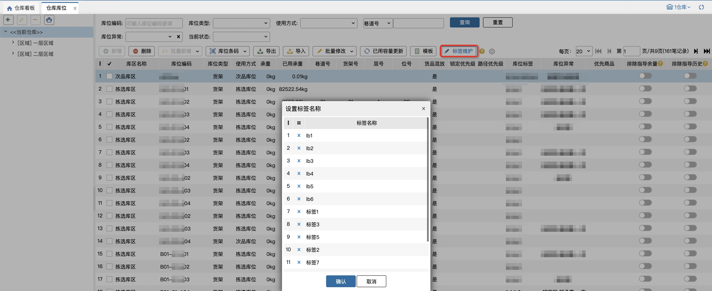

注：最多能添加100个标签，标签名称不允许重复，最多10个字符

###### ②.设置库位标签
库位标签支持单个库位设置、批量设置。

单个库位设置如下图，点击...显示设置弹窗，勾选指定库位标签后点击确定，即可添加成功：

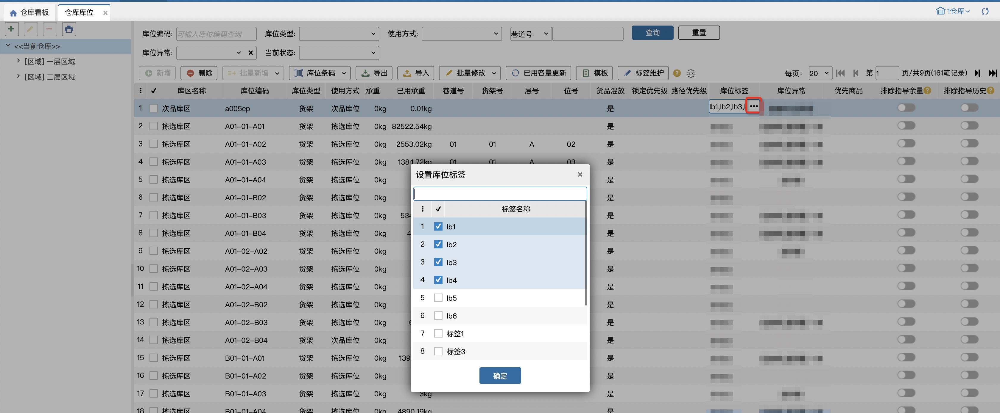

批量设置如下图，先勾选目标库位，再点击批量修改库位标签，选择指定标签后点击追加或覆盖：

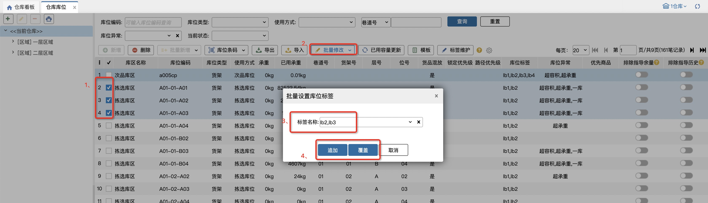

注：

（1）每个库位最多支持设置10个库位标签，若超出则设置失败，会有报错提示；

（2）追加：指在现有库位标签基础上增加新设置的库位标签；覆盖：指不保留原有库位标签，用新设置的库位标签覆盖现有数据。

##### 09.路径优先级
通过设置库位的拣货优先级就可以改变仓库内拣货、移库取货的库位排序顺序，便于自行对库位路径进行规划

①.修改原库位优先级为锁定优先级，新增路径优先级，输入限制1-999999

②。优先级1最高999999最低, 无优先级排最后，可直接编辑，也可以批量修改或者清除，支持导入导出。修改成功后，PDA拣货页面及补货任务、移库任务、加工领料页面订单按照库区编码+设置的优先级+库位编码展示，默认按库区编码从小到大排列，相同库区下按照设置的优先级从高到低排序，相同优先级下按库位编码从小到大排序

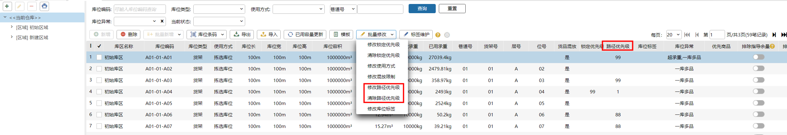

注：次品库位不支持输入优先级；是否按库区编码排序有后台开关，开启后可以只按照路径优先级排，不按库区编码排。

##### 10.存储条件
系统默认库位存储条件为空，支持自定义存储条件。修改存储条件时，若指定库位无库存及优先商品，则存储条件可任意设置；若指定库位有库存或优先商品时，则库位存储条件必须与库存商品/优先商品的存储条件保持一致（或库位存储条件为【不限】），否则不允许设置。

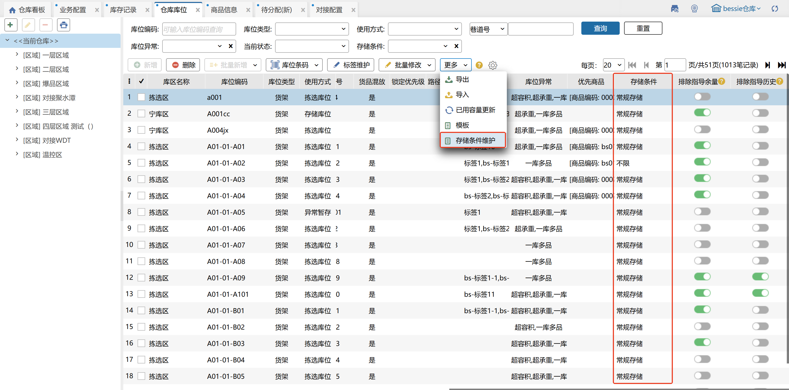

注：1.导入库位未指定存储条件时，wms系统默认填充为空；

2.仓库和库位的自定义存储条件数据互通；

3.使用中的存储条件不支持删除。

##### 11.库位存储类型
区分“普通库位”和“托盘库位”，托盘容器只能指导到托盘库位上。

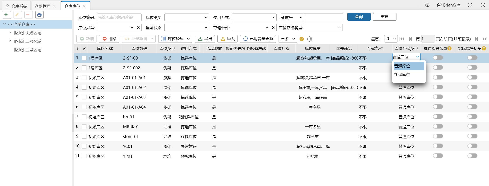

> 更新: 2026-05-06 09:32:18  
> 原文: <https://hupun.yuque.com/unzko7/lsbfg0/tbvpyuo6brv761dg>