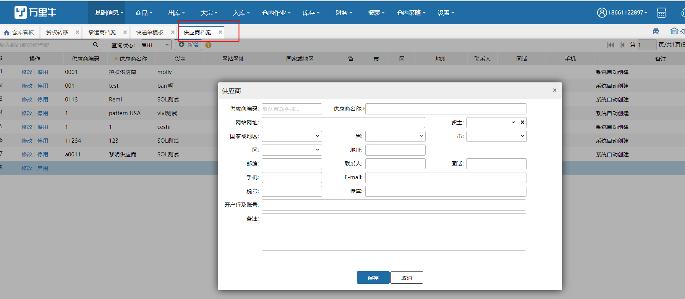
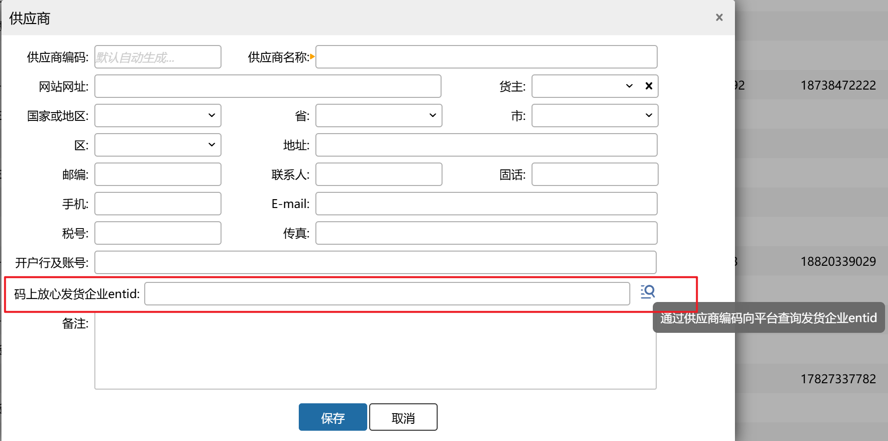

# 供应商档案

供应商是给你供货的群体，你需要根据自己店铺的销售状况，定期向他们发出订货订单，供应商信息通过手工方式新增。

### **1.新增**
点击新增，输入供应商详细信息，保存。

相关信息填写好，以备查找供应商相关信息是可以快速查询。

公司开启【UDI追溯回传】模块时，新增弹窗会多一个字段：码上放心发货企业entid。该字段有值时，在对接溯源上传系统时会优先使用该字段内容，若该字段为空则使用供应商编码。支持手动查询entid信息，若有查询结果会自动填充到文本框中，无查询结果或有异常时会报错提示。

### **2.停用、启用**
对于不用的供应商，点击停用，供应商停用但不删除；停用的供应商再次使用，点击启用。

### **3.匹配规则**
ERP推采购订单到WMS，供应商匹配规则如下：

1. 先匹配供应商编码，编码未匹配到，再匹配供应商名称，名称也未匹配到会自动新增供应商，入库预约的操作记录可以查看到日志

2.编码匹配到                        

①、供应商状态是启用，ERP和WMS名称不一致时，自动修改WMS中供应商名与ERP中的一样；名称一致，不修改供应商名称；                        

②、供应商状态是停用，ERP和WMS名称不一致时，WMS中供应商状态停用自动变为启用且修改供应商名称；名称一致，WMS中供应商状态停用自动变为启用且不修改名称

3. 编码没有匹配到，名称匹配到                   

①、供应商状态是启用，修改WMS中供应商编码与erp中一样                     

②、供应商状态是停用，WMS中供应商状态停用自动变为启用且修改供应商编码        

> 更新: 2026-04-28 18:21:28  
> 原文: <https://hupun.yuque.com/unzko7/lsbfg0/smxs1gl5xzzbiqcg>